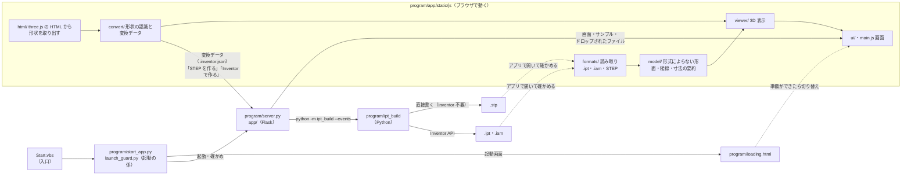

# Inventor 3Dツール

Autodesk Inventor の部品（.ipt）・組立（.iam）、STEP（.stp）と、three.js で作った 3D モデル（.html）をブラウザで表示・解析し、
three.js のモデルを STEP（.stp。Inventor 不要）と Inventor の部品（.ipt）・組立（.iam）に変換する 1 つのアプリ。

画面（HTML・JavaScript・CSS）と Python（Flask）のサーバーで動く。WaveLog・転写距離・ピッチ解析と同じ形
（最上位の `Start.vbs` ＋ `program` フォルダ、Python と Flask だけで動く）にそろえてある。

- アプリの構成・設計の判断・段階計画: [docs/app-architecture.md](docs/app-architecture.md)
- 形式の調査結果: [docs/ipt-format.md](docs/ipt-format.md)（部品）・[docs/iam-format.md](docs/iam-format.md)（組立・STEP との照合）
- Inventor で部品を作る手順（「Inventor で作る」・変換データ・コマンド）: [docs/inventor-builder.md](docs/inventor-builder.md)
- .stp・.ipt・.iam を Inventor なしで作れるか（技術的な検討と、いまの制約）: [docs/cad-output.md](docs/cad-output.md)

## はじめに（使い方）

1. **準備（初回のみ）**: Python 3.10 以上と Flask を入れる（WaveLog などが動く PC なら、そのまま使える）。
   Flask が入っていなければ、起動したときに「入れますか？」と尋ねる
2. **起動**: 最上位の **`Start.vbs`** をダブルクリックする。すぐに起動画面が開き、準備ができるとそのままアプリに切り替わる
   （Microsoft Edge があればアドレスバーの無いアプリの窓、無ければ既定のブラウザー）
3. **終了**: 画面（窓・タブ）を閉じる。十数秒でサーバーも止まる

| 操作 | 動き |
|---|---|
| `Start.vbs` をダブルクリック | アプリを開く（起動画面 → アプリ。サーバーが動いていれば、それを使う） |
| .ipt・.iam・.stp・.html・.inventor.json を `Start.vbs` にドロップ | そのファイルをアプリで開く（複数なら 1 つの窓にまとめ、起動画面の一覧から切り替える）。.iam は同じフォルダの .ipt も部品として使い、組み立てて表示する |
| パネルの **STEP を作る** | 取り込んだ形（または開いた変換データ）から、STEP（.stp）を作る。Inventor もライブラリも使わない（下の「CAD ファイルを作る」） |
| パネルの **Inventor で作る** | STEP に加えて、Inventor で部品（.ipt）と組立（.iam）を作り、部品ごとに体積・表面積を照合する |
| `program\stop.bat` | 明示的に止める（program フォルダを入れ替える前など） |
| `program\start.bat` | 診断起動: 起動しないときに、Python・Flask・ポートの確認と起動の段階をその窓に出す（ファイルをドロップしてもよい） |

- 開いたあとも、画面へのドラッグ＆ドロップ・`Ctrl`+`O`・「サンプル・使い方」で開き直せる
- 記録（うまく動かないときの手がかり）は `%LOCALAPPDATA%\Inventor3DTool\logs`（launcher.log・app.log・server_console.log）
- ポートは 57840（`program\config\appsettings.json` で変えられる）。この PC の中（127.0.0.1）からだけ受け付ける

### 配り方・更新

`Start.vbs` と `program` フォルダを並べて置く（フォルダの名前は自由）。更新は `program\stop.bat` で止めてから `program` を入れ替える
（git で取り込む場合も同じ）。止め忘れても、次の起動で「動いているサーバーが今のファイルと違う」ことに気づき、止めて起動し直す。
作業場所（記録・受け渡し・.pyc）は `%LOCALAPPDATA%\Inventor3DTool` にあり、`program` フォルダは動いている間も「使用中」にならない。

## CAD ファイルを作る

three.js の HTML を開くと、元のページで表示中の形を取り込み、部品ごとに「回転体」「押し出し」「近似（三角形のまま）」に分ける。

1. **単位を確かめる**: 「取り込み結果」の **シーンの 1 単位**。three.js の座標に単位は無く、HTML ごとに「1 = 1 mm」「1 = 1 m」
   「32 = 1500 mm」などと違う。大きさから推定した単位と、実寸での全体の大きさが出るので、実物と違えば選び直す
   （mm・cm・m・inch・任意の長さ。HTML ごとに覚える）
2. **作る**: パネルの「CAD ファイルを作る」で
   - **STEP を作る**（.stp・Inventor 不要）: すべての部品と組立を STEP にする。STEP は Inventor で開けば .ipt・.iam になる
   - **Inventor で作る**（.ipt・.iam・.stp）: STEP に加えて、Inventor で部品と組立を作る。回転体・押し出しは寸法を編集できる部品
     （回転・押し出し・面取りのフィーチャ）、近似の部品は STEP を開いた立体になる。初めてのときは、Inventor の操作に使う Python の
     ライブラリ（pywin32）を「入れて作る」かを尋ねる（インターネットから入れる。1 分ほど）
   - この PC に Inventor が見つからなければ、STEP のほうを勧める（Inventor のボタンも押せる）
3. **結果を見る**: STEP の行（厳密な面か、三角形の面か）と、Inventor で作ったときは部品ごとに照合の結果
   （**一致**（緑）・**不一致**（琥珀）・**失敗**（赤。理由を添える））が並ぶ。**保存先を開く** でフォルダを開く。途中でやめるときは **中止**

保存先は `ドキュメント\Inventor 3Dツール\<HTML の名前>_cad`（同じ名前があれば「 (2)」…。前の結果を上書きしない）。
STEP（.stp）・部品（.ipt）・組立（.iam）・照合の結果（`build-report.json`）・作ったときの変換データの写し（`.inventor.json`）が入る
（近似の部品を Inventor で開くための部品ごとの STEP は `step` フォルダ）。保存先の親フォルダは `program\config\appsettings.json` の
`build.output_dir` で変えられる。作っている間は、別のファイルを開いても、画面を閉じても、作り終えるまで続く。
Inventor に接続できなかったときも、STEP は残る（理由を表示する）。

### 取り込めるもの・作れるもの

| 元の形 | 扱い |
|---|---|
| 回転体（円柱・円錐・球・トーラス・溝のある円板・扇形・たる形など） | 正確に認識し、STEP では厳密な面（たる形は三角形）、Inventor では回転のフィーチャ |
| 押し出し（多角形・円弧・穴・端面の等距離の面取り） | 同上（押し出しと面取りのフィーチャ）。面取り付きは STEP では三角形 |
| 開いた面の組み合わせ（円筒の壁とリングの筒など）・端の開いた管・継ぎ目の刻みが面ごとに違う形（アルミコイルなど） | 縫い合わせ・平らな縁を塞ぐ・継ぎ目の頂点をそろえて立体にする（部品の説明に書く） |
| それ以外（段付き・横穴・曲がった管・丸い面取りなど） | 近似（三角形のまま）で STEP・.ipt・.iam に入れる。元の形が自分と交わる所があれば知らせる |
| 床・板・文字などの厚みのない面、線・点 | 除外（「除外したもの」に理由と数を出す） |

どの部品も、変換のたびに「認識した寸法で作る形」と元の形が一致するかを両方向で確かめ、合わなければ近似に回す。
.ipt・.iam を Inventor なしで作らない理由と、残っている制約は [docs/cad-output.md](docs/cad-output.md)。

## 変換データ（.inventor.json）の使い方

**変換データ**は、取り込んだ形を作るための設計図（JSON）。部品ごとに、断面（直線・円弧・円）・回転か押し出しか・面取り、
近似の部品は三角形（mesh）、配置（どこに何個置くか）と、照合に使う体積・表面積の期待値を持つ。同じ形の部品は 1 つにまとめる
（例: リールは 459 個 → 25 種類）。「STEP を作る」「Inventor で作る」も、内部ではこの変換データを使っている。ファイルとして使うのは次のとき:

| 使う場面 | 手順 |
|---|---|
| **Inventor の無い PC で取り込み、Inventor のある PC で作る** | 取り込んだ PC で「CAD ファイルを作る」→「あとで別の PC で作るとき（変換データを保存）」→ **変換データを保存**。そのファイルを Inventor のある PC に持っていき、アプリで開く（画面か `Start.vbs` にドロップ）→ **Inventor で作る**（STEP だけなら、取り込んだ PC で **STEP を作る** でよい） |
| 作ったものの記録・作り直し | 保存先に置かれる写し（`<名前>.inventor.json`）を開けば、同じ形をもう一度作れる |
| 中身を確かめる | アプリで開くと、作る形を 3D で表示し、部品ごとの種類・寸法・数を並べる（面取りは形には描かず、説明に書く） |
| コマンドで作る・Inventor を使わずに確かめる | `program` フォルダで `python -m ipt_build 名前.inventor.json`（`--step-only` で STEP だけ、`--dry-run` で何も作らずに期待値を確かめる）。[docs/inventor-builder.md](docs/inventor-builder.md) §2-3 |

変換データではない JSON や、アプリより新しい版の変換データは、理由を示して開かない。

## リポジトリの見取り図

リポジトリには**ソースだけ**を置く（ビルドも生成物も無い。ブラウザは `program/app/static` のファイルをそのまま読む）。



| 場所 | 中身 |
|---|---|
| `Start.vbs` | **入口**（これだけを使う。Python を探し、`program\start_app.py` を窓なしで起動する） |
| `program/start_app.py`・`launch_guard.py` | 起動の係: ドロップされたファイルの記録・起動画面・サーバーの起動と確かめ |
| `program/server.py`・`app/` | サーバー（Flask）: 画面（`templates/`・`static/`）を配り、サンプル・受け取ったファイルを渡し、「CAD ファイルを作る」の仕事を受け持ち（`builds.py`）、画面が閉じたら止まる |
| `program/settings.py`・`config/appsettings.json` | アプリの印・ポート・作業場所（答えは 1 か所） |
| `program/local_app.py`・`process_manager.py`・`handoff.py`・`app_build.py` | 動いているサーバーへ尋ねる・止める、ファイルの受け渡し、プログラムの指紋 |
| `program/loading.html`・`start.bat`・`stop.bat`・`requirements.txt` | 起動画面・診断起動・停止・必要なライブラリ（Flask） |
| `program/ipt_build/` | CAD ファイルを作るビルダー（Python。サーバーが別のプロセスで動かす。コマンドでも使える）。STEP は標準ライブラリだけで書き（`p21.py`・`brep.py`・`step.py`）、.ipt・.iam は Inventor で作る（操作に使うライブラリは中の `requirements.txt`） |
| `program/samples/` | サンプルの置き場（起動画面のサンプル一覧兼、評価の題材） |
| `program/tests/` | 評価。Python（`test_*.py`: サーバー・起動の係・配る形・ビルダー）と JavaScript（`js/`） |
| `program/tools/` | 開発用の道具（ファイルの中身の調査・テスト用データの作成・書き出した STEP の形状カーネルでの確かめ） |
| `docs/`・`package.json` | 設計と調査の記録、JavaScript の評価の実行（開発用） |

### 画面のソース（`program/app/static/js/`）

| フォルダ | 役割 | 画面（DOM）に依存 |
|---|---|:-:|
| `core/` | ベクトル・行列・数値の道具、表示名（`labels.json`） | — |
| `formats/` | ファイルの読み取り。`ipt/`（OLE2 → Zstandard → SAB → B-rep）・`iam/`（参照・出現・配置）・`step/`（ISO 10303-21）。入口は `open.js`（形式の判定と、表示・変換で共通に使う「モデル」への読み込み） | — |
| `model/` | 形式によらない形（面・稜線）: 曲線の計算、寸法の要約（穴・外径・R・ねじ・円錐）、表示用の面のデータ | — |
| `html/` | three.js の HTML を隔離した枠で動かし、表示中の形状を取り出す（フック・受け渡し・表示用データ） | ✓ |
| `convert/` | 実寸の単位（`units.js`）。三角形メッシュを立体に閉じ（`recognize/shells.js`）、回転体・押し出し（面取りを含む）を認識して元の形と照らし合わせ（`recognize/`）、変換データを作る（`inventor.js`）。変換データを開いたときの 3D と説明（`preview.js`） | — |
| `viewer/` | 三角形分割・3D 表示・面と部品の説明 | ✓ |
| `ui/` | 画面の部品: 仕様パネル・起動画面・ファイルの受け付け・変換の節（`convert.js`）・シーンの単位（`units.js`）・「CAD ファイルを作る」（`build.js`）・起動ファイルの名前 | ✓ |
| `server.js` | ローカルサーバーとのやりとり: サンプル・起動ファイルから届いたファイル・「CAD ファイルを作る」・「画面が開いている」の知らせ | ✓ |
| `main.js` | 入口。ファイルを読み、表示し、3D ⇄ パネルを連動させる | ✓ |

three.js・fzstd（Zstandard の展開）・Delaunator と Constrainautor（面の表示用の制約付き Delaunay 分割）は `static/vendor/` に同梱し、`templates/index.html` の importmap で読む（インターネットは要らない）。

## できること

- **.ipt**: 形状と寸法（外形・穴・外径・R・ねじ・円錐）を表示する。ねじは Inventor が面に付けた情報から呼び（M6×1 など）・等級・ねじ長さを示す。
  材質・密度（iProperties）が分かれば体積と質量も示す。対応している面は平面・円筒・円錐・トーラスで、それ以外は稜線だけを表示する
- **.iam（組立）**: 部品の参照と配置を読み、参照先の .ipt（一緒に受け取ったもの・同じフォルダのもの・サンプル）で組み立てる。部品表（部品名・数・外形・材質・質量）の
  行にカーソルを合わせると 3D の部品を強調し、押すとその部品を開く。見つからない部品は一覧に出し、その .ipt をドロップすると組立に加わる
- **STEP（.stp・.step）**: 部品の形状と組立の配置を全て含むので、単独で表示できる（部品が 1 つなら部品として、2 つ以上なら組立として）
- **.html（three.js）**: 元のページを隔離した枠の中で動かし、表示中の 3D モデルを取り出す（インスタンス描画を含む）。シーンの単位を
  実寸（mm）に直し、開いた面は縫い合わせ・縁を塞いで立体にし、部品ごとに「回転体」「押し出し（端面の縁の等距離面取りを含む）」
  「近似（三角形のまま）」に分類して寸法を復元する
- **STEP を作る**: 取り込んだ形状から、Inventor なしで STEP（.stp）を作る（上の「CAD ファイルを作る」）
- **Inventor で作る**: STEP に加えて、Inventor で部品（.ipt）と組立（.iam）を作り、部品ごとに照合する。
  Inventor の無い PC では変換データ（.inventor.json）として保存し、Inventor のある PC で開いて作ることもできる
- ファイルはこの PC の中だけで解析し、外部には送信しない（HTML が読み込む three.js などは、そのページの指定どおり取得する）。
  書体（IBM Plex）は読み込めたときだけ使い、つながらない PC では Yu Gothic UI などで表示する

## サンプル

| フォルダ | 内容 |
|---|---|
| [`program/samples/ipt/`](program/samples/ipt) | .ipt（部品）。アプリのサンプルと解析の評価に使う（詳しくは中の README） |
| [`program/samples/iam/`](program/samples/iam) | .iam（組立）。参照する部品は samples/ipt のものを使って組み立てる |
| [`program/samples/stp/`](program/samples/stp) | STEP（.stp・.step）。同じ部品の .ipt・同じ組立の .iam との照合にも使う |
| [`program/samples/html/`](program/samples/html) | 形状認識の検証に使う three.js の HTML（アプリのサンプルにもなる） |

## 開発

Python の評価（program フォルダで。サーバー・起動の係・配る形・ビルダー。本物のサーバーを起動する通しの評価を含む）:

```
cd program
python -m unittest discover -s tests -t .      # 「CAD ファイルを作る」は本物の別のプロセス＋Inventor の代替オブジェクトで確かめる
python -m ipt_build 名前.inventor.json --step-only  # STEP だけを作る（どの OS でも可）
python -m ipt_build 名前.inventor.json --dry-run    # 何も作らずに変換データを確かめる（どの OS でも可）
```

書き出した STEP を形状カーネル（OpenCascade）でも確かめるには、開発用に `pip install cadquery-ocp` を入れる
（入っていなければ、その評価だけ飛ばす。アプリには要らない）。`python tools/check_step.py 名前.stp` で 1 つのファイルも確かめられる。

JavaScript の評価と道具（リポジトリの最上位で。Node.js 22 以上。npm で入れるものは無い）:

```
npm test                 # 読み取り・三角形分割・組立と STEP の照合・形状認識・変換データ・書き出した STEP の読み戻し（要 Python）
npm run inspect -- program/samples/ipt/E_Plate_改_Φ54.5.ipt [--dump 出力先]   # .ipt・.iam の中身を調べる（形式の調査の再現）
npm run fixtures:html    # samples/html から形状を取り出し、テスト用データを作り直す（要 Playwright）
npm run fixtures:builder # ビルダーのテスト用の変換データ（program/tests/fixtures/builder）を作り直す
```

画面を手元で確かめるときは `Start.vbs`（Windows 以外では `python program/start_app.py`）で起動し、表示された URL を開く。
