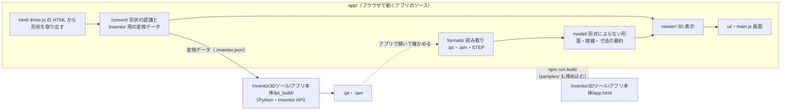

# Inventor 3Dツール

Autodesk Inventor の部品（.ipt）・組立（.iam）、STEP（.stp）と、three.js で作った 3D モデル（.html）をブラウザで表示・解析し、
three.js のモデルを Inventor の部品（.ipt）・組立（.iam）に変換する 1 つのアプリ。

- アプリの構成・設計の判断・段階計画: [docs/app-architecture.md](docs/app-architecture.md)
- 形式の調査結果: [docs/ipt-format.md](docs/ipt-format.md)（部品）・[docs/iam-format.md](docs/iam-format.md)（組立・STEP との照合）
- Inventor で部品を作る手順: [docs/inventor-builder.md](docs/inventor-builder.md)

## リポジトリの見取り図

アプリは 1 つだけ。**編集するのはソース**（`app/`・`Inventor3Dツール/アプリ本体/ipt_build/`）で、
`Inventor3Dツール/アプリ本体/app.html` は `npm run build` が `app/` から作る**生成物**（使う人がビルドせずに使えるよう、生成物もリポジトリに置く）。



| 場所 | 中身 |
|---|---|
| [`Inventor3Dツール/`](Inventor3Dツール) | **配布フォルダ**（使う人に渡すもの。下の「使う人に渡すもの」） |
| `app/index.html`・`app/src/` | アプリのソース（HTML・JavaScript・CSS） |
| `app/test/` | アプリの評価（`npm test`） |
| `app/tools/` | 開発用の道具（ファイルの中身の調査・テスト用データの作成） |
| `app/build.mjs` | `app/` と `samples/` から配布フォルダの `app.html` を作る |
| `samples/` | サンプルの置き場（アプリに埋め込むサンプル兼、評価の題材） |
| `tests/` | ビルダー（Python）の評価（`python -m unittest`）。Inventor の代わりの `fake_inventor.py` を使う |
| `docs/` | 設計と調査の記録 |

### アプリのソース（`app/src/`）

| フォルダ | 役割 | 画面（DOM）に依存 |
|---|---|:-:|
| `core/` | ベクトル・行列・数値の道具、表示名（`labels.json`） | — |
| `formats/` | ファイルの読み取り。`ipt/`（OLE2 → Zstandard → SAB → B-rep）・`iam/`（参照・出現・配置）・`step/`（ISO 10303-21）。入口は `open.js`（形式の判定と、表示・変換で共通に使う「モデル」への読み込み） | — |
| `model/` | 形式によらない形（面・稜線）: 曲線の計算、寸法の要約（穴・外径・R・ねじ・円錐）、表示用の面のデータ | — |
| `html/` | three.js の HTML を隔離した枠で動かし、表示中の形状を取り出す（フック・受け渡し・表示用データ） | ✓ |
| `convert/` | 三角形メッシュから回転体・押し出し（面取りを含む）を認識し（`recognize/`）、Inventor 用の変換データを作る（`inventor.js`） | — |
| `viewer/` | 三角形分割・3D 表示・面と部品の説明 | ✓ |
| `ui/` | 画面の部品: 仕様パネル・起動画面・ファイルの受け付け・変換の節・製品名 | ✓ |
| `main.js` | 入口。ファイルを読み、表示し、3D ⇄ パネルを連動させる | ✓ |

## 使う人に渡すもの（配布フォルダ）

[`Inventor3Dツール/`](Inventor3Dツール) を **フォルダごと** 渡す（ZIP にして渡してよい）。

```
Inventor3Dツール/
├─ Inventor3Dツール.vbs   ← 起動ファイル（これだけを使う）
└─ アプリ本体/            ← 中身（開かなくてよい）
   ├─ 起動.bat             起動の振り分け（VBS が黒い画面を出さずに実行する）
   ├─ app.html             アプリ（HTML 単体で動く。npm run build が作る）
   ├─ ipt_build/           Inventor で部品を作るビルダー（Python）
   └─ requirements.txt     ビルダーが使う Python のライブラリ
```

| 操作 | 動き |
|---|---|
| 起動ファイルをダブルクリック | アプリを開く（Microsoft Edge のアプリ画面。無ければ既定のブラウザー） |
| .ipt・.iam・.stp・.html を起動ファイルにドロップ | そのファイルをアプリで開く（複数なら 1 つのウィンドウにまとめ、起動画面の一覧から切り替える）。.iam は同じフォルダの .ipt も一緒に送り、組み立てて表示する |
| 変換データ（.inventor.json）を起動ファイルにドロップ | 確認のダイアログのあと、Inventor で部品（.ipt）と組立（.iam）を作る。進み具合と結果は HTML のページに出る（要 Python 3.10 以上） |

- 起動ファイル（VBS）は「黒い画面を出さない」ためだけにあり、処理はすべて `アプリ本体\起動.bat` にある。
  VBScript が使えない環境では 起動.bat を直接使ってもよい（黒い画面が出るだけ）
- 起動画面で「ファイルを開く（ドラッグ＆ドロップ）」「サンプルで試す」「変換の流れ」を示す。
  開いたあとも、画面へのドラッグ＆ドロップ・`Ctrl`+`O`・「サンプル・使い方」で開き直せる
- **.ipt**: 形状と寸法（外形・穴・外径・R・ねじ・円錐）を表示する。ねじは Inventor が面に付けた情報から呼び（M6×1 など）・等級・ねじ長さを示す。
  材質・密度（iProperties）が分かれば体積と質量も示す。対応している面は平面・円筒・円錐・トーラスで、それ以外は稜線だけを表示する
- **.iam（組立）**: 部品の参照と配置を読み、参照先の .ipt（一緒に受け取ったもの・サンプル）で組み立てる。部品表（部品名・数・外形・材質・質量）の
  行にカーソルを合わせると 3D の部品を強調し、押すとその部品を開く。見つからない部品は一覧に出し、その .ipt をドロップすると組立に加わる
- **STEP（.stp・.step）**: 部品の形状と組立の配置を全て含むので、単独で表示できる（部品が 1 つなら部品として、2 つ以上なら組立として）
- **.html（three.js）**: 元のページを隔離した枠の中で動かし、表示中の 3D モデルを取り出す。部品ごとに「回転体」
  「押し出し（端面の縁の等距離面取りを含む）」「近似（三角形のまま）」に分類し、寸法を復元する
- **Inventor へ変換**: 取り込んだ形状を「変換データ（.inventor.json）」として保存し、起動ファイルにドロップして .ipt にする
- ファイルはブラウザ内だけで解析し、外部には送信しない（HTML が読み込む three.js などは、そのページの指定どおり取得する）
- three.js とフォントはインターネット上の CDN から読み込む（オフラインでは表示できない）

## サンプル

| フォルダ | 内容 |
|---|---|
| [`samples/ipt/`](samples/ipt) | .ipt（部品）。アプリのサンプルと解析の評価に使う（詳しくは中の README） |
| [`samples/iam/`](samples/iam) | .iam（組立）。参照する部品は samples/ipt のものを使って組み立てる |
| [`samples/stp/`](samples/stp) | STEP（.stp・.step）。同じ部品の .ipt・同じ組立の .iam との照合にも使う |
| [`samples/html/`](samples/html) | 形状認識の検証に使う three.js の HTML（アプリのサンプルにもなる） |

## 開発

```
npm install
npm test                 # アプリの評価（読み取り・三角形分割・組立と STEP の照合・形状認識・変換データ・配布フォルダ）
npm run build            # app/ → Inventor3Dツール/アプリ本体/app.html（samples のファイルを埋め込む）
npm run test:launcher    # 起動ファイル（VBS・起動.bat）の動作確認（要 Wine・Playwright）
npm run inspect -- samples/ipt/E_Plate_改_Φ54.5.ipt [--dump 出力先]   # .ipt・.iam の中身を調べる（形式の調査の再現）
node app/tools/capture-html.mjs      # samples/html から形状を取り出し、テスト用データを作り直す（要 Playwright）
node app/tools/builder-fixtures.mjs  # ビルダーのテスト用の変換データ（tests/fixtures/builder）を作り直す
```

### ビルダー（Python）

ビルダーは配布フォルダの `アプリ本体/ipt_build/` にある（配布物と開発で同じものを使う。コピーは持たない）。

```
pip install -r "Inventor3Dツール/アプリ本体/requirements.txt"
python -m unittest discover -s tests       # ビルダーの評価（Inventor の代わりに fake_inventor を使う）

cd "Inventor3Dツール/アプリ本体"
python -m ipt_build 名前.inventor.json --dry-run    # Inventor を使わずに確かめる（どの OS でも可）
```
