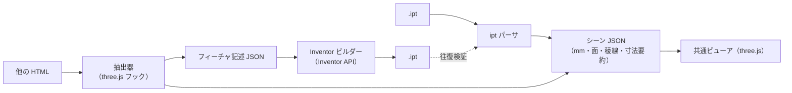

# アプリ構成案: ipt ビューア ＋ three.js → ipt 変換

## 1. 要件

1. **ipt ビューア**: .ipt を読み込み、自作の HTML アプリ上で three.js で描画する
2. **HTML 抽出・変換**: 他の HTML ファイルを読み込み、three.js で書かれた 3D モデル部分を抽出して表示し、.ipt に変換する

## 2. 全体構成

入力の違いは「シーン JSON」に変換する段階で吸収し、ビューアは 1 つにする。

## 3. 検証済みの根拠

| 要素 | 確認したこと |
|---|---|
| ipt → three.js 描画 | `python -m ipt_inspect <file>.ipt --viewer out.html` で描画。サンプル部品の形状・寸法が Inventor の画面と一致 |
| HTML からの抽出 | three.js r170 の `Scene` と `WebGLRenderer` は生成時に `__THREE_DEVTOOLS__` へ `observe` イベントを送る。これを HTML のスクリプトより先に用意すると、`window` に公開されていないシーンも捕捉できる |
| 寸法の復元 | 検証用 HTML から、`ExtrudeGeometry` の外形（直線・円弧）・穴 2 つ（R2.25）・押し出し量 2、`CylinderGeometry` の半径・高さ、`BoxGeometry` の 3 辺を取得できた |

## 4. 変換の忠実度は「three.js 側の作り方」で決まる

| three.js 側の形状 | 取り出せる情報 | Inventor 側で作れるもの |
|---|---|---|
| `BoxGeometry` / `CylinderGeometry` | 寸法、位置・回転 | スケッチ＋押し出し（正確、フィーチャ付き） |
| `ExtrudeGeometry`（`Shape`＋`holes`） | 外形・穴の曲線、押し出し量 | スケッチ＋押し出し（正確、フィーチャ付き） |
| `LatheGeometry` | 断面形状、回転角 | 回転フィーチャ（正確） |
| 三角形だけの `BufferGeometry`、glTF・STL の読み込み | 三角形のみ | メッシュの取り込み（多面体近似。円は多角形になる） |
| ブーリアン演算ライブラリで作った形状 | 結果の三角形（ライブラリによっては操作履歴も） | 個別に検討 |

- 位置・回転は各オブジェクトのワールド行列から得られるので、スケッチ平面と座標に変換する
- three.js の座標には単位がない。「1 = 1 mm」などの取り決めを設定として持つ
- 変換対象の HTML を自作するなら、上の表の上 3 行で形を作る規約にすると、変換の忠実度が最も高くなる

## 5. 制約と対策

- **.ipt の書き出しには Inventor（Windows・ライセンス）が必要。** ブラウザ単体では書けない。
  ブラウザはフィーチャ記述 JSON を出力し、Inventor 側のビルダー（iLogic ルールやアドイン）が読み込んで部品を作る。
- **ブラウザだけで .ipt を読むには、パーサを JavaScript に移植する。** 必要なのは OLE2 の読み取り・
  Zstandard の展開（JS 実装のライブラリがある）・SAB の解読。現在の Python 実装は、移植後の出力を照合する基準として使える。
- **対応している曲面は平面と円筒のみ。** 円錐・トーラス（曲線の稜線に付けたフィレット）・スプライン面は未対応なので、稜線だけが表示される。
- **他人の HTML は任意のスクリプトを含む。** `sandbox` 属性付きの iframe で実行し、差し込んだフックから
  `postMessage` で形状データだけを受け取る。

## 6. 段階計画（案）

| 段階 | 内容 | 完了の判定 |
|---|---|---|
| 1 | ipt ビューア（ドラッグ＆ドロップ）。パーサを JS に移植 | サンプルで Python 版と出力が一致する |
| 2 | HTML 抽出ビューア。フック・iframe 分離・プリミティブの認識 | 検証用 HTML の寸法をすべて復元できる |
| 3 | Inventor ビルダー。フィーチャ記述 → Inventor API → .ipt | 生成した .ipt を段階 1 のパーサで読み、元の寸法と一致する |
| 4 | 対応形状の拡大（円錐・トーラス・スプライン、回転、ブーリアン） | 形状ごとの検証用ファイルで一致する |
