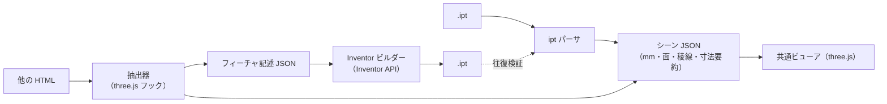

# アプリ構成: ipt ビューア ＋ three.js → ipt 変換

## 1. 要件

1. **ipt ビューア**: .ipt を読み込み、自作の HTML アプリ上で three.js で描画する
2. **HTML 抽出・変換**: 他の HTML ファイルを読み込み、three.js で書かれた 3D モデル部分を抽出して表示し、.ipt に変換する

### 決定事項

| 項目 | 決定 | 設計への影響 |
|---|---|---|
| 変換を実行する PC | Inventor がある | .ipt の書き出しは Inventor API を使うビルダーで行う |
| three.js の単位 | 1 = 1 mm | 抽出した座標をそのまま mm として扱う |
| 変換対象の HTML | 他の人が作ったものも含む | 任意のスクリプトを隔離して実行する。三角形しか持たない形状も必ず扱う前提にし、「正確に変換できる部品」と「近似になる部品」を画面で区別する |

## 2. 全体構成

入力の違いは「シーン JSON」に変換する段階で吸収し、ビューアは 1 つにする。

## 3. 検証済みの根拠

| 要素 | 確認したこと |
|---|---|
| ipt → three.js 描画 | ビューア（`Inventor部品ビューア/アプリ本体/ipt-viewer.html`）で描画。サンプル部品の形状・寸法が Inventor の画面と一致（段階 1 で実装済み） |
| HTML からの抽出 | three.js r170 の `Scene` と `WebGLRenderer` は生成時に `__THREE_DEVTOOLS__` へ `observe` イベントを送る。これを HTML のスクリプトより先に用意すると、`window` に公開されていないシーンも捕捉できる |
| 寸法の復元 | 検証用 HTML から、`ExtrudeGeometry` の外形（直線・円弧）・穴 2 つ（R2.25）・押し出し量 2、`CylinderGeometry` の半径・高さ、`BoxGeometry` の 3 辺を取得できた |

## 4. 変換の忠実度は「three.js 側の作り方」で決まる

| three.js 側の形状 | 取り出せる情報 | Inventor 側で作れるもの |
|---|---|---|
| `BoxGeometry` / `CylinderGeometry` | 寸法、位置・回転 | スケッチ＋押し出し（正確、フィーチャ付き） |
| `ExtrudeGeometry`（`Shape`＋`holes`） | 外形・穴の曲線、押し出し量 | スケッチ＋押し出し（正確、フィーチャ付き） |
| `LatheGeometry` | 断面形状、回転角 | 回転フィーチャ（正確） |
| 三角形だけの `BufferGeometry`、glTF・STL の読み込み | 三角形のみ | メッシュの取り込み（多面体近似。円は多角形になる） |
| ブーリアン演算ライブラリで作った形状 | 結果の三角形（ライブラリによっては操作履歴も） | 個別に検討 |

- 位置・回転は各オブジェクトのワールド行列から得られるので、スケッチ平面と座標に変換する
- three.js の座標には単位がない。「1 = 1 mm」などの取り決めを設定として持つ
- 変換対象の HTML を自作するなら、上の表の上 3 行で形を作る規約にすると、変換の忠実度が最も高くなる

## 5. 制約と対策

- **.ipt の書き出しには Inventor（Windows・ライセンス）が必要。** ブラウザ単体では書けない。
  ブラウザはフィーチャ記述 JSON を出力し、Inventor 側のビルダー（iLogic ルールやアドイン）が読み込んで部品を作る。
- **解析処理は JavaScript 版（`app/src/ipt/`）と Python 版（`ipt_inspect/`）の 2 つがある。** JS 版はアプリ本体、
  Python 版は正解データ（`tests/fixtures/`）を作る参照実装。両者の出力の一致を `npm test` で検証する。
  対応形状を増やすときは両方に手を入れる必要があるため、JS 版だけで十分に検証できる段階になったら
  Python 版を退役させ、二重管理を解消する。
- **対応している曲面は平面・円筒・円錐。** 稜線は直線・円弧に加え、面どうしの交線（B スプライン）にも対応する。
  トーラス（曲線の稜線に付けたフィレット）・スプライン面は未対応なので、稜線だけが表示される。
- **他人の HTML は任意のスクリプトを含む。** `sandbox` 属性付きの iframe で実行し、差し込んだフックから
  `postMessage` で形状データだけを受け取る。

## 6. 段階計画

| 段階 | 内容 | 完了の判定 |
|---|---|---|
| 1 ✅ | ipt ビューア（ドラッグ＆ドロップ）。パーサを JS に移植 | サンプルで Python 版と出力が一致する（`npm test`） |
| 2 ✅ | HTML 抽出ビューア。フック・iframe 分離・形状認識 | 検証用 HTML の寸法を復元できる（丸刃を除く。§8） |
| 3 🟡 | Inventor ビルダー。変換データ → Inventor API → .ipt / .iam | 実物の Inventor での初回実行で、全部品の体積・表面積・外形が期待値と一致する（代替オブジェクトでは確認済み。§9） |
| 4 🟡 | 対応形状の拡大（円錐・トーラス・スプライン、回転、ブーリアン） | 形状ごとの検証用ファイルで一致する（ビューアは円錐・トーラス・交線の B スプラインまで対応。§7・§12） |
| 5 ✅ | 組立（.iam）と STEP の表示。部品表・材質と質量 | .iam の配置が同じ組立の STEP と一致し、STEP の部品が同じ部品の .ipt と一致する（§12） |

## 7. 段階 1 の実装と評価

- **構成**: `app/src/ipt/`（解析）→ `app/src/viewer/`（三角形分割・3D 表示・説明文）→ `app/src/ui/panel.js`・`main.js`（画面）。
  `npm run build` で 1 つの HTML（`Inventor部品ビューア/アプリ本体/ipt-viewer.html`）にまとめる。three.js は CDN、それ以外は同梱。
- **評価関数**（`npm test`）
  - 解析結果（ファイル構造・セグメント・形状要約・シーン）が Python 版の正解データと 1e-6 mm 以内で一致する
  - 三角形分割の面積が寸法から計算した厳密値と一致する（全表面積 388.847 mm² に対し厳密値 388.883 mm²、誤差 −0.009%）
  - 全ての三角形の向きが面の法線と揃っている
  - 忠実度（`app/test/ipt-fidelity.test.mjs`、samples/ipt の全ファイル）: 面ごとの分割をつなぐと閉じたソリッドになる
    （全ての辺がちょうど 2 枚の三角形に逆向きで使われる。隙間・はみ出し・重なりがない）、体積が正、
    円筒・円錐の三角形が解析曲面の上にある、体積が「端面の面積 × 厚さ」や寸法から求めた厳密値と一致する、
    ねじ・穴・外径・円錐がファイル名とサムネイルから読み取れる値と一致する
- **曲面の三角形分割**（`app/src/viewer/tessellate.js`）: 円筒・円錐は展開図（角度 θ × 高さ h）の上で、境界ループ（隣の面と共有する
  稜線の点列）に沿って分割する。軸を 1 周するループは、穴や母線に沿う辺を避けた継ぎ目で切り開く。earcut の結果を辺の入れ替えで
  制約付き Delaunay 分割に直してから、θ の幅が π/32 を超える内側の辺だけを二等分する（境界の辺は分けないので、面どうしに隙間ができない）。
  円筒・円錐は母線に沿って真っすぐなので、Delaunay 分割の前に h を縮め、上下の境界をジグザグに結ぶ分割を選ばせる
  （A1 の三角形は 131,566 → 3,770。分割にかかる時間は 1 ファイル 60 ms 以下）
- **ブラウザでの動作確認**: 起動時のサンプル表示、ボタン・ドラッグ＆ドロップでの読み込み（日本語のファイル名を含む）、
  ipt 以外のファイルでのエラー表示、3D ⇄ パネルの強調の連動、ライト・ダーク両テーマで、コンソールエラーがないことを確認した。

## 8. 段階 2 の実装と評価

### 分かったこと: 実際の HTML は三角形を直接組み立てている

受け取った 2 つの HTML（LS-4 部品ビューア: three.js r180、スプール／リール組立: r160）は、形状の大半を
`BoxGeometry` などの標準クラスではなく、独自の関数（`revolve()`・`arcBlock()`・`buildBlade()` など）で三角形から組み立てていた。
そのため「形状クラスの寸法パラメータを読む」方法はほぼ使えず、**三角形の並びから形の種類と寸法を逆算する形状認識**を実装した。

### 仕組み

1. **取り出し**（`app/src/extract/`）: 元の HTML の `<head>` 直後にフックを差し込み、`sandbox="allow-scripts"` の iframe で動かす。
   three.js が生成時に送る `__THREE_DEVTOOLS__` の通知でレンダラーを捕まえ、画面に描いた最後のシーンを覚える。
   「この状態を取り込む」で、見えているメッシュ（頂点・三角形・ワールド行列）を `postMessage` で受け取る。
2. **下準備**（`recognize/mesh.js`）: 0.001 mm 以内の頂点を統合し、つながった塊ごとに分け、閉じた立体か（全ての辺を 2 枚の三角形が共有）を判定する。
   閉じていない面（床・刻印・半透明の警告表示など）は部品ではないとして除外する。
3. **回転体**（`recognize/revolve.js`）: 軸を仮定して各頂点を（高さ, 半径, 角度）に変換し、同じ（高さ, 半径）の点が 12 個以上の円を成すか、
   円どうしのつながりが 1 本の断面輪郭になるか、全ての三角形が隣り合う円の帯か扇形の端面に載っているかを確かめる。扇形の部分回転体も扱う。
4. **押し出し**（`recognize/prism.js`）: 三角形を「端面（最上段・最下段で平ら）」「側壁（軸と平行）」「斜面」に分ける。
   側壁を平面に投影すると線になるので、重なる頂点（柱）を側壁がつなぐ順にたどると断面の輪郭（外周＋穴）になる。
   端面の縁に**等距離の面取り**があってもよい（§10）。途中の高さに平らな面がある（段付き）場合は対象外。
5. **断面の分解**（`recognize/segments.js`）: 曲がりが小さく等間隔に続く区間を円弧の候補にし、円に当てはまるかを確かめる。
   正六角形のように頂点が同じ円周に並ぶ多角形を円と誤認しないよう、1 頂点あたりの曲がりが 15° 以下（円を 24 分割以上）のものだけを円弧とする。
6. 候補の軸は、部品自身の座標軸 → ワールドの X・Y・Z の順に試す（手続き的に作られた形状は自身の座標軸に沿うことが多い）。

### 評価（`npm test`）

期待値は各 HTML のソースに書かれた定数から導いた。

| 対象 | 認識結果 |
|---|---|
| スペーサー T10 / T50 | 回転体 φ240/φ200。T50 は逃がし溝の R2 を円弧 2 つとして復元（直線 12・円弧 2） |
| ゴムリング・紙管・ゴムスリーブ・鉄スプール | 回転体。外径・内径・長さ・面取りの数がソースと一致 |
| ベークライトフィンガー | 押し出し（八角形 560 × 20、長さ 10） |
| リール φ508（459 部品） | 全て正確: 段付き軸 10（回転体）、ボルト頭 8（六角柱）、扇形 48（部分回転体。角度はソースの π/2−0.10 などと一致）、直方体 393 |
| 組立 | 近似 0。拡径後のゴムスリーブ φ615/φ508 も復元 |
| 丸刃 | 押し出し＋面取り（§10）。外径 φ240・内径 φ200＋キー溝（幅 20・深さ 6）を厚み 5 で押し出し、穴の縁の両面に C1 |

加えて three.js 標準の `CylinderGeometry`・`BoxGeometry`・`LatheGeometry`・`TorusGeometry`・`ExtrudeGeometry` でも正しく認識できることを確かめている。
ブラウザでの動作（元のページの操作 → 取り込み、r160 / r180 の両方、ライト・ダーク）も確認した。

### 限界と次の改善候補

- **段付きの押し出し**・幅と深さが違う面取り・丸い面取り（R）は未対応（近似になり、理由を表示する）
- `ExtrudeGeometry` を粗い分割（`curveSegments` が 24 未満）で作った円は多角形として認識される。形状クラスが持つ曲線の定義（`parameters.shapes`）を取り出せば解消できる
- 軸が部品自身の座標軸にもワールドの軸にも沿っていない回転体は認識できない
- HTML が相対パスで読み込むファイル（テクスチャ・モデル）は、HTML 単体を開いた場合は読み込めない
- `InstancedMesh`（インスタンス描画）は未対応（除外として数える）
- Artifact（claude.ai）上での HTML 取り込みは、埋め込み先の制約により動作を確認できていない。手元のビューア（配布フォルダ）では動作する

## 9. 段階 3 の実装と評価

手順は [inventor-builder.md](inventor-builder.md)。

- **変換データ**（`app/src/export/`）: 部品ごとに、断面スケッチ（直線・円弧・円）、回転／押し出しの指定、
  取り込んだシーン内の配置、体積・表面積の期待値を持つ。同じ形の部品は 1 つにまとめる（リール 459 部品 → 25 種類）。
  float32 由来の誤差を丸めるので、断面の座標は設計値（101・−25・R2 の中心 112, 13 など）そのものになる。
- **ビルダー**（`ipt_build/`、Python + pywin32）: Inventor API で部品と組立を作り、次の 2 つで結果を確かめる。
  1. Inventor が計算した体積・表面積 ⇔ 期待値（断面からの厳密計算）
  2. 保存した .ipt を ipt_inspect で読み直した外形 ⇔ 変換データから計算した外形（ビルダーの単位の前提に頼らない確認）

### 評価

| 確認 | 方法 | 結果 |
|---|---|---|
| 変換データが元の形を表す | 元のメッシュの全頂点と、変換データから再構成した面との距離 | 最大 0.000015 mm |
| 期待値の正しさ | 厳密値の手計算（スペーサー 2π×21780 mm³、穴あき板）／メッシュの体積との比較（多角形近似の理論誤差内） | 一致 |
| 期待値の計算の独立性 | JS（アプリ）と Python（ビルダー）で別々に実装し、全部品で照合 | 一致（丸め幅 1e-6 以内） |
| ビルダーの描き方 | Inventor の代替オブジェクト上で作り、断面を折れ線にした数値計算（第 3 の方法）で体積・表面積を求めて照合 | 4 データの全部品で一致 |
| 評価の感度 | 描画の単位換算を抜くと検出される／期待値を誤った値にすると失敗する | 検出できた |
| アプリからビルダーまで | ブラウザで取り込み → 保存 → ビルダーのドライラン | 一致 |

### 残っている不確かさ

実物の Inventor で初めて確かめられること（列挙値、対称の押し出しの距離の解釈、組立の配置の向き）は
inventor-builder.md §5 に挙げた。いずれも照合（体積・表面積・外形）で「不一致」として現れるので、初回の実行結果で判別できる。

## 10. 面取り付き押し出し

丸刃（LS-4）のように、押し出した板の端面の縁を面取りした形を、「押し出し＋面取り（Inventor の面取りフィーチャ）」として扱う。

### 認識（`recognize/prism.js`）

1. 三角形を端面・側壁・斜面に分け、側壁から断面の輪郭を求める（§8 の 4）
2. 輪郭ごとに、側壁の上端・下端の高さを調べる。端面まで届いていなければ、その縁は面取りされている（面取り量 a = 端面からの深さ）。
   高さが輪郭の一部だけ違う場合（一部だけの面取り・段）は対象外
3. 斜面の各頂点が、端面からの深さ t の位置で「輪郭を材料側へ a − t ずらした線」の上にあるかを確かめる（等距離の面取りなら必ず載る）
4. 輪郭の角から 2a 以内は、作り方（留め継ぎ・丸め・角度での再分割など）で形が変わるので照合から外し、
   その範囲での縁の位置の差の最大値を**角付近の差**として一覧に表示する

「輪郭を材料側へずらした線」（`recognize/geometry2d.js` の `offsetIntoMaterial`）は、直線は平行に、円弧は同心で半径を変えてずらし、
隣どうしを延長・切り詰めて交点で継ぐ（角は尖ったまま＝留め継ぎ。CAD の面取りと同じ）。ずらす量が大きいと短い部分は長さ 0 になって
消えるので、消える距離（事象）を二分法で求め、両隣を直接継ぐ。

### 丸刃で分かったこと

元の HTML は、面取りの外側の輪郭を「内径の輪郭の式を 1 mm 大きくして、同じ 0.25° 刻みで再サンプリング」して作っている。
このため、キー溝の角付近（角から 2 mm 以内、全頂点の 1%）だけは、面取り面が CAD の留め継ぎとわずかに違う
（縁の位置の差 最大 0.147 mm。パターン A・厚み 15 では 0.253 mm）。変換後は CAD 標準の面取りになる。
また、キー溝の幅 20 の側壁と R0.5 は 0.25° 刻みでは 1〜2 点しか無く、元のメッシュ自体が角を 0.26 mm ほど切り落とした折れ線になっている。
変換はこの折れ線（メッシュ）に忠実に行い、設計値（尖った角・R0.5）の推測はしない。

### 体積・表面積の期待値

- 削られる体積 = ∫₀ᵈ（ずらし量 s で端面から削られる面積）ds。削られる面積は事象の間では滑らかなので、事象で区切って
  8 点のガウス＝ルジャンドル則で積分する
- 表面積は、端面から削られた面積を引き、45° の面取り面（端面に投影した面積の √2 倍）を加え、側壁を縁の長さ × d だけ短くする
- ビルダー（Python）は、輪郭を 1 周 16384 分割の折れ線にして多角形の留め継ぎを進める**別の方法**で計算し直す
  （頂点は事象の間では直線的に動くので、面積の 2 次式を厳密に積分できる）

### 評価

| 確認 | 結果 |
|---|---|
| ずらした輪郭の面積 | 正方形・円・角 R の長方形・角を切り落とした正方形（途中で辺が消える）を、外周・穴の両方で手計算の式と照合し一致（1e-9） |
| 削られる体積 | 円の穴・外周は π(R d² ± d³/3) と一致。辺が途中で消える形は、式を数値積分した値と一致 |
| 丸刃の認識 | ソースの定数（φ240・φ200・溝の底まで 106・溝幅 20・厚み 5・C1）と一致。外周の縁は面取りなし |
| 一般性 | three.js の `ExtrudeGeometry` の bevel（直線の面取り）を、外周と穴の両面 C1 として認識（角の差 0）。幅と深さが違う面取り・丸い面取りは近似として理由を表示 |
| 元の形との一致 | 角の範囲の外（全頂点の 99%）で、再構成した面との距離 0.000006 mm。全体でも表示した角付近の差を超えない |
| 期待値 | 元のメッシュの体積と 1.4e-5 以内で一致。JS（厳密）と Python（折れ線）の値が相対 5e-11 で一致 |
| ビルダー | 代替オブジェクト上で、穴の縁の稜線を両方の端面から過不足なく選び、1 つの面取りフィーチャ（0.1 cm）にまとめる。体積・表面積が一致 |
| 評価の感度 | 消える辺を扱わない・材料側を逆にする・面取りの単位換算を抜く・端面の向きを無視する・ループの一部だけ選ぶ、の各誤りを検出できた |

## 11. 配布フォルダ・起動ファイル・起動画面

### 配布フォルダ

使う人が迷わないよう、直下は起動ファイルと「アプリ本体」フォルダだけにする（`npm test` で確かめる）。
Python のコード（ビルダー・解析ツール）と表示名（`labels.json`）は「アプリ本体」を唯一の置き場とし、
開発用の評価（`tests/`）はそこを import パスに加えて使う（コピーを二重に持たない）。ビューアは `npm run build` がここに書き出し、
現在のソースから作ったものと一致するかを `npm test` で確かめる。

### 起動の仕組み（VBS → bat → HTML・Python）

アプリ本体は HTML・JavaScript・CSS（ビューア）と Python（Inventor の操作）で作る。HTML だけでできることは HTML で行い、
Python は Inventor の操作（COM）にだけ使う。Python はコマンドプロンプト経由で動くので起動処理は bat が担い、
bat ではできない「黒い画面を出さない」ことだけを VBS が受け持つ。

| ファイル | 役割 |
|---|---|
| `Inventor部品ビューア.vbs` | `アプリ本体\起動.bat` を画面を出さずに実行し、ドロップされたファイルをそのまま渡すだけ（十数行） |
| `アプリ本体\起動.bat` | 振り分け: 引数なし・.ipt・.html → ビューアを開く／.json → Python で部品を作る／Python が無い → ビューアで案内 |
| `アプリ本体\ipt-viewer.html` | ビューア（HTML 単体で動く。Python は不要） |
| `アプリ本体\ipt_build`（`--gui`） | 作る前の確認はダイアログ、進み具合と結果は HTML のページ（`<名前>_ipt\作成結果.html`）で示す |

- VBScript が使えない環境では `起動.bat` を直接ダブルクリック・ドロップすればよい（黒い画面が出るだけで、動きは同じ）
- ブラウザーのページは、ドロップされたファイルをパスから直接は読めない。bat はビューアの複製を一時フォルダ
  （`%TEMP%\ipt-viewer`、1 日たつと消す）に作り、その末尾に「ファイルの名前と中身を certutil で Base64 にした script」を
  付け足して開く（アプリの処理は type="module" なのでページを読み終えてから動き、付け足した script はそれより先に動く）。
  名前は `cmd /u` で UTF-16 の文字として書き出してから Base64 にするので、どんな文字の名前でも崩れない。
  ブラウザーの安全設定（ローカルファイルの読み取り許可）を緩める方法は採らない（取り込んだ他人の HTML からも読めてしまうため）
- 複数のファイルは 1 つのウィンドウにまとめ、ビューアの起動画面の「受け取ったファイル」から切り替える
- ビューアは Edge のアプリ画面（アドレスバーの無いウィンドウ）で開く。Edge が無いとき、一時フォルダのパスに # があるとき
  （URL では意味が変わる）は既定のブラウザーで開く
- bat の実行する行は英数字だけで書き、日本語は注記だけにする（Windows の文字コードの設定に左右されない）。
  利用者への知らせはビューア（HTML）と Python（ダイアログ・HTML）が出す
- 文字コード: VBS は UTF-16（BOM 付き、Windows Script Host が日本語を読める形式）、bat は UTF-8（BOM なし）。
  どちらも CRLF で、git では変換しない（`.gitattributes`）

評価（`node app/test/launcher-wine.mjs`）は Wine で VBS と bat を実行する。Wine（9.0）で動かない部分だけを差し替えた検証用の
コピーを使う: VBS は日本語の文字列を UTF-16 のテキストから読み、MsgBox と shell.Run を記録する。bat は certutil と `cmd /u` の
結果（certutil と同じ形式の Base64）を検証側で用意し、ブラウザーの起動を記録し、Python を終了コードを返す代わりのコマンドにする。
作ったページは Chromium で開いて確かめる。確かめたこと（21 項目、全て合格）:

| 確認 | 内容 |
|---|---|
| VBS | 起動.bat を画面を出さずに（style 0）待たずに実行し、ファイルをそのまま渡す。起動.bat が無ければ理由を示す |
| ビューアを開く | 一時フォルダの複製を Edge のアプリ画面で 1 つ開く（空白・かっこを含む場所の URL のまま開ける）。Edge が無い・# を含む場所なら既定のブラウザー |
| ドロップしたファイル | .ipt・.html（名前に # & ' 空白・かっこ・日本語）・対応外・フォルダ → ページ 1 つに 3 件。ビューアは最初の .ipt を開き、2 件を一覧に並べ、対応外を知らせる。読めなかったファイルは前のファイルの内容を混ぜずに「受け取れなかった」と知らせる |
| 変換データ | アプリ本体で `py -3 -m ipt_build --gui` を実行（3.10 以上を確認）。Python が無ければ py・python の順に探し、ビューアで入れ方を案内する |

Windows でしか確かめられないこと: UTF-16 の VBS の読み込み（Windows Script Host の仕様）、certutil と `cmd /u` の実際の出力、
Edge の `--app` での表示、Python の確認ダイアログ（tkinter）。

作業中に、Wine と Windows で動きが違う書き方を避けた（どちらでも同じ意味になる書き方にした）:
`A && B` の連鎖は `if errorlevel` の分岐に、引数は For Each ではなく番号で回す、パス → URL の変換は遅延展開を使わない。
また、ファイルを読めなかったときに前のファイルの結果が混ざる欠陥を見つけて直した（ファイルごとに作業用のファイルを空にする）。

### Inventor で部品を作る（画面つき、`ipt_build --gui`）

作成の中核（接続 → 部品ごとの作成と照合 → 組立 → 結果の保存）を `runner.py` にまとめ、表示の仕方と切り離した
（コマンドは 1 行ずつ表示、画面つきは HTML のページ）。画面つきの流れ:

1. 変換データを読み、ダイアログで確かめる（部品の数・配置・保存先）
2. pywin32 が無ければ、入れるかをダイアログで確かめ、pip で入れてから新しい Python で続ける（入れたライブラリを読み込むため）
3. 進み具合と結果を `作成結果.html` に書いてブラウザーで開く。作成中は 2 秒ごとに自動で読み直し、部品ごとに
   一致（緑）・不一致（琥珀）・失敗（赤）・作成中（青）・待ち（灰）を示す。書き換えは置き換えで行い、途中の内容を読ませない

評価（`tests/test_gui.py`、10 件）: 作る前の確認・取りやめ（何も残さない）・pywin32 を入れる／入れない／入れられない・
入れた後の再実行（確認を省き、開いたページを使う）・変換データの誤り・Inventor に接続できない、の各場合のページの内容。

### 起動画面（モーダル）

`<dialog>` を使う（Esc・背景のクリック・× で閉じる。フォーカスは「ファイルを選ぶ」から始まる）。
情報は重要度の順に置く: 主な操作（ファイルを開く・大きな受け口）→ 次の選択肢（サンプル）→ 全体の見通し（変換の 4 段階）。
ファイルを開くと閉じ、「サンプル・使い方」でいつでも開き直せる。起動ファイルから開いたときは出さない。

- ドラッグ中は、起動画面が開いていればその受け口を、閉じていれば画面全体の案内を強調する
- 複数のファイルを受け取ったときは、.ipt・.html の最初の 1 つを開き、起動画面の「受け取ったファイル」に並べる（表示中に印）。
  件数と一覧の場所を知らせる（誤りの赤ではなく知らせの青）
- 起動ファイルから Python が見つからないと知らされたときは、起動画面の最上段に入れ方を示す
- 変換データ（.json）はビューアでは開かず、起動ファイルへのドロップを案内する
- 何も開いていないときは、3D の場所に「ファイルが開かれていません」と開き方を示し、仕様パネルの項目は出さない

ブラウザでの確認（ヘッドレス Chromium、1728×1152・表示倍率 1.25、ライト・ダーク）: 起動画面 25 項目、既存の ipt 19・HTML 17・変換 11 項目、全て合格。

## 12. 組立（.iam）と STEP

### 何を表示するか

| 入力 | 読むもの | 表示 |
|---|---|---|
| .iam | 参照ファイル・出現名・配置（[iam-format.md](iam-format.md)）。部品の形状は参照先の .ipt から | 組立全体、部品表、見つからない部品 |
| STEP（.stp・.step） | 部品の B-rep・組立の配置・単位・材質と密度（AP214） | 部品が 1 つなら部品の表示、2 つ以上なら組立の表示 |

- **シーンの形をそろえる**: .iam と STEP はどちらも `{ parts: [{ name, bodies, material, density }], instances: [{ part, name, matrix }] }` にする。
  部品の面は .ipt と STEP で同じ中立な形（面・ループ・稜線）にし、寸法の要約（`summarizeFaces`）と三角形分割を共用する
- **部品ごとに 1 回だけ分割する**: 同じ部品の形状（面をまとめた 1 つの BufferGeometry と稜線）を作り、配置の数だけ行列で置く（39 か所でも分割は 10 回）
- **部品表**: 組立の中で最初に現れた順。行 = 番号・部品名・数・外形・材質・質量。行にカーソルを合わせると 3D の該当部品を強調し、
  押すとその部品を部品の表示で開く（「組立に戻る」で戻る）。質量は表示用の三角形から求めた体積 × 密度（iProperties・STEP の材質）
- **見つからない部品**（.iam のみ）: 部品表では橙の印で示し、別の節に保存先のパスとともに挙げる。その .ipt をドロップすると組立に加わる
  （表示中の組立を開き直す）。起動ファイルに .iam をドロップすると、同じフォルダの .ipt も一緒に送る
- **稜線は面と面の境界だけを描く**: STEP の閉じた曲面（穴の円筒・円錐など）は、角度の切れ目に「継ぎ目」の稜線を持つ
  （同じ面が 2 回使う）。面の境界ではないので描かない（位相の数には数える）。.ipt（SAB）の面には継ぎ目が無い
- **判断: .iam・STEP の読み取りは JS だけに置く**。Python 版（`ipt_inspect`）の役割はビルダーが作った .ipt の確認で、組立や STEP は読まない。
  JS 版の正しさは、Python との一致の代わりに**形式をまたいだ照合**で確かめる（.iam の配置 ⇄ STEP の配置、STEP の部品 ⇄ 同じ部品の .ipt）

### 三角形分割で直したこと（STEP のボルトで分かった）

Content Center のボルト（JIS B 1176）の六角穴の底（円錐の先端を含む面）が閉じず、分割が終わらないこともあった。原因は 4 つで、どれも形式によらない。

| 原因 | 対策（`app/src/viewer/tessellate.js`） |
|---|---|
| 展開図（θ, h）は円錐の先端で特異（先端の高さの直線全体が 3D の 1 点に潰れる）。先端のまわりの細い三角形が 3D で裏返り、重なる | 先端を含む面は、軸に垂直な平面への正射影 (ρcosθ, ρsinθ) の上で分割する（`apexCone`）。正射影は線形なので、平面で向きがそろい重ならない分割は 3D でも同じ。先端は内部の点（earcut の Steiner 点）として加え、継ぎ目の母線（先端と縁を往復する辺）はループから除く |
| earcut は耳が見つからなくなると、一直線に並ぶ境界の点を省いてやり直す（内部の点を加えたときに起きる）。六角穴の縁は正射影で直線になる | 省かれた境界の点を、その点を通る境界の辺を持つ三角形に扇形に分け入れて戻す（`triangulate`。平面・曲面で共用） |
| 細分の目安を三角形ごとに緩める（粗い境界の辺の 3/4）と、隣の三角形と分ける辺が食い違い、辺の途中に点が浮く（隙間）。分け直しの応酬で終わらない | 緩めた目安は辺ごとに記録して両側で使う。中点のできた辺は反対側でも同じ中点で分ける（先に出力した三角形も分け直す） |
| 分けるべき辺そのものを分けると、長い辺を残したまま 3 つ目の点が同じ位置に近づき続ける（不動点） | 分けるべき辺を持つ三角形は、境界以外で最も幅の広い辺で分ける（最長辺の二等分） |

安全弁として、1 面の点が 20 万に達したら目安による分割をやめる（中点のある辺の分け直しだけ続けるので、必ず終わり、隙間も残らない）。
評価では 1 面の三角形を 1 万以下（サンプルの最大は約 2,000）とし、安全弁に頼らず自然に終わることを確かめる。

トーラス（ボルトの首下などの丸み）は展開図 (θ, φ) の両方向が周期的な面として分割する。管のまわりは π/8 刻み（弦の誤差は管の半径の 1.9%）。

### 評価（`app/test/assembly.test.mjs`・`tessellate.test.mjs`・`ipt-fidelity.test.mjs`）

| 対象 | 確かめること |
|---|---|
| STEP の書式 | 複合エンティティ・UTF-16 の文字列・行をまたぐ文字列、単位（長さ・角度）、材質と密度（g/cm³ → g/mm³） |
| STEP の稜線 | 描く稜線は全て、ちょうど 2 つの面の境界（継ぎ目を描かない）。ボルトの軸・頭は全周の円筒（分かれた円弧を足して 360°） |
| STEP の部品（10 種類） | 閉じたソリッドとして描ける（全ての辺が逆向きの 2 枚の三角形に 1 回ずつ使われる）、体積が正、曲面からの離れが設計上の弦の誤差の 2.5 倍以内、1 面の三角形が 1 万以下 |
| STEP ⇄ .ipt（8 部品） | 外形・座標の範囲・円筒・円錐・面の数・種数・材質・密度が一致、体積の差が外接箱の体積の 0.2% 以内 |
| 配置の正しさ（形から独立に） | ボルト 20 本の軸が、組み付け先の部品の穴の軸と一直線になる |
| .iam ⇄ STEP | 参照 10・出現 39 の名前・並び・部品・配置が一致（配置の差 1e-9 mm 以内。実測 5.1e-13 mm） |
| .iam の部品の解決 | samples/ipt から 8 種類を見つけ、Content Center のボルト 2 種類（18 本・2 本）を「見つからない」とする。質量の合計は「除く」と示す |
| 三角形分割の性質（合成した面） | 一直線に並ぶ境界の点を全て使う。先端を含む円錐（.ipt の形・STEP の形）の面積が厳密値と一致し、境界は縁だけ。六角穴の底で境界の点を全て使い、細分が自然に終わる |

曲面からの離れの許容は、分割の刻み（`STEPS`）から求める設計上の弦の誤差（軸のまわり π/32、トーラスの管のまわり π/8）の 2.5 倍。
ただし境界の折れ線（隣の面と共有する稜線の点列）がそれより粗い面は、その粗さの弦の誤差を基準にする（分割は境界の点を変えないため）。

### 残っている限界

- **B スプラインの稜線の点の数**: ノットの区間ごとに 4 分割（Python 版と共通）。六角穴の縁（区間 1 つの有理 B スプライン）は 1 区間が
  軸のまわり最大 0.26 rad になり、その弦は円錐の面から最大約 12 µm 離れる（M4 の六角穴）。見た目には分からないが、
  隣の面の曲がり具合に合わせて点を足すには、稜線の分割で両側の面を考える必要がある（JS 版・Python 版の両方の変更）
- **未対応の面**: 球（STEP では読むが分割しない）・B スプライン曲面などは稜線だけを描く
- **.iam**: 拘束・抑制・サブアセンブリ・パターンは未確認（[iam-format.md](iam-format.md) §8）
- **円筒の角度（sweep）**: 同じ円の上の円弧を足して数える（STEP は 1 周の円を頂点で分けて持つことがある。.ipt の結果は変わらない）

ブラウザでの確認（ヘッドレス Chromium、1728×1152・表示倍率 1.25）: .iam・STEP のサンプルを開く、部品表の行で強調、
行から部品を開く・組立に戻る、見つからない部品の一覧、ボルトの部品表示（首下のトーラス、六角穴と底の円錐、継ぎ目の線が出ないこと）。
コンソールエラーなし。組立の表示までの時間は、.iam（部品 8 種類の .ipt の解析を含む）約 2 秒、STEP 約 1.2 秒（待ち時間を含む）。
