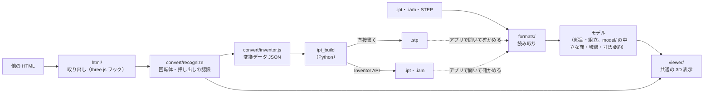
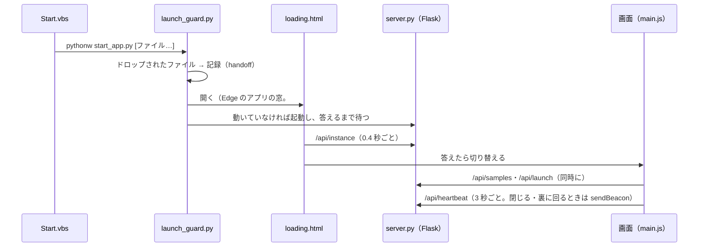
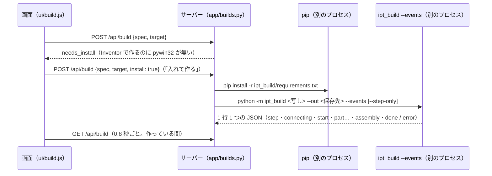
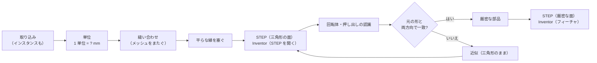

# アプリ構成: Inventor 3Dツール（表示 ＋ three.js → STEP・Inventor 変換）

## 1. 要件

1. **表示**: .ipt（当初の対象）・.iam・STEP を読み込み、自作の HTML アプリ上で three.js で描画する
2. **HTML 抽出・変換**: 他の HTML ファイルを読み込み、three.js で書かれた 3D モデル部分を抽出して表示し、.stp・.ipt・.iam に変換する。
   その過程の制約はできるだけ無くす（§13）
3. **1 つのアプリ**: 表示と変換を同じ画面・同じ「モデル」でまとめる（将来、表示したモデルそのものの変換も同じ流れに載せる）

### 決定事項

| 項目 | 決定 | 設計への影響 |
|---|---|---|
| 変換を実行する PC | Inventor があるとは限らない | STEP はアプリが直接書く（Inventor 不要）。.ipt・.iam は Inventor API を使うビルダーで作る（[cad-output.md](cad-output.md)） |
| three.js の単位 | HTML ごとに違う（1 = 1 mm・1 = 1 m・独自の縮尺） | 大きさから推定し、実寸の全体の大きさを示して利用者が選ぶ（HTML ごとに覚える。§13） |
| 変換対象の HTML | 他の人が作ったものも含む | 任意のスクリプトを隔離して実行する。三角形しか持たない形状も必ず扱う前提にし、「正確に変換できる部品」と「近似になる部品」を画面で区別する |

## 2. 全体構成

入力の違いは「モデル」（`program/app/static/js/formats/open.js`）に読み込む段階で吸収し、表示（`viewer/`）と変換（`convert/`）は 1 つにする。
三角形しか持たない HTML の形状だけは、iframe で動かして取り出し（`html/`）、認識してから変換する。

### ソースの構成と依存の向き（`program/app/static/js/`）

依存は「画面 → 表示・変換 → モデル → 読み取り → 基礎」の一方向にし、DOM に依存しない層（`core/`・`formats/`・`model/`・`convert/`）は
Node のテストでそのまま確かめる。

| 層 | 役割 |
|---|---|
| `core/` | ベクトル・行列・数値の道具、表示名（`labels.json`） |
| `formats/` | 形式ごとの読み取り（`ipt/`・`iam/`・`step/`）と、入口 `open.js`（形式の判定・モデルへの読み込み・利用者に見せる説明） |
| `model/` | 形式によらない面・稜線: 曲線の計算とサンプリング（`curves.js`）、寸法の要約（`summary.js`）、表示用の面（`scene.js`） |
| `html/` | three.js の HTML を隔離した iframe で動かし、表示中の形状を取り出す |
| `convert/` | 単位（`units.js`）、メッシュの認識（`recognize/`: 立体に閉じる `shells.js`・回転体・押し出し・元の形との照らし合わせ・自己交差 `intersect.js`）と変換データ（`inventor.js`）、変換データの 3D 表示と説明（`preview.js`） |
| `viewer/` | 三角形分割・3D 表示・面と部品の説明 |
| `ui/`・`server.js`・`main.js` | 仕様パネル・起動画面・ファイルの受け付け・変換の節・シーンの単位（`units.js`）・「CAD ファイルを作る」（`build.js`）、ローカルサーバーとのやりとり、全体の連動 |

### 統合の方針（表示したモデルの変換）

変換の入口はいま「HTML から認識した形状」だけ。表示したモデル（.ipt・STEP の B-rep）を変換するときは、
`formats/open.js` のモデルを受け取り、`model/` の面（平面・円筒・円錐）から押し出し・回転の断面を組み立てる処理を `convert/` に加え、
同じ変換データ（`convert/inventor.js` の形）を出す。ビルダー・画面の変換の節（`ui/convert.js`）はそのまま使える。

## 3. 検証済みの根拠

| 要素 | 確認したこと |
|---|---|
| ipt → three.js 描画 | アプリで描画。サンプル部品の形状・寸法が Inventor の画面と一致（段階 1 で実装済み） |
| HTML からの抽出 | three.js r170 の `Scene` と `WebGLRenderer` は生成時に `__THREE_DEVTOOLS__` へ `observe` イベントを送る。これを HTML のスクリプトより先に用意すると、`window` に公開されていないシーンも捕捉できる |
| 寸法の復元 | 検証用 HTML から、`ExtrudeGeometry` の外形（直線・円弧）・穴 2 つ（R2.25）・押し出し量 2、`CylinderGeometry` の半径・高さ、`BoxGeometry` の 3 辺を取得できた |

## 4. 変換の忠実度は「three.js 側の作り方」で決まる

| three.js 側の形状 | 取り出せる情報 | Inventor 側で作れるもの |
|---|---|---|
| `BoxGeometry` / `CylinderGeometry` | 寸法、位置・回転 | スケッチ＋押し出し（正確、フィーチャ付き） |
| `ExtrudeGeometry`（`Shape`＋`holes`） | 外形・穴の曲線、押し出し量 | スケッチ＋押し出し（正確、フィーチャ付き） |
| `LatheGeometry` | 断面形状、回転角 | 回転フィーチャ（正確） |
| 三角形だけの `BufferGeometry`、glTF・STL の読み込み | 三角形のみ | 回転体・押し出しなら認識して正確に。それ以外は三角形のまま（STEP を開いた立体。円は多角形になる） |
| ブーリアン演算ライブラリで作った形状 | 結果の三角形（ライブラリによっては操作履歴も） | 個別に検討 |

- 位置・回転は各オブジェクトのワールド行列から得られるので、スケッチ平面と座標に変換する
- three.js の座標には単位がない。HTML ごとに「シーンの 1 単位」を選ぶ（§13）
- 変換対象の HTML を自作するなら、上の表の上 3 行で形を作る規約にすると、変換の忠実度が最も高くなる

## 5. 制約と対策

- **.ipt・.iam の書き出しには Inventor（Windows・ライセンス）が必要。** 形式が非公開で、正しさを Inventor でしか確かめられないため
  （[cad-output.md](cad-output.md) §3）。ブラウザは変換データ（JSON）を出力し、ビルダー（Python）が Inventor API で部品を作る。
  **STEP は Inventor なしで作れる**（公開の規格。ビルダーが直接書く。§13）
- **解析処理は JavaScript（`formats/`）の 1 つだけ。** 当初は Python 版（`ipt_inspect`）もあり、両者の出力の一致で
  JS 版を検証していたが、対応形状を増やすたびに両方へ同じ変更が要るため退役させた（二重管理の解消）。退役の条件は
  「JS 版だけで十分に検証できること」で、次の評価がそれを担う: 形状の忠実度（閉じたソリッド・厳密な体積・ねじ・円錐）、
  STEP・.iam との形式をまたいだ照合、E_Plate の位相・穴の位置、SAB の参照の型の網羅検証、稜線と位相の連続性（`ipt-format.test.mjs`）。
  ビルダーが Python 版で行っていた「保存した .ipt の外形の確認」は、Inventor の `PreciseRangeBox` による確認に替えた（§9）。
  形式の調査に使う中身の書き出しは `npm run inspect -- FILE --dump DIR`（`program/tools/inspect.mjs`）
- **対応している曲面は平面・円筒・円錐・トーラス。** 稜線は直線・円弧に加え、面どうしの交線（B スプライン）にも対応する。
  スプライン面・球は未対応なので、稜線だけが表示される。
- **他人の HTML は任意のスクリプトを含む。** `sandbox` 属性付きの iframe で実行し、差し込んだフックから
  `postMessage` で形状データだけを受け取る。

## 6. 段階計画

| 段階 | 内容 | 完了の判定 |
|---|---|---|
| 1 ✅ | ipt ビューア（ドラッグ＆ドロップ）。パーサを JS に移植 | サンプルの解析が正しい（当時は Python 版との一致、いまは JS の評価で確かめる。§5） |
| 2 ✅ | HTML 抽出ビューア。フック・iframe 分離・形状認識 | 検証用 HTML の寸法を復元できる（丸刃を除く。§8） |
| 3 🟡 | Inventor ビルダー。変換データ → Inventor API → .ipt / .iam | 実物の Inventor での初回実行で、全部品の体積・表面積・外形が期待値と一致する（代替オブジェクトでは確認済み。§9） |
| 4 🟡 | 対応形状の拡大（円錐・トーラス・スプライン、回転、ブーリアン） | 形状ごとの検証用ファイルで一致する（ビューアは円錐・トーラス・交線の B スプラインまで対応。§7・§12） |
| 5 ✅ | 組立（.iam）と STEP の表示。部品表・材質と質量 | .iam の配置が同じ組立の STEP と一致し、STEP の部品が同じ部品の .ipt と一致する（§12） |
| 6 ✅ | 1 つのアプリへの整理（Inventor 3Dツール）。読み取りの入口をモデルに統一、Python の解析を退役 | 全ての評価が JS の 1 実装で通る（§2・§5） |
| 7 ✅ | ほかのアプリと同じ形（Start.vbs ＋ program、Flask）へ。ビルドと Node.js を不要に | 通しの評価（本物の起動の係とサーバー）とブラウザーでの確認（§11） |
| 8 ✅ | 「Inventor で作る」をアプリの中に。変換データ（.json）もアプリで開いて 3D で確かめ、同じボタンで作る | 本物の別のプロセスで作る評価（Inventor は代替オブジェクト）とブラウザーでの確認（§11） |
| 9 ✅ | 制約を減らす: 単位・インスタンス描画・開いた面（継ぎ目の刻みの違いを含む）・元の形との照らし合わせ。STEP を Inventor なしで書き、近似の部品も出力する | サンプル 10 件の取り込み・3 つの独立した STEP の確かめ（自作・OpenCascade・アプリの読み取り）・誤りを入れた感度の評価（§13） |

## 7. 段階 1 の実装と評価

- **構成**: `formats/ipt/`（解析）→ `viewer/`（三角形分割・3D 表示・説明文）→ `ui/panel.js`・`main.js`（画面）。
  サーバー（§11）が分割したまま配り、ブラウザがそのまま読む。three.js・fzstd は同梱（`static/vendor`）。
- **評価関数**（`npm test`）
  - 解析結果: E_Plate の位相（面 12・稜線 28・頂点 20）・外形・穴の位置・R、SAB の参照が全てスロットに合う型を指す、
    稜線の点列が頂点と一致しループが途切れない、形状の単位が 1 = 10 mm（`tests/js/ipt-format.test.mjs`）
  - 三角形分割の面積が寸法から計算した厳密値と一致する（全表面積 388.847 mm² に対し厳密値 388.883 mm²、誤差 −0.009%）
  - 全ての三角形の向きが面の法線と揃っている
  - 忠実度（`tests/js/ipt-fidelity.test.mjs`、samples/ipt の全ファイル）: 面ごとの分割をつなぐと閉じたソリッドになる
    （全ての辺がちょうど 2 枚の三角形に逆向きで使われる。隙間・はみ出し・重なりがない）、体積が正、
    円筒・円錐の三角形が解析曲面の上にある、体積が「端面の面積 × 厚さ」や寸法から求めた厳密値と一致する、
    ねじ・穴・外径・円錐がファイル名とサムネイルから読み取れる値と一致する
- **曲面の三角形分割**（`viewer/tessellate.js`）: 円筒・円錐は展開図（角度 θ × 高さ h）の上で、境界ループ（隣の面と共有する
  稜線の点列）に沿って分割する。軸を 1 周するループは、穴や母線に沿う辺を避けた継ぎ目で切り開く。earcut の結果を辺の入れ替えで
  制約付き Delaunay 分割に直してから、θ の幅が π/32 を超える内側の辺だけを二等分する（境界の辺は分けないので、面どうしに隙間ができない）。
  円筒・円錐は母線に沿って真っすぐなので、Delaunay 分割の前に h を縮め、上下の境界をジグザグに結ぶ分割を選ばせる
  （A1 の三角形は 131,566 → 3,770。分割にかかる時間は 1 ファイル 60 ms 以下）
- **ブラウザでの動作確認**: 起動時のサンプル表示、ボタン・ドラッグ＆ドロップでの読み込み（日本語のファイル名を含む）、
  ipt 以外のファイルでのエラー表示、3D ⇄ パネルの強調の連動、ライト・ダーク両テーマで、コンソールエラーがないことを確認した。

## 8. 段階 2 の実装と評価

### 分かったこと: 実際の HTML は三角形を直接組み立てている

受け取った 2 つの HTML（LS-4 部品ビューア: three.js r180、スプール／リール組立: r160）は、形状の大半を
`BoxGeometry` などの標準クラスではなく、独自の関数（`revolve()`・`arcBlock()`・`buildBlade()` など）で三角形から組み立てていた。
そのため「形状クラスの寸法パラメータを読む」方法はほぼ使えず、**三角形の並びから形の種類と寸法を逆算する形状認識**を実装した。

### 仕組み

1. **取り出し**（`html/`）: 元の HTML の `<head>` 直後にフックを差し込み、`sandbox="allow-scripts"` の iframe で動かす。
   three.js が生成時に送る `__THREE_DEVTOOLS__` の通知でレンダラーを捕まえ、画面に描いた最後のシーンを覚える。
   「この状態を取り込む」で、見えているメッシュ（頂点・三角形・ワールド行列）を `postMessage` で受け取る。
2. **下準備**（`recognize/mesh.js`）: 0.001 mm 以内の頂点を統合し、つながった塊ごとに分け、閉じた立体か（全ての辺を 2 枚の三角形が共有）を判定する。
   閉じていない面（床・刻印・半透明の警告表示など）は部品ではないとして除外する。
3. **回転体**（`recognize/revolve.js`）: 軸を仮定して各頂点を（高さ, 半径, 角度）に変換し、同じ（高さ, 半径）の点が 12 個以上の円を成すか、
   円どうしのつながりが 1 本の断面輪郭になるか、全ての三角形が隣り合う円の帯か扇形の端面に載っているかを確かめる。扇形の部分回転体も扱う。
4. **押し出し**（`recognize/prism.js`）: 三角形を「端面（最上段・最下段で平ら）」「側壁（軸と平行）」「斜面」に分ける。
   側壁を平面に投影すると線になるので、重なる頂点（柱）を側壁がつなぐ順にたどると断面の輪郭（外周＋穴）になる。
   端面の縁に**等距離の面取り**があってもよい（§10）。途中の高さに平らな面がある（段付き）場合は対象外。
5. **断面の分解**（`recognize/segments.js`）: 曲がりが小さく等間隔に続く区間を円弧の候補にし、円に当てはまるかを確かめる。
   正六角形のように頂点が同じ円周に並ぶ多角形を円と誤認しないよう、1 頂点あたりの曲がりが 15° 以下（円を 24 分割以上）のものだけを円弧とする。
6. 候補の軸は、部品自身の座標軸 → ワールドの X・Y・Z の順に試す（手続き的に作られた形状は自身の座標軸に沿うことが多い）。

### 評価（`npm test`）

期待値は各 HTML のソースに書かれた定数から導いた。

| 対象 | 認識結果 |
|---|---|
| スペーサー T10 / T50 | 回転体 φ240/φ200。T50 は逃がし溝の R2 を円弧 2 つとして復元（直線 12・円弧 2） |
| ゴムリング・紙管・ゴムスリーブ・鉄スプール | 回転体。外径・内径・長さ・面取りの数がソースと一致 |
| ベークライトフィンガー | 押し出し（八角形 560 × 20、長さ 10） |
| リール φ508（459 部品） | 全て正確: 段付き軸 10（回転体）、ボルト頭 8（六角柱）、扇形 48（部分回転体。角度はソースの π/2−0.10 などと一致）、直方体 393 |
| 組立 | 近似 0。拡径後のゴムスリーブ φ615/φ508 も復元 |
| 丸刃 | 押し出し＋面取り（§10）。外径 φ240・内径 φ200＋キー溝（幅 20・深さ 6）を厚み 5 で押し出し、穴の縁の両面に C1 |

加えて three.js 標準の `CylinderGeometry`・`BoxGeometry`・`LatheGeometry`・`TorusGeometry`・`ExtrudeGeometry` でも正しく認識できることを確かめている。
ブラウザでの動作（元のページの操作 → 取り込み、r160 / r180 の両方、ライト・ダーク）も確認した。

### 限界と次の改善候補

- **段付きの押し出し**・幅と深さが違う面取り・丸い面取り（R）は未対応（近似になり、理由を表示する）
- `ExtrudeGeometry` を粗い分割（`curveSegments` が 24 未満）で作った円は多角形として認識される。形状クラスが持つ曲線の定義（`parameters.shapes`）を取り出せば解消できる
- 軸が部品自身の座標軸にもワールドの軸にも沿っていない回転体は認識できない
- HTML が相対パスで読み込むファイル（テクスチャ・モデル）は、HTML 単体を開いた場合は読み込めない
- `InstancedMesh`（インスタンス描画）は未対応（除外として数える）
- Artifact（claude.ai）上での HTML 取り込みは、埋め込み先の制約により動作を確認できていない。手元のアプリ（起動ファイルから開くもの）では動作する

## 9. 段階 3 の実装と評価

手順は [inventor-builder.md](inventor-builder.md)。

- **変換データ**（`convert/inventor.js`）: 部品ごとに、断面スケッチ（直線・円弧・円）、回転／押し出しの指定、
  取り込んだシーン内の配置、体積・表面積の期待値を持つ。同じ形の部品は 1 つにまとめる（リール 459 部品 → 25 種類）。
  float32 由来の誤差を丸めるので、断面の座標は設計値（101・−25・R2 の中心 112, 13 など）そのものになる。
- **ビルダー**（`ipt_build/`、Python + pywin32）: Inventor API で部品と組立を作り、次の 2 つで結果を確かめる。
  1. Inventor が計算した体積・表面積 ⇔ 期待値（断面からの厳密計算）
  2. Inventor が計算したボディの外接箱（`SurfaceBody.PreciseRangeBox`。`RangeBox` は囲むことしか保証しない）⇔ 変換データから計算した外接箱。
     体積・表面積では分からない位置のずれ（対称のはずの押し出し・回転が片側に寄るなど）を見つける。
     長さの単位（Inventor の内部は cm）の前提は、Inventor が保存した実物の .ipt 全てで形状データの単位が 1 = 10 mm であることで確かめている

### 評価

| 確認 | 方法 | 結果 |
|---|---|---|
| 変換データが元の形を表す | 元のメッシュの全頂点と、変換データから再構成した面との距離 | 最大 0.000015 mm |
| 期待値の正しさ | 厳密値の手計算（スペーサー 2π×21780 mm³、穴あき板）／メッシュの体積との比較（多角形近似の理論誤差内） | 一致 |
| 期待値の計算の独立性 | JS（アプリ）と Python（ビルダー）で別々に実装し、全部品で照合 | 一致（丸め幅 1e-6 以内） |
| ビルダーの描き方 | Inventor の代替オブジェクト上で作り、断面を折れ線にした数値計算（第 3 の方法）で体積・表面積を求めて照合 | 4 データの全部品で一致 |
| 評価の感度 | 描画の単位換算を抜くと検出される／期待値を誤った値にすると失敗する | 検出できた |
| アプリからビルダーまで | ブラウザで取り込み → 保存 → ビルダーのドライラン | 一致 |

### 残っている不確かさ

実物の Inventor で初めて確かめられること（列挙値、対称の押し出しの距離の解釈、組立の配置の向き）は
inventor-builder.md §5 に挙げた。いずれも照合（体積・表面積・外形）で「不一致」として現れるので、初回の実行結果で判別できる。

## 10. 面取り付き押し出し

丸刃（LS-4）のように、押し出した板の端面の縁を面取りした形を、「押し出し＋面取り（Inventor の面取りフィーチャ）」として扱う。

### 認識（`recognize/prism.js`）

1. 三角形を端面・側壁・斜面に分け、側壁から断面の輪郭を求める（§8 の 4）
2. 輪郭ごとに、側壁の上端・下端の高さを調べる。端面まで届いていなければ、その縁は面取りされている（面取り量 a = 端面からの深さ）。
   高さが輪郭の一部だけ違う場合（一部だけの面取り・段）は対象外
3. 斜面の各頂点が、端面からの深さ t の位置で「輪郭を材料側へ a − t ずらした線」の上にあるかを確かめる（等距離の面取りなら必ず載る）
4. 輪郭の角から 2a 以内は、作り方（留め継ぎ・丸め・角度での再分割など）で形が変わるので照合から外し、
   その範囲での縁の位置の差の最大値を**角付近の差**として一覧に表示する

「輪郭を材料側へずらした線」（`recognize/geometry2d.js` の `offsetIntoMaterial`）は、直線は平行に、円弧は同心で半径を変えてずらし、
隣どうしを延長・切り詰めて交点で継ぐ（角は尖ったまま＝留め継ぎ。CAD の面取りと同じ）。ずらす量が大きいと短い部分は長さ 0 になって
消えるので、消える距離（事象）を二分法で求め、両隣を直接継ぐ。

### 丸刃で分かったこと

元の HTML は、面取りの外側の輪郭を「内径の輪郭の式を 1 mm 大きくして、同じ 0.25° 刻みで再サンプリング」して作っている。
このため、キー溝の角付近（角から 2 mm 以内、全頂点の 1%）だけは、面取り面が CAD の留め継ぎとわずかに違う
（縁の位置の差 最大 0.147 mm。パターン A・厚み 15 では 0.253 mm）。変換後は CAD 標準の面取りになる。
また、キー溝の幅 20 の側壁と R0.5 は 0.25° 刻みでは 1〜2 点しか無く、元のメッシュ自体が角を 0.26 mm ほど切り落とした折れ線になっている。
変換はこの折れ線（メッシュ）に忠実に行い、設計値（尖った角・R0.5）の推測はしない。

### 体積・表面積の期待値

- 削られる体積 = ∫₀ᵈ（ずらし量 s で端面から削られる面積）ds。削られる面積は事象の間では滑らかなので、事象で区切って
  8 点のガウス＝ルジャンドル則で積分する
- 表面積は、端面から削られた面積を引き、45° の面取り面（端面に投影した面積の √2 倍）を加え、側壁を縁の長さ × d だけ短くする
- ビルダー（Python）は、輪郭を 1 周 16384 分割の折れ線にして多角形の留め継ぎを進める**別の方法**で計算し直す
  （頂点は事象の間では直線的に動くので、面積の 2 次式を厳密に積分できる）

### 評価

| 確認 | 結果 |
|---|---|
| ずらした輪郭の面積 | 正方形・円・角 R の長方形・角を切り落とした正方形（途中で辺が消える）を、外周・穴の両方で手計算の式と照合し一致（1e-9） |
| 削られる体積 | 円の穴・外周は π(R d² ± d³/3) と一致。辺が途中で消える形は、式を数値積分した値と一致 |
| 丸刃の認識 | ソースの定数（φ240・φ200・溝の底まで 106・溝幅 20・厚み 5・C1）と一致。外周の縁は面取りなし |
| 一般性 | three.js の `ExtrudeGeometry` の bevel（直線の面取り）を、外周と穴の両面 C1 として認識（角の差 0）。幅と深さが違う面取り・丸い面取りは近似として理由を表示 |
| 元の形との一致 | 角の範囲の外（全頂点の 99%）で、再構成した面との距離 0.000006 mm。全体でも表示した角付近の差を超えない |
| 期待値 | 元のメッシュの体積と 1.4e-5 以内で一致。JS（厳密）と Python（折れ線）の値が相対 5e-11 で一致 |
| ビルダー | 代替オブジェクト上で、穴の縁の稜線を両方の端面から過不足なく選び、1 つの面取りフィーチャ（0.1 cm）にまとめる。体積・表面積が一致 |
| 評価の感度 | 消える辺を扱わない・材料側を逆にする・面取りの単位換算を抜く・端面の向きを無視する・ループの一部だけ選ぶ、の各誤りを検出できた |

## 11. 起動・配る形（Start.vbs ＋ program フォルダ、Flask）

### 形（WaveLog・転写距離・ピッチ解析と同じ）

利用者の別のアプリ（HTML・JavaScript・CSS ＋ Python・Flask）と同じ形にそろえ、同じ準備（Python と Flask）で動かす。
移植元は転写距離・ピッチ解析（Defect-Pitch-Analyzer。WaveLog と同じ方式）の起動の係。

| 場所 | 役割 |
|---|---|
| `Start.vbs`（最上位） | 入口。利用者が触るのはこれだけ。pythonw.exe をコマンドを使わずに探し（黒い窓を出さない）、`program\start_app.py` を窓なしで起動する。ドロップされたファイルはそのまま渡す |
| `program/start_app.py` | Python 3.10 以上かを確かめ、.pyc の置き場を手元の作業場所にしてから起動の係へ渡す |
| `program/launch_guard.py` | 起動の係（下の「流れ」） |
| `program/server.py`・`app/` | サーバー（Flask。Waitress があれば使う）。画面と JavaScript を配り、サンプル・受け取ったファイルを渡す。画面が閉じたら止まる（`app/lifecycle.py`） |
| `program/loading.html` | 起動画面（file:// で開く）。サーバーが答えたらアプリに切り替わる |
| `program/settings.py`・`config/appsettings.json` | アプリの印（`Inventor3DTool`）・ポート（57840）・作業場所（`%LOCALAPPDATA%\Inventor3DTool`）。答えは 1 か所 |
| `program/local_app.py`・`process_manager.py`・`stop.bat` | 動いているサーバーへ尋ねる・止める（プロキシを通さない。止まったかはポートが閉じたかで確かめる） |
| `program/handoff.py` | ドロップされたファイルの受け渡し |
| `program/app_build.py` | プログラムの指紋（前の版のサーバーを見分ける） |
| `program/start.bat` | 診断起動（Python・Flask・ポートの確認と、起動の段階・失敗の理由をその窓に出す） |

### 判断: ビルドをやめ、ローカルサーバーで配る

以前は Node.js で画面を 1 つの HTML にまとめ（esbuild）、起動.bat がドロップされたファイルを Base64（certutil）にしてその末尾に付け足していた。
ブラウザは file:// で開いたページから分割した JavaScript（`import`）を読まないためである。

- **http://127.0.0.1 で配れば、分割したままの JavaScript をブラウザがそのまま読む**。まとめる作業（ビルド）が要らなくなり、Node.js も要らない
- **ドロップされたファイルは、サーバーがパスから読む**（Base64 の埋め込みが要らない）。組立と同じフォルダの部品は、組立が必要としたときだけ読む
- **1 つの HTML にまとめた版は持たない**。必要なときは、利用者が持っている「HTML・JS・CSS を 1 つにする道具」で作れる
- three.js と fzstd は `static/vendor` に同梱し、importmap で読む（インターネットにつながらない PC でも動く。以前は three.js を CDN から読んでいた）

### 流れ

1. 変換データ（.json）も含めてすべてアプリで開く（変換データは画面の「Inventor で作る」で作る。下の「Inventor で作る」）
2. ドロップされたファイルは、画面を開く**前に** `runtime/launch` へ 1 回分の記録として書く（開いた画面が先に尋ねて空振りすることが無い）
3. Flask が入っていなければ入れるかを尋ね（断られたら何も開かない）、起動画面を開いてから入れる（入れている間も起動画面が見える）
4. 動いているサーバーが「このフォルダの、いまのファイルと同じ版」（`/api/instance` の指紋）なら使う。違えば止めて起動し直す
   （更新した直後に古い画面へ新しい JavaScript が混ざらない）。ポートをほかのアプリが使っていれば、ポートの変え方を示す
5. サーバーが起動の途中で終われば、その出力（Python のエラー）をメッセージボックスで見せる。起動画面は 20 秒で「時間がかかっている」、
   120 秒で原因の確かめ方（start.bat・記録の場所）を出す
6. サーバーは、画面を閉じたら 12 秒・裏に回ったまま 4 時間・一度も画面がつながらないまま 10 分で止まる。stop.bat は「終了」を頼み、
   答えなければプロセスを止める

同じ PC で 2 つ起動しても、サーバーは 1 つ（同じフォルダの起動の係どうしは Windows の名前付きミューテックスで順番を待つ）。
画面は起動のたびに開き、ドロップしたファイルは記録の古い順に 1 回分ずつ受け取る（記録は 180 秒で失効）。

### 守り（この PC のファイルをほかの Web サイトに読ませない）

サーバーはファイルを渡す窓口を持つので、ほかの Web サイトのスクリプトから呼ばれないようにする。

- 127.0.0.1 だけで待ち受ける（設定では変えない）
- 宛先の名前（Host）が 127.0.0.1・localhost 以外の依頼は断る（名前を 127.0.0.1 に向けて読み取る攻撃を断つ）
- ファイルを渡す・止めるなどの依頼には、起動ごとの合言葉を求める。合言葉は画面（`<meta name="app-token">`）と、
  手元の作業場所の `runtime/server.json`（止める係が読む）にだけ書く。見出しを付けられない sendBeacon は本文に入れる
- 読めるファイルは、サンプルの置き場と、起動ファイルから受け取ったファイル（とその組立と同じフォルダの .ipt）だけ

### 移植元との違い

| 違い | 理由 |
|---|---|
| 起動画面を開くのは VBS ではなく Python | ドロップの記録を書き終えてから開くため。Edge のアプリの窓で開き、URL の #port= を確実に渡すため（パスの符号化も Python が行う） |
| 合言葉（上の「守り」） | このアプリはファイルを渡す窓口を持ち、将来は Inventor を動かす窓口も持つため |
| 一度も画面がつながらないときに止まる | ブラウザが開けなかったとき、見えないサーバーを残し続けない |
| 作業場所・ポートの式は `settings.py` の 1 か所 | 移植元は同じ式が 4 つのファイルにあった |
| start.bat の Flask の版は `importlib.metadata` で読む | `flask.__version__` は Flask 3.2 で無くなる |
| JS・CSS の読み直しは `Cache-Control: no-cache`（毎回確かめる） | 分割したモジュールの中の `import` には版の印を付けられないため（変わっていなければ 304 で速い） |
| 返す種類（Content-Type）を .js・.mjs・.json・.css で決め直す | Windows のレジストリの設定で .js が text/plain の PC があり、ブラウザがモジュールとして読まない |

### 評価

Python（`program/tests`、`python -m unittest discover -s tests -t .`。作業場所とポートは評価だけのものを使う）:

| 評価 | 確かめること |
|---|---|
| `test_server.py`（14） | 画面の JavaScript が読み込む先が全て在る（相対の import は実在するファイル、名前の import は importmap にある）。importmap は同梱を指す。同梱の three.js の版が記録どおり。.js がレジストリの設定に左右されず text/javascript。宛先の名前・合言葉の確かめ。サンプルの一覧と置き場の外へ出られないこと。受け渡し（組立と同じフォルダの部品・見つからないファイル・1 回分は 1 度だけ・古い順・失効）。生存の知らせ・終了 |
| `test_launch_guard.py`（12） | 記録を画面を開く前に書く（変換データも画面へ渡す）・Flask を入れる／入れない／入れられない・動いているサーバーを使う／入れ替える・ポートをほかが使っている・起動の途中で終わった |
| `test_lifecycle.py`（7） | 表に出ている・裏に回った・閉じた・スリープから戻った・一度もつながらない・自動停止を切った、の猶予。名乗りは自分のものだけ消す |
| `test_local_app.py`（3） | プロキシの設定があっても自分の PC には直接尋ねる（設定は読み込む時点で在るようにする）。合言葉を添える。ポートが閉じたことを確かめる |
| `test_layout.py`（7） | 最上位の入口は Start.vbs だけ。Start.vbs・bat は CP932・CRLF で git が変えない。Start.vbs・bat・起動画面・設定のアプリの印・ポート・記録の場所が一致。止める係はこのアプリの server.py だけを止める |
| `test_e2e.py`（1） | 本物の起動の係とサーバー（別のプロセス）で、ドロップ → 起動 → 画面と同じ問い合わせで受け取る → 2 度目の起動は同じサーバー → 停止（名乗りも消える） |

評価の感度: 次の 12 通りの誤りをわざと入れ、どれも評価が落ちることを確かめた。返す種類の登録を外す・宛先の名前の確かめを外す・
合言葉の確かめを外す・ドロップした部品を parts に重ねる・読み込む先を壊す・importmap を CDN に戻す・記録を画面を開いた後に書く・
一度もつながらないときに止めない・失効を見ない・他人の名乗りを消す・プロキシを通す（`ProxyHandler()`）・既定の opener を使う。
最初は「プロキシを通す」を見逃した（評価がプロキシの設定を入れる前に local_app を読み込んでいた）ので、評価を直した。

JavaScript（`npm test`、226 件）は、画面と同じ importmap を Node の読み込みの係（`tests/js/importmap.mjs`）で使い、同梱の three.js・fzstd で動く（npm で入れるものは無い）。

ブラウザー（Chromium、1728×1152）での通しの確認: 起動画面 → アプリ 0.3 秒、.iam のドロップ（同じフォルダの部品を使い、部品表 10 行・見つからないボルト 2 種）、
見つからなくなったファイルの知らせ、サンプル 15 件、.ipt のサンプル、HTML のサンプル 2 つ（r160・r180。この検証環境はインターネットに出られないので、
ページが CDN から読む three.js を同じ版の手元の写しで返した）、画面を閉じたら止まる（`idle_timeout`）・stop 相当で止まる（`explicit`）。
起動画面の「時間がかかっている」「起動できない」の表示（ライト・ダーク）。

Windows でしか確かめられないこと（この検証環境では確かめていない）: Start.vbs（CP932）の実行と pythonw.exe の探し方、
Edge のアプリの窓で file:// の起動画面から http:// のアプリへ切り替わること、メッセージボックス、start.bat・stop.bat の表示（chcp 932）、
netstat・tasklist・PowerShell によるプロセスの特定と停止。Start.vbs の探し方と bat・停止の係は、移植元で使われているものと同じ作り。
Edge が無い PC で既定のブラウザーに file:// の URL を渡したとき、#port= が保たれるかも分からない（保たれなければ、起動画面は既定のポート 57840 を見る。ポートを変えていなければ動きは同じ）。

### CAD ファイルを作る（アプリの中で）

作る入口は、パネルの「CAD ファイルを作る」の 2 つのボタン: **Inventor で作る**（.ipt・.iam・.stp）と **STEP を作る**（.stp・Inventor 不要）。
HTML から取り込んだ形も、開いた変換データ（.json）も同じ節・同じボタンで作る。この PC に Inventor が見つからなければ（レジストリの
`Inventor.Application` の登録で調べる）、STEP を主のボタン（塗り）にして理由を添える。目的（CAD ファイルが欲しい）に対して、
この PC でできる手段を先に示すため（以前は変換データを保存して起動ファイルへドロップし直し、別の画面で作っていた。役目が 2 つになるので退役した）。

1. 変換データを確かめる（`ipt_build.parse_spec`）。作れない内容なら理由を返して始めない（400）。作っている間は次を受け付けない（409）
2. 保存先 `<出力先>/<名前>_cad`（同じ名前があれば「 (2)」…）を作り、変換データの写しを置く。出力先の既定はドキュメント\Inventor 3Dツール
3. Inventor で作るときに pywin32 が無ければ、画面が「入れて作る」かを尋ね、pip で入れてから作る（STEP だけなら尋ねない）
4. ビルダーは最初に必ず STEP を書く（`step`）。STEP だけのときはここで終わる。Inventor で作るときは続けて接続し、部品と組立を作る。
   Inventor に接続できない・作れないときは `inventor_error` に理由を入れ、STEP は残す（「STEP はできました。Inventor では作れませんでした」）
5. 作るのは**別のプロセス**（`python -m ipt_build … --events`）。入れたばかりのライブラリは Python の起動時に読む設定（.pth）を持つので、
   新しいプロセスでないと使えないことがあるため。Inventor（COM）の不調でサーバーを巻き込まないためでもある
6. 進み具合は 1 行 1 つの JSON（`BuildRun.status()`: STEP の結果・部品ごとの結果・組立・一致の数。ASCII だけで書く）。サーバーが状態にまとめ、画面が読む
7. 終わりの状態（done・failed・cancelled）は、片付けまで済ませてから 1 度に出す。何も作れずに終わった（中止した・STEP も書けなかった）ときは、
   自分が置いた写しだけのフォルダを消す（STEP や途中まで作った部品があれば、写しとともに残す）
8. 作っている間は、画面を閉じてもサーバーを止めない（`Lifecycle` の busy）。**中止** は作る係のプロセスを止める

画面: 状態の一文（進行中は青・一致は緑・不一致は琥珀・失敗は赤）、進み具合の棒、STEP の行（厳密か、三角形の面の部品の数）、部品ごとの行（札・名前・体積の差。名前は共通の頭を省く）、
中止・保存先を開く。作っている間に別のファイルを開いてもよく、作っている仕事の状態はどの変換の節にも出す。終わった結果は、
作り始めた形を表示している間だけ出す（ほかの形の結果と取り違えない）。

**変換データを開いたとき**（`convert/preview.js`）: 断面・回転角・押し出し量・配置から、ビルダーと同じ形（回転は XY 平面に対して対称、
押し出しは ±長さ/2）の 3D を作り、組立と同じ「部品ごとの形 × 配置」で表示する。面取りは形に描かず、部品の説明に書く。近似の部品は三角形をそのまま描く。

評価:

| 評価 | 確かめること |
|---|---|
| `test_builder.py`（`--events`、3） | 全ての段階を知らせる（リール: STEP・接続・開始・部品 25・組立・完了）。まだの部品も並べる。不一致は差を添える。作れない変換データは 1 行の理由。Inventor に接続できなくても STEP は残り、COM の説明をそのまま知らせる |
| `test_builds.py`（18） | 本物の別のプロセスで作る（Inventor は代替オブジェクト）: STEP・部品・組立・写し・結果。STEP だけなら Inventor もライブラリも使わない。上書きしない。作れないものは始めない。保存先を作れなければ直し方を示す。1 度に 1 つ・中止。入れてから作る・入れられない・落ちた・Inventor の例外（STEP は残す）。何も作れなければ片付け、途中まで作ったら残す。API の合言葉・尋ねてから入れる・400・409。作っている間はサーバーを止めない |
| `preview.test.mjs` | 変換データの全部品が閉じた外向きの立体で、体積が期待値（面取りを除く）と 0.5% 以内、XY 平面に対して対称。近似の部品は三角形のまま。配置の数・位置。説明。変換データではないものを断る |

評価の感度: 作る係 9 通り（上書き・作成中の受け付け・作ったものの片付け・理由を捨てる・中止しない・写しを置かない・尋ねない・
作っている間に止める・ASCII で書かない）と、3D の形 7 通り（向きをそろえない・穴の向き・回転の対称・端面・押し出しの対称・行列の並び・
回転の法線）の誤りを入れ、どれも評価が落ちることを確かめた。最初は「作ったものがあっても片付けにいく」と「押し出しを片側へ寄せる」を
見逃した（フォルダの削除は空でないと失敗するが、その前に写しを消していた／体積と閉じ方は変わらない）ので、評価を足した。
作る係の評価は、終わりを出してから片付けていた競合（画面が片付け前の保存先を読む）も見つけた。

ブラウザー（Chromium、1728×1152）: HTML を取り込んで作る（保存先を開く）・変換データ（リール 25 種類・459 か所）を開いて 3D と一覧を確かめて作る
（組立まで）・ライブラリが無い → 尋ねる → 入れて作る・Inventor に接続できない（赤で理由）。実物の Inventor・pywin32 では確かめていない。

### 起動画面（モーダル）

`<dialog>` を使う（Esc・背景のクリック・× で閉じる。フォーカスは「ファイルを選ぶ」から始まる）。
情報は重要度の順に置く: 主な操作（ファイルを開く・大きな受け口）→ 次の選択肢（サンプル）→ 全体の見通し（変換の 4 段階）。
ファイルを開くと閉じ、「サンプル・使い方」でいつでも開き直せる。起動ファイルから開いたときは出さない。

- ドラッグ中は、起動画面が開いていればその受け口を、閉じていれば画面全体の案内を強調する
- 複数のファイルを受け取ったときは、.ipt・.html の最初の 1 つを開き、起動画面の「受け取ったファイル」に並べる（表示中に印）。
  件数と一覧の場所を知らせる（誤りの赤ではなく知らせの青）
- 変換データ（.json）は開いて 3D と部品の一覧を示し、「Inventor で作る」で作る
- 何も開いていないときは、3D の場所に「ファイルが開かれていません」と開き方を示し、仕様パネルの項目は出さない

ブラウザでの確認（ヘッドレス Chromium、1728×1152・表示倍率 1.25、ライト・ダーク）: 起動画面 25 項目、既存の ipt 19・HTML 17・変換 11 項目、全て合格。

## 12. 組立（.iam）と STEP

### 何を表示するか

| 入力 | 読むもの | 表示 |
|---|---|---|
| .iam | 参照ファイル・出現名・配置（[iam-format.md](iam-format.md)）。部品の形状は参照先の .ipt から | 組立全体、部品表、見つからない部品 |
| STEP（.stp・.step） | 部品の B-rep・組立の配置・単位・材質と密度（AP214） | 部品が 1 つなら部品の表示、2 つ以上なら組立の表示 |

- **シーンの形をそろえる**: .iam と STEP はどちらも `{ parts: [{ name, bodies, material, density }], instances: [{ part, name, matrix }] }` にする。
  部品の面は .ipt と STEP で同じ中立な形（面・ループ・稜線）にし、寸法の要約（`summarizeFaces`）と三角形分割を共用する
- **部品ごとに 1 回だけ分割する**: 同じ部品の形状（面をまとめた 1 つの BufferGeometry と稜線）を作り、配置の数だけ行列で置く（39 か所でも分割は 10 回）
- **部品表**: 組立の中で最初に現れた順。行 = 番号・部品名・数・外形・材質・質量。行にカーソルを合わせると 3D の該当部品を強調し、
  押すとその部品を部品の表示で開く（「組立に戻る」で戻る）。質量は表示用の三角形から求めた体積 × 密度（iProperties・STEP の材質）
- **見つからない部品**（.iam のみ）: 部品表では橙の印で示し、別の節に保存先のパスとともに挙げる。その .ipt をドロップすると組立に加わる
  （表示中の組立を開き直す）。起動ファイルに .iam をドロップすると、同じフォルダの .ipt もサーバーが部品の置き場に加える
- **稜線は面と面の境界だけを描く**: STEP の閉じた曲面（穴の円筒・円錐など）は、角度の切れ目に「継ぎ目」の稜線を持つ
  （同じ面が 2 回使う）。面の境界ではないので描かない（位相の数には数える）。.ipt（SAB）の面には継ぎ目が無い
- **判断: 読み取りの正しさは形式をまたいだ照合で確かめる**（.iam の配置 ⇄ STEP の配置、STEP の部品 ⇄ 同じ部品の .ipt）。
  別の実装との一致ではなく、独立に作られたデータどうしの一致なので、同じ誤りを両方に持つおそれがない

### 三角形分割で直したこと（STEP のボルトで分かった）

Content Center のボルト（JIS B 1176）の六角穴の底（円錐の先端を含む面）が閉じず、分割が終わらないこともあった。原因は 4 つで、どれも形式によらない。

| 原因 | 対策（`viewer/tessellate.js`） |
|---|---|
| 展開図（θ, h）は円錐の先端で特異（先端の高さの直線全体が 3D の 1 点に潰れる）。先端のまわりの細い三角形が 3D で裏返り、重なる | 先端を含む面は、軸に垂直な平面への正射影 (ρcosθ, ρsinθ) の上で分割する（`apexCone`）。正射影は線形なので、平面で向きがそろい重ならない分割は 3D でも同じ。先端は内部の点（earcut の Steiner 点）として加え、継ぎ目の母線（先端と縁を往復する辺）はループから除く |
| earcut は耳が見つからなくなると、一直線に並ぶ境界の点を省いてやり直す（内部の点を加えたときに起きる）。六角穴の縁は正射影で直線になる | 省かれた境界の点を、その点を通る境界の辺を持つ三角形に扇形に分け入れて戻す（`triangulate`。平面・曲面で共用） |
| 細分の目安を三角形ごとに緩める（粗い境界の辺の 3/4）と、隣の三角形と分ける辺が食い違い、辺の途中に点が浮く（隙間）。分け直しの応酬で終わらない | 緩めた目安は辺ごとに記録して両側で使う。中点のできた辺は反対側でも同じ中点で分ける（先に出力した三角形も分け直す） |
| 分けるべき辺そのものを分けると、長い辺を残したまま 3 つ目の点が同じ位置に近づき続ける（不動点） | 分けるべき辺を持つ三角形は、境界以外で最も幅の広い辺で分ける（最長辺の二等分） |

安全弁として、1 面の点が 20 万に達したら目安による分割をやめる（中点のある辺の分け直しだけ続けるので、必ず終わり、隙間も残らない）。
評価では 1 面の三角形を 1 万以下（サンプルの最大は約 2,000）とし、安全弁に頼らず自然に終わることを確かめる。

トーラス（ボルトの首下などの丸み）は展開図 (θ, φ) の両方向が周期的な面として分割する。管のまわりは π/8 刻み（弦の誤差は管の半径の 1.9%）。

### 評価（`tests/js/assembly.test.mjs`・`tessellate.test.mjs`・`ipt-fidelity.test.mjs`）

| 対象 | 確かめること |
|---|---|
| STEP の書式 | 複合エンティティ・UTF-16 の文字列・行をまたぐ文字列、単位（長さ・角度）、材質と密度（g/cm³ → g/mm³） |
| STEP の稜線 | 描く稜線は全て、ちょうど 2 つの面の境界（継ぎ目を描かない）。ボルトの軸・頭は全周の円筒（分かれた円弧を足して 360°） |
| STEP の部品（10 種類） | 閉じたソリッドとして描ける（全ての辺が逆向きの 2 枚の三角形に 1 回ずつ使われる）、体積が正、曲面からの離れが設計上の弦の誤差の 2.5 倍以内、1 面の三角形が 1 万以下 |
| STEP ⇄ .ipt（8 部品） | 外形・座標の範囲・円筒・円錐・面の数・種数・材質・密度が一致、体積の差が外接箱の体積の 0.2% 以内 |
| 配置の正しさ（形から独立に） | ボルト 20 本の軸が、組み付け先の部品の穴の軸と一直線になる |
| .iam ⇄ STEP | 参照 10・出現 39 の名前・並び・部品・配置が一致（配置の差 1e-9 mm 以内。実測 5.1e-13 mm） |
| .iam の部品の解決 | samples/ipt から 8 種類を見つけ、Content Center のボルト 2 種類（18 本・2 本）を「見つからない」とする。質量の合計は「除く」と示す |
| 三角形分割の性質（合成した面） | 一直線に並ぶ境界の点を全て使う。先端を含む円錐（.ipt の形・STEP の形）の面積が厳密値と一致し、境界は縁だけ。六角穴の底で境界の点を全て使い、細分が自然に終わる |

曲面からの離れの許容は、分割の刻み（`STEPS`）から求める設計上の弦の誤差（軸のまわり π/32、トーラスの管のまわり π/8）の 2.5 倍。
ただし境界の折れ線（隣の面と共有する稜線の点列）がそれより粗い面は、その粗さの弦の誤差を基準にする（分割は境界の点を変えないため）。

### 残っている限界

- **B スプラインの稜線の点の数**: ノットの区間ごとに 4 分割（`model/curves.js`）。六角穴の縁（区間 1 つの有理 B スプライン）は 1 区間が
  軸のまわり最大 0.26 rad になり、その弦は円錐の面から最大約 12 µm 離れる（M4 の六角穴）。見た目には分からないが、
  隣の面の曲がり具合に合わせて点を足すには、稜線の分割で両側の面を考える必要がある（解析が JS の 1 つになったので、変更は 1 か所で済む）
- **未対応の面**: 球（STEP では読むが分割しない）・B スプライン曲面などは稜線だけを描く
- **.iam**: 拘束・抑制・サブアセンブリ・パターンは未確認（[iam-format.md](iam-format.md) §8）
- **円筒の角度（sweep）**: 同じ円の上の円弧を足して数える（STEP は 1 周の円を頂点で分けて持つことがある。.ipt の結果は変わらない）

ブラウザでの確認（ヘッドレス Chromium、1728×1152・表示倍率 1.25）: .iam・STEP のサンプルを開く、部品表の行で強調、
行から部品を開く・組立に戻る、見つからない部品の一覧、ボルトの部品表示（首下のトーラス、六角穴と底の円錐、継ぎ目の線が出ないこと）。
コンソールエラーなし。組立の表示までの時間は、.iam（部品 8 種類の .ipt の解析を含む）約 2 秒、STEP 約 1.2 秒（待ち時間を含む）。

## 13. 制約を減らす（段階 9）: 単位・開いた面・元の形との照らし合わせ・STEP

最終目標は「HTML から 3D を取り出し、.ipt・.iam・.stp を、過程の制約なしに出す」こと。追加されたサンプル（8 件、のちに 2 件）で、どこで止まるかを測ってから直した。

### 改良前に止まっていた所（実測）

| 原因 | 影響したサンプル |
|---|---|
| three.js r128 の `WebGLRenderer` に `isWebGLRenderer` が無く、フックがレンダラーを見分けられない | タイヤ（何も取り込めない） |
| 単位が HTML ごとに違う（クレーン・コイル = m、2号機 = 32 単位 = 1500 mm）のに 1 = 1 mm 固定。許容差 0.001 が 1 mm 相当になり、頂点がつぶれて面が開く | クレーン・コイル転倒・メッセンジャー |
| 端が開いた管（`TubeGeometry`）、開いた円筒＋リング（`RingGeometry`）で作った筒（複数のメッシュの面の組み合わせ）を「開いた面」として除外 | 2号機（52 中 11）・メッセンジャー（26 中 13）・Cトング（3 中 3）など |
| 隣り合う面が同じ線を別々の刻みで分割（幅方向の等間隔と端ほど細かい間隔、端面の渦巻きの角度の刻み）。縁の頂点が相手の稜線の途中に乗る（T 字の継ぎ目）ので、頂点を合わせるだけでは縫えない | アルミニウムコイル（10 中 10。面は全てそろっている） |
| 近似の部品は作らない | 回転体・押し出し以外の全て |
| 元の形との照合が空振りする所があった（多角形の丸い面取りを C 面取りと誤認） | — |

### 仕組み

| 段 | 実装 | 決まり |
|---|---|---|
| フック | `html/hook.js` | レンダラーは型の印ではなく、`render` と `getContext` を持つかで見分ける（版によらない）。`InstancedMesh` はインスタンスごとの行列を持ち帰る |
| 単位 | `convert/units.js`・`ui/units.js` | 厚みのない面を除いた全体の大きさが 50 未満なら m、それ以外は mm と推定し、実寸の全体の大きさとともに示す。mm・cm・m・inch・任意の長さを選べ、HTML ごとに覚える。単位を変えると認識し直す |
| 許容差 | `recognize/mesh.js` | float32 の丸め（2^-23）× 座標の大きさ × 行列の伸び × 単位の 8 倍と 0.001 mm の大きいほう。大きな座標のシーンでも頂点がつぶれない |
| 殻 | `recognize/shells.js` | ちょうど 2 つの三角形が共有する辺だけで三角形をつなぎ、向きをそろえて外向きにする。どの辺も逆向きに 1 回ずつ使われれば閉じている。厚みのない殻（体積が面積 × 許容差程度）は面として除く |
| 縫い合わせ・塞ぐ | 同上 | 開いた殻は、メッシュをまたいで頂点を合わせ直してから殻を作り直す（許容差は元のメッシュごと。2 点は大きい方で比べる。座標の大きな床の粗い許容差で、細かい形の頂点をまとめない）。残った縁のうち平らな輪は、同じ平面の輪を外周と穴に分けて塞ぐ。塞ぐ面積が自分の面積より大きいもの（帯状の飾り・短い広い帯）は塞がない |
| 継ぎ目の刻み | 同上（`conformSeams`） | まだ開いている所で、縁の頂点が相手の縁の稜線の途中に乗っていれば（T 字の継ぎ目）、稜線をその頂点で分ける。曲線の継ぎ目では頂点が弦から「弦のたわみ」だけ外側に離れるので、たわみの見積もり（弦の側の曲がり、または頂点の側の曲がり）の 2 倍まで、曲がりの外側だけを許す。頂点の縁が稜線と同じ向き（30° 以内）に沿うこと、三角形自身の頂点は入れないこと。平行に並んだ別の縁（薄い板の表と裏）は、まっすぐなら許容差を超え、曲がっていれば内側にあるので継がない。閉じなかった所は元の三角形に戻す。「塞ぐ」より後に試す（二重の壁の筒は、これまでどおり塞いで閉じる） |
| 認識 | `recognize/revolve.js`・`prism.js` | 中心の点の無い円板（円を多角形で塞いだ面）も回転体の端面として扱う。押し出しの側壁は、投影した線分の途中に乗る柱（側壁の途中の高さまでしか無い頂点）で分けてつなぎ、柱の上端・下端はその位置を覆う側壁の三角形から決める（分割の違う面を継いだ箱も押し出しになる）。断面の小さな折れ（元のメッシュが 2〜4 区間先の線と交差する所）は取り除き、ずれを部品の説明に書く。本当に自分と交わる断面は近似に回す |
| 照らし合わせ | `recognize/index.js`（`verifyExact`）・`convert/inventor.js`（`reverseDeviation`） | 元の形 → 作る形（元の頂点が作る形の上にあるか）と、作る形 → 元の形（作る形の角・端面の縁に元の頂点があるか）の両方向。許容は 4 × 許容差 ＋ 面取りの角の差 ＋ 取り除いた折れのずれ。面取りは、角の付近でも斜面の中ほどの点を必ず確かめる（丸い面取りの誤認を防ぐ） |
| 近似の部品 | `convert/inventor.js`・`recognize/intersect.js` | 変換データ（版 3）に三角形（部品の座標系）を入れ、STEP・.ipt・.iam に出す。元の形が自分と交わる所（三角形どうしの交差。格子で速くする）を数えて知らせる |
| STEP | `ipt_build/p21.py`・`brep.py`・`step.py` | [cad-output.md](cad-output.md) §2 |

### 評価

| 評価 | 確かめること |
|---|---|
| `shells.test.mjs` | 閉じた殻・向きの伝播・縫い合わせ・平らな縁を塞ぐ・帯を塞がない・継ぎ目の刻みをそろえる（曲線の筒・直線の箱・アルミコイルと同じ式の形。体積は設計の式と 0.2% 以内）・平行な別の縁は継がない・細い三角形を潰さない・頂点が 5 万を超える閉じた殻・遠くの大きな床・自己交差の数・断面の折れの取り除き |
| `capture.test.mjs`・`recognize.test.mjs` | r128 のレンダラー・インスタンスの取り込み。新しいサンプル 4 件（2号機・クレーン外観・メッセンジャー・タイヤ）の部品の種類と寸法（2号機のコイルは元の定数 φ1500/φ508×1400 と一致） |
| `export.test.mjs` | 円弧の中心が両端から等距離。近似の部品の三角形・期待値・注意 |
| `test_step.py` | 面の種類ごとの 14 形状とテスト用データの全部品で、B-rep の決まり（`tests/step_check.py`）・形状カーネルでの妥当性・自己交差・体積・表面積。組立の出現の名前と位置 |
| `step-writer.test.mjs` | 書き出した STEP をアプリの読み取りで読み戻し、部品・出現・位置・体積が変換データと一致 |
| `test_builder.py`・`test_builds.py` | STEP を最初に書く。STEP だけなら Inventor も pywin32 も使わない。Inventor に接続できなくても STEP は残る。近似の部品は STEP を開いて作る |

評価の感度（誤りをわざと入れて、評価が落ちるか）:

- 取り込み・単位・殻・縫い合わせ: 13 通り。照らし合わせ: 6 通り（確かめない・逆向きを見ない・端面の縁を見ない・回転体の角を見ない・許容を 100 倍・面取りの中ほどの点を角の範囲として飛ばす）。全て検出
- 継ぎ目・大きさ: 10 通り（継ぎ目の段を使わない・稜線の鍵をビット演算で反転・許容差を全体の最大で統合・縫った三角形を元の向きで上書き・
  曲がりの内側も継ぐ・頂点の側の曲がりを使わない・三角形の向かいの頂点も入れる・側壁の線分を途中の柱で分けない・柱の高さを覆う三角形から
  渡さない・自己交差の組の重複除けを外す）。最初は「三角形の向かいの頂点も入れる」を見逃したので、細い三角形の評価を足した
- STEP の書き出し: 12 通り（面・断面・円弧の向き、三角形の輪の向き、球面の欠落、組立の変換の向き、単位、実数の書き方、STEP だけのときの指示、
  近似の部品の STEP）。3 つの確かめのどれかが全て検出した。ただし最初、自作の確かめ（`step_check.py`）は向き・球面・単位の 7 通りを見逃した
  （形状カーネルは読むときに面の向きを直してしまい、アプリの読み戻しは押し出しの円弧の向きを見逃した）。輪を曲面の座標 (u, v) に写して
  回り方と面の法線を比べる確かめと、長さの単位の確かめを足し、OpenCascade の無い環境でも 12 通り全てを検出するようにした
- 変換データの円弧（中心を丸めたあとも両端から等距離か）・たる形の回転体（STEP 用の三角形を添えるか）も、直す前の書き方に戻すと評価が落ちる

### 改良後（サンプル 10 件）

| サンプル | 単位 | 結果 |
|---|---|---|
| 2号機 | 32 単位 = 1500 mm（選ぶ） | 44 部品が全て厳密（押し出し 17・回転体 27）。除外は床 1 つ |
| クレーン外観 R10 | m | 厳密 26・近似 1・除外 1 |
| クレーンシミュレータ R10 | m | 厳密 109・近似 14・除外 30（厚みのない板） |
| コイル転倒シミュレータ R10 | m | 厳密 34・近似 4・除外 1 |
| タイヤシミュレータ R2 | m | 厳密 586（六角の押し出し 584・回転体 2）・除外 3 |
| メッセンジャーワイヤー方式 | m | 厳密 13・近似 12（曲がった管。端を塞いで立体に）・除外 1 |
| Cトング | 1 単位 = 100 mm（選ぶ） | 近似 2・除外 1 |
| アルミニウムコイル | m | 9 つの面を継ぎ目の刻みをそろえて 1 つの立体（近似。三角形 16 万）・除外は床 1 つ。体積 1.0970 m³ は HTML と同じ式の数値積分と −0.002%。STEP は形状カーネルで正しい立体（自己交差なし・体積一致） |
| ドーナツ（`TorusGeometry`） | m（任意単位） | 厳密 1（断面が円の回転体。STEP の体積が 2π²Rr² と一致）・除外は床 1 つ |
| 閉じたスプライン曲面 | m（任意単位） | 近似 1（曲面）・厳密 42（制御点の球。表示を切れば取り込まない） |

### 残っている限界

- **複数のフィーチャを組み合わせた部品**（段・横穴・切欠き・ねじ）・斜めの軸・丸い面取りは近似になる。面を種類ごとに分けて B-rep にする
  （[cad-output.md](cad-output.md) §5）のが次の候補
- **元の形が自分と交わる近似の部品**（丸い面取りのへこんだ角、急に曲がる管）: 知らせるだけで直さない
- **面取り付きの押し出し・たる形の回転体の STEP** は三角形（Inventor で作ると厳密）
- **表示**: 球面は三角形に分けない（STEP では読むが、稜線だけを描く）
- **近似の部品は元の三角形の細かさのまま**: アルミニウムコイルは三角形 16 万・変換データ 6 MB・STEP 93 MB（面 79,066。書くのに約 14 秒）。
  取り込みと認識は約 8〜15 秒（この開発環境）。三角形を減らす（間引く）と形が変わるので行わない
- 以前「アルミニウムコイルは見えない面（裏・端）も描いていない」と書いたのは誤り。HTML の式を読むと、立体に要る面は全てそろっていて、
  閉じない原因は継ぎ目の刻みの違いだけだった（見えない最後の巻きの内側は、その下の巻きの外側と重なる面なので、立体には要らない）
