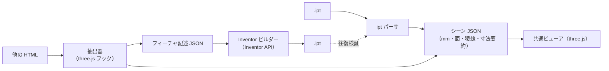

# アプリ構成: ipt ビューア ＋ three.js → ipt 変換

## 1. 要件

1. **ipt ビューア**: .ipt を読み込み、自作の HTML アプリ上で three.js で描画する
2. **HTML 抽出・変換**: 他の HTML ファイルを読み込み、three.js で書かれた 3D モデル部分を抽出して表示し、.ipt に変換する

### 決定事項

| 項目 | 決定 | 設計への影響 |
|---|---|---|
| 変換を実行する PC | Inventor がある | .ipt の書き出しは Inventor API を使うビルダーで行う |
| three.js の単位 | 1 = 1 mm | 抽出した座標をそのまま mm として扱う |
| 変換対象の HTML | 他の人が作ったものも含む | 任意のスクリプトを隔離して実行する。三角形しか持たない形状も必ず扱う前提にし、「正確に変換できる部品」と「近似になる部品」を画面で区別する |

## 2. 全体構成

入力の違いは「シーン JSON」に変換する段階で吸収し、ビューアは 1 つにする。

## 3. 検証済みの根拠

| 要素 | 確認したこと |
|---|---|
| ipt → three.js 描画 | `dist/ipt-viewer.html` で描画。サンプル部品の形状・寸法が Inventor の画面と一致（段階 1 で実装済み） |
| HTML からの抽出 | three.js r170 の `Scene` と `WebGLRenderer` は生成時に `__THREE_DEVTOOLS__` へ `observe` イベントを送る。これを HTML のスクリプトより先に用意すると、`window` に公開されていないシーンも捕捉できる |
| 寸法の復元 | 検証用 HTML から、`ExtrudeGeometry` の外形（直線・円弧）・穴 2 つ（R2.25）・押し出し量 2、`CylinderGeometry` の半径・高さ、`BoxGeometry` の 3 辺を取得できた |

## 4. 変換の忠実度は「three.js 側の作り方」で決まる

| three.js 側の形状 | 取り出せる情報 | Inventor 側で作れるもの |
|---|---|---|
| `BoxGeometry` / `CylinderGeometry` | 寸法、位置・回転 | スケッチ＋押し出し（正確、フィーチャ付き） |
| `ExtrudeGeometry`（`Shape`＋`holes`） | 外形・穴の曲線、押し出し量 | スケッチ＋押し出し（正確、フィーチャ付き） |
| `LatheGeometry` | 断面形状、回転角 | 回転フィーチャ（正確） |
| 三角形だけの `BufferGeometry`、glTF・STL の読み込み | 三角形のみ | メッシュの取り込み（多面体近似。円は多角形になる） |
| ブーリアン演算ライブラリで作った形状 | 結果の三角形（ライブラリによっては操作履歴も） | 個別に検討 |

- 位置・回転は各オブジェクトのワールド行列から得られるので、スケッチ平面と座標に変換する
- three.js の座標には単位がない。「1 = 1 mm」などの取り決めを設定として持つ
- 変換対象の HTML を自作するなら、上の表の上 3 行で形を作る規約にすると、変換の忠実度が最も高くなる

## 5. 制約と対策

- **.ipt の書き出しには Inventor（Windows・ライセンス）が必要。** ブラウザ単体では書けない。
  ブラウザはフィーチャ記述 JSON を出力し、Inventor 側のビルダー（iLogic ルールやアドイン）が読み込んで部品を作る。
- **解析処理は JavaScript 版（`app/src/ipt/`）と Python 版（`ipt_inspect/`）の 2 つがある。** JS 版はアプリ本体、
  Python 版は正解データ（`tests/fixtures/`）を作る参照実装。両者の出力の一致を `npm test` で検証する。
  対応形状を増やすときは両方に手を入れる必要があるため、JS 版だけで十分に検証できる段階になったら
  Python 版を退役させ、二重管理を解消する。
- **対応している曲面は平面と円筒のみ。** 円錐・トーラス（曲線の稜線に付けたフィレット）・スプライン面は未対応なので、稜線だけが表示される。
- **他人の HTML は任意のスクリプトを含む。** `sandbox` 属性付きの iframe で実行し、差し込んだフックから
  `postMessage` で形状データだけを受け取る。

## 6. 段階計画

| 段階 | 内容 | 完了の判定 |
|---|---|---|
| 1 ✅ | ipt ビューア（ドラッグ＆ドロップ）。パーサを JS に移植 | サンプルで Python 版と出力が一致する（`npm test`） |
| 2 ✅ | HTML 抽出ビューア。フック・iframe 分離・形状認識 | 検証用 HTML の寸法を復元できる（丸刃を除く。§8） |
| 3 🟡 | Inventor ビルダー。変換データ → Inventor API → .ipt / .iam | 実物の Inventor での初回実行で、全部品の体積・表面積・外形が期待値と一致する（代替オブジェクトでは確認済み。§9） |
| 4 | 対応形状の拡大（円錐・トーラス・スプライン、回転、ブーリアン） | 形状ごとの検証用ファイルで一致する |

## 7. 段階 1 の実装と評価

- **構成**: `app/src/ipt/`（解析）→ `app/src/viewer/`（三角形分割・3D 表示・説明文）→ `app/src/ui/panel.js`・`main.js`（画面）。
  `npm run build` で 1 つの HTML（`dist/ipt-viewer.html`）にまとめる。three.js は CDN、それ以外は同梱。
- **評価関数**（`npm test`）
  - 解析結果（ファイル構造・セグメント・形状要約・シーン）が Python 版の正解データと 1e-6 mm 以内で一致する
  - 三角形分割の面積が寸法から計算した厳密値と一致する（全表面積 388.847 mm² に対し厳密値 388.883 mm²、誤差 −0.009%）
  - 全ての三角形の向きが面の法線と揃っている
- **ブラウザでの動作確認**: 起動時のサンプル表示、ボタン・ドラッグ＆ドロップでの読み込み（日本語のファイル名を含む）、
  ipt 以外のファイルでのエラー表示、3D ⇄ パネルの強調の連動、ライト・ダーク両テーマで、コンソールエラーがないことを確認した。

## 8. 段階 2 の実装と評価

### 分かったこと: 実際の HTML は三角形を直接組み立てている

受け取った 2 つの HTML（LS-4 部品ビューア: three.js r180、スプール／リール組立: r160）は、形状の大半を
`BoxGeometry` などの標準クラスではなく、独自の関数（`revolve()`・`arcBlock()`・`buildBlade()` など）で三角形から組み立てていた。
そのため「形状クラスの寸法パラメータを読む」方法はほぼ使えず、**三角形の並びから形の種類と寸法を逆算する形状認識**を実装した。

### 仕組み

1. **取り出し**（`app/src/extract/`）: 元の HTML の `<head>` 直後にフックを差し込み、`sandbox="allow-scripts"` の iframe で動かす。
   three.js が生成時に送る `__THREE_DEVTOOLS__` の通知でレンダラーを捕まえ、画面に描いた最後のシーンを覚える。
   「この状態を取り込む」で、見えているメッシュ（頂点・三角形・ワールド行列）を `postMessage` で受け取る。
2. **下準備**（`recognize/mesh.js`）: 0.001 mm 以内の頂点を統合し、つながった塊ごとに分け、閉じた立体か（全ての辺を 2 枚の三角形が共有）を判定する。
   閉じていない面（床・刻印・半透明の警告表示など）は部品ではないとして除外する。
3. **回転体**（`recognize/revolve.js`）: 軸を仮定して各頂点を（高さ, 半径, 角度）に変換し、同じ（高さ, 半径）の点が 12 個以上の円を成すか、
   円どうしのつながりが 1 本の断面輪郭になるか、全ての三角形が隣り合う円の帯か扇形の端面に載っているかを確かめる。扇形の部分回転体も扱う。
4. **押し出し**（`recognize/prism.js`）: 軸方向の高さがちょうど 2 段で、上下の点が 1 対 1 に対応し、側面が全て軸と平行なら押し出し。底面の縁が断面になる。
5. **断面の分解**（`recognize/segments.js`）: 曲がりが小さく等間隔に続く区間を円弧の候補にし、円に当てはまるかを確かめる。
   正六角形のように頂点が同じ円周に並ぶ多角形を円と誤認しないよう、1 頂点あたりの曲がりが 15° 以下（円を 24 分割以上）のものだけを円弧とする。
6. 候補の軸は、部品自身の座標軸 → ワールドの X・Y・Z の順に試す（手続き的に作られた形状は自身の座標軸に沿うことが多い）。

### 評価（`npm test`）

期待値は各 HTML のソースに書かれた定数から導いた。

| 対象 | 認識結果 |
|---|---|
| スペーサー T10 / T50 | 回転体 φ240/φ200。T50 は逃がし溝の R2 を円弧 2 つとして復元（直線 12・円弧 2） |
| ゴムリング・紙管・ゴムスリーブ・鉄スプール | 回転体。外径・内径・長さ・面取りの数がソースと一致 |
| ベークライトフィンガー | 押し出し（八角形 560 × 20、長さ 10） |
| リール φ508（459 部品） | 全て正確: 段付き軸 10（回転体）、ボルト頭 8（六角柱）、扇形 48（部分回転体。角度はソースの π/2−0.10 などと一致）、直方体 393 |
| 組立 | 近似 0。拡径後のゴムスリーブ φ615/φ508 も復元 |
| 丸刃 | 近似（メッシュ）。内径側 C1 の面取りで厚み方向の高さが 4 段になるため |

加えて three.js 標準の `CylinderGeometry`・`BoxGeometry`・`LatheGeometry`・`TorusGeometry`・`ExtrudeGeometry` でも正しく認識できることを確かめている。
ブラウザでの動作（元のページの操作 → 取り込み、r160 / r180 の両方、ライト・ダーク）も確認した。

### 限界と次の改善候補

- **面取り・段付きの押し出し**（丸刃）は未対応。「押し出し＋面取り」の認識を加えれば正確に扱える見込み
- `ExtrudeGeometry` を粗い分割（`curveSegments` が 24 未満）で作った円は多角形として認識される。形状クラスが持つ曲線の定義（`parameters.shapes`）を取り出せば解消できる
- 軸が部品自身の座標軸にもワールドの軸にも沿っていない回転体は認識できない
- HTML が相対パスで読み込むファイル（テクスチャ・モデル）は、HTML 単体を開いた場合は読み込めない
- `InstancedMesh`（インスタンス描画）は未対応（除外として数える）
- Artifact（claude.ai）上での HTML 取り込みは、埋め込み先の制約により動作を確認できていない。手元の `dist/ipt-viewer.html` では動作する

## 9. 段階 3 の実装と評価

手順は [inventor-builder.md](inventor-builder.md)。

- **変換データ**（`app/src/export/`）: 部品ごとに、断面スケッチ（直線・円弧・円）、回転／押し出しの指定、
  取り込んだシーン内の配置、体積・表面積の期待値を持つ。同じ形の部品は 1 つにまとめる（リール 459 部品 → 25 種類）。
  float32 由来の誤差を丸めるので、断面の座標は設計値（101・−25・R2 の中心 112, 13 など）そのものになる。
- **ビルダー**（`ipt_build/`、Python + pywin32）: Inventor API で部品と組立を作り、次の 2 つで結果を確かめる。
  1. Inventor が計算した体積・表面積 ⇔ 期待値（断面からの厳密計算）
  2. 保存した .ipt を ipt_inspect で読み直した外形 ⇔ 変換データから計算した外形（ビルダーの単位の前提に頼らない確認）

### 評価

| 確認 | 方法 | 結果 |
|---|---|---|
| 変換データが元の形を表す | 元のメッシュの全頂点と、変換データから再構成した面との距離 | 最大 0.000015 mm |
| 期待値の正しさ | 厳密値の手計算（スペーサー 2π×21780 mm³、穴あき板）／メッシュの体積との比較（多角形近似の理論誤差内） | 一致 |
| 期待値の計算の独立性 | JS（アプリ）と Python（ビルダー）で別々に実装し、全部品で照合 | 一致（丸め幅 1e-6 以内） |
| ビルダーの描き方 | Inventor の代替オブジェクト上で作り、断面を折れ線にした数値計算（第 3 の方法）で体積・表面積を求めて照合 | 4 データの全部品で一致 |
| 評価の感度 | 描画の単位換算を抜くと検出される／期待値を誤った値にすると失敗する | 検出できた |
| アプリからビルダーまで | ブラウザで取り込み → 保存 → ビルダーのドライラン | 一致 |

### 残っている不確かさ

実物の Inventor で初めて確かめられること（列挙値、対称の押し出しの距離の解釈、組立の配置の向き）は
inventor-builder.md §5 に挙げた。いずれも照合（体積・表面積・外形）で「不一致」として現れるので、初回の実行結果で判別できる。
