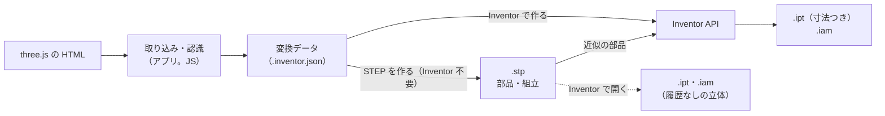

# CAD ファイル（.stp・.ipt・.iam）を Inventor なしで作れるか

three.js の HTML から取り出した形を、Inventor の部品（.ipt）・組立（.iam）と STEP（.stp）にするうえで、
「Inventor が無くても作れるか」を形式ごとに調べ、このアプリの作り方を決めた記録。

## 1. 結論

| 出力 | Inventor なしで作れるか | このアプリの作り方 | 根拠 |
|---|---|---|---|
| **.stp（STEP）** | **作れる** | アプリ（Python）が直接書く（AP214）。**「STEP を作る」**は Inventor もライブラリも使わない | 公開の国際規格（ISO 10303-21 書式・-42 形状・-214 応用）。書いたファイルを、形状カーネル OpenCascade とアプリ自身の読み取りの 2 つで検証した（§2） |
| **.ipt（部品）** | 現実的でない | 手元の Inventor で作る。回転体・押し出し（面取りを含む）は Inventor API で**寸法を編集できる部品**に、近似の部品は STEP を Inventor で開いて**履歴の無い立体**にする | 形式が非公開の内部データベースで、版ごとに変わり、正しさを確かめる手段が Inventor 自身しか無い（§3） |
| **.iam（組立）** | 現実的でない | 手元の Inventor で、作った .ipt を取り込んだシーンと同じ位置に置く | .ipt と同じ非公開の形式。形は持たず、参照と配置を内部のセグメントに持つ（[iam-format.md](iam-format.md)） |

つまり、**Inventor の無い PC でも STEP までは作れ、STEP を Inventor で開けば .ipt・.iam になる**。
Inventor のある PC で「Inventor で作る」を使うと、STEP に加えて、回転体・押し出しを寸法つき（フィーチャの履歴つき）の .ipt にできる。

## 2. STEP（.stp）: アプリが直接書く

### 書くもの

| 項目 | 内容 |
|---|---|
| 形式 | ISO 10303-21、AP214 第 3 版（`AUTOMOTIVE_DESIGN { 1 0 10303 214 3 1 1 }`）。Inventor 2026 が書き出す STEP と同じ応用・同じつなぎ方（部品の PRODUCT → 形状表現 SHAPE_REPRESENTATION → 関係 → ADVANCED_BREP_SHAPE_REPRESENTATION、組立の出現 NEXT_ASSEMBLY_USAGE_OCCURRENCE、配置の ITEM_DEFINED_TRANSFORMATION）。点・座標系は部品の中でだけ使い回す。改行は CR+LF、1 行はおよそ 80 文字 |
| 単位 | mm・ラジアン。形の精度 0.00001 mm（`UNCERTAINTY`） |
| 名前 | 部品名（日本語は `\X2\` の書き方）。出現は「部品名:番号」 |
| 回転体 | 断面の直線・円弧を回した面: 円筒・円錐・平面・球・トーラス。一周する面は半分ずつ 2 面に割る（Inventor の STEP と同じ）。断面の円弧の円が軸と交わる形（たる形・りんご形。紡錘形のトーラス）は元の形の三角形で書く（規格の書き方 `DEGENERATE_TOROIDAL_SURFACE` は、OpenCascade が体積を 100 倍に読み違えた。読み手の扱いがそろわない） |
| 押し出し | 側面（平面・円筒）と両端の平面。円は半円 2 つ |
| 近似の部品 | 三角形のまま。同じ平面の隣り合う三角形は 1 つの平らな面にまとめる |
| 面取り付きの押し出し | 元の形の三角形で書く（厳密な面取り面の書き出しは未実装。Inventor で作ると面取りは厳密になる） |
| 組立 | 配置が 2 か所以上なら組立（同じ形は 1 つの部品を使い回す）。1 か所なら部品だけ |

実装: `program/ipt_build/p21.py`（書式）・`brep.py`（面・稜線・頂点のつながり）・`step.py`（製品構造と組立）。

### 検証（3 つの独立した確かめ）

| 確かめ | 方法 | 結果 |
|---|---|---|
| B-rep の決まり | `tests/step_check.py`（Python・自作の読み取り）: どの稜線も逆向きに 2 回使われる、どの輪も閉じる、頂点が曲線・曲面の上にある、輪を曲面の座標に写した回り方が面の法線と合う（外周は反時計回り・穴は時計回り。円弧は稜線の向きどおりにたどる）、長さの単位が mm | 面の種類ごとの 14 形状・たる形・テスト用データ 6 件の全部品で合格（輪 12,395 個。曲面の特異点を通る 7 個は境界だけでは内側が決まらないので飛ばす） |
| 形状カーネル | OpenCascade（CAD で広く使われる形状カーネル。開発のときだけ使う。`tools/check_step.py`）: 正しい立体か、自己交差が無いか、体積・表面積 | 14 形状とテスト用データの全部品が正しい立体で、体積・表面積が変換データの期待値と相対 1e-9 以内で一致。全サンプル 13 件の STEP（部品 586 個のタイヤ、462 個のリール組立、三角形 16 万のアルミコイルなど）も確かめた |
| アプリで読み戻す | `tests/js/step-writer.test.mjs`: Inventor が書いた STEP で確かめてあるアプリの読み取りで読む | 部品・出現の数と置いた位置、体積（表示用の分割の誤差の範囲）が一致 |

独立した確かめで見つけて直した誤り:

- 極から極への円弧（球）の面を書いていなかった（OpenCascade で 25 か所中 24 個しか立体が出ず発覚）
- 三角形の平らな面をまとめる幅がファイルに書く精度より粗かった
- 円弧の中心をきりのよい値に丸めると、両端から中心までの距離が最大 0.00007 mm 食い違い、頂点が円から外れた（コイル転倒。丸めた後に両端の垂直二等分線へ戻す）
- たる形の回転体を、半径が負のトーラス（規格違反。OpenCascade は読めるが、ほかの読み手は分からない）で書いていた

誤りをわざと入れる評価（12 通り: 面・断面・円弧の向き、三角形の輪の向き、球面の欠落、組立の変換の向き、単位、実数の書き方、
STEP だけのときの指示、近似の部品の STEP）は、3 つの確かめのどれかが必ず検出した。ただし OpenCascade は読むときに面の向きを直してしまい、
アプリの読み戻しは押し出しの円弧の向きを見逃したので、自作の確かめに向き（輪の回り方）と単位の確かめを足し、OpenCascade の無い環境
（アプリを使う PC）でも 12 通り全てを見つけられるようにした。

### Inventor 2026 で開けないという報告の調査

「アプリの STEP が Inventor 2026 で開けない」という報告を受けて調べた。**結論: 開けないことは無かった**（下の「実物で確かめた結果」。報告は勘違いだった）。

| 調べたこと | 結果 |
|---|---|
| Inventor 2026 は STEP を開けるか（仕様） | 開ける。Inventor 2026 自身が同じ AP214 第 3 版で書き出している（`program/samples/stp`）ので、STEP を開けないのは仕様ではない |
| アプリの STEP は規格どおりか | 規格どおり。AP214 の EXPRESS スキーマ（STEPcode の AP214E3_2010）から作った検査プログラム（`p21read`、厳しい判定 `-s`）で、部品・組立・三角形の部品（最大 33 万実体）の全てで誤り 0。同じ検査で、Inventor が書いた 6 ファイル（2026 が 5・2022 が 1）は全てに違反がある（名前を `$` にした配置の変換・説明を `$` にした形状定義・色の属性の省略）。Inventor の読み取りは、厳密でない STEP も受け付けている |
| Inventor の書き方との違い（1 回目） | 3 つ（どれも規格上は正しい）: 形状表現のつなぎ方（B-rep の形状表現を直接つないでいた）、全ての部品が 1 つの座標系を共有していた、改行が LF（ただし Windows で書くと CR+LF になる）。Inventor と同じ書き方にそろえた |
| Inventor の書き方との違い（2 回目。部品だけの `Plate.stp` など 5 ファイルが増えて分かった） | 3 つ: 応用の文脈の文（`Core Data for Automotive Mechanical Design Process`）、応用プロトコルの年（**2009**）、部品の形状表現の関係の名前（`'SRR','None'`）。6 ファイル全てが同じ値だった。1 回目に年を 2010（規格の第 3 版の年）にして「Inventor と合わせた」としたのは誤りだった（Inventor のファイルでなく規格の版から決めていた）。今は `tests/test_step.py` が、samples/stp の Inventor 2026 の全ファイルと値を照合する |
| 行の長さ | 字句の切れ目（区切りの後・複合実体の構成要素の間）で、1 行 80 文字以内に改行する（Inventor も 75〜98 文字。Inventor は文字列の途中でも改行するが、アプリはしない）。長い日本語の名前の文字列は 1 行に置く |
| 残した違い | 形の精度（アプリ 0.00001 mm・Inventor 0.01 mm。アプリの形は精度が高いので、そのとおりに書く）。材質・色・作成日（アプリの変換データに無い。開くのに要らない） |

**実物で確かめた結果**（2026 年 10 月）: 「Inventor で作る」（部品 33 種類・69 か所）で、アプリが書いた近似の部品の STEP 5 つを
Inventor 2026 が開き（API の `Documents.Open`）、体積・表面積が相対 2e-7 以内で一致した。作った STEP（組立）も Inventor 2026 で普通に開けた
（利用者の報告）。今のアプリの STEP は Inventor 2026 で開ける。

直す前の書き方の STEP（[step-check/](step-check/README.md) の 1〜3）も、今の書き方の STEP も、Inventor 2026 で開けた（利用者が確かめた）。
はじめの報告は勘違いで、アプリの STEP にも Inventor にも問題は無かった。上の表の「そろえた」書き方は、開けるようにするための修正ではなかったことになる。
どれも規格上正しく、Inventor の書き方に近いので残す（`tests/test_step.py` が samples/stp の Inventor の STEP と照合し続ける）。

確認用の STEP（[step-check/](step-check/README.md)）は、STEP の書き方を変えたときに Inventor で開けるかを確かめるために残す。
今の書き方のもの（4〜8）と 9 は、`python tools/step_check_kit.py`（program フォルダで）で今の書き手から作り直せる。

検査の再現（開発用）: `git clone https://github.com/stepcode/stepcode` → `cmake .. -DSC_BUILD_SCHEMAS=ap214e3` →
`make p21read_sdai_ap214e3` → `p21read_sdai_ap214e3 -s ファイル.stp`（「SECOND PASS complete: N instances valid」なら規格どおり）。

### 分からないこと（実物の Inventor で確かめる）

- この STEP を Inventor で開いたときの振る舞い: 取り込みの設定（「変換」か「参照」か）によって、.ipt が STEP を参照し続けるかが変わるはずだが、
  既定の設定と API（`Documents.Open`）での振る舞いは**分からない**。「Inventor で作る」は近似の部品の STEP を保存先の `step` フォルダに残すので、
  参照のままでも .ipt は開ける
- （確かめた）Inventor は形の精度 0.00001 mm の STEP（三角形の部品）を開き、体積・表面積が相対 2e-7 以内で一致した（Inventor 自身の STEP は 0.01 mm と書く）

## 3. .ipt・.iam: Inventor なしでは作らない

### 直接書くのが現実的でない理由（[ipt-format.md](ipt-format.md) §4）

1. .ipt は形状ファイルではなく、Inventor の内部オブジェクトのデータベースを直列化したもの。8 つのセグメント（設計履歴・形状・表示・ブラウザー…）が
   相互に参照し合う。形状（B-rep）だけを正しく書いても、ほかのセグメントと整合しなければ開けないか、不整合を起こす
2. 設計履歴のオブジェクトの型は文書化されておらず、Inventor の内部にしか定義が無い
3. 版ごとに形式が変わる（2026 の .ipt はセグメントが Zstandard で圧縮されている）
4. 正しさを確かめる手段が Inventor 自身しか無い
5. Autodesk のソフトウェアの解析は利用規約で制限されている（自分のファイルを読むこととは別。法的な判断はここではできない）

このアプリは .ipt・.iam を**読む**ことはできる（形状・寸法・ねじ・組立の配置。表示に使っている）。書くことだけをしない。

### 検討した方法

| 方法 | Inventor | 得られるもの | 判断 |
|---|---|---|---|
| A. Inventor API（「Inventor で作る」） | 手元に要る | 寸法を編集できる .ipt（回転・押し出し・面取り）と .iam | **採用** |
| B. STEP を Inventor で開く | 手元に要る（開くだけ） | 履歴の無い立体の .ipt・.iam | **採用**（近似の部品は「Inventor で作る」が自動で行う。STEP だけ作ったときは利用者が開く） |
| C. Design Automation API for Inventor（Autodesk Platform Services） | クラウドの Inventor | .ipt・.iam | 見送り: 形をインターネットの外へ送る（このアプリは PC の中だけで解析する方針）、Autodesk のアカウントと有償の利用枠が要る（料金は分からない） |
| D. Inventor Apprentice Server（無償） | 不要 | .ipt の読み取り・プロパティの編集 | 不可: 形を作れない |
| E. .ipt・.iam を直接書く | 不要 | — | 非推奨（上の理由） |
| F. 形状カーネル（OpenCascade など）で STEP を作る | 不要 | STEP（面取り・ブーリアン演算も可） | 開発時の検証に使う（アプリには入れない）。Python 版 `cadquery-ocp` は Windows の Python 3.11〜3.14 に入る（約 67 MB）。厳密な面取り・一般の形を STEP にする段階で、アプリの任意の機能として入れるか検討する |

## 4. 取り込みから出力までの制約（いまの状態）

| 段階 | できること | 残っている制約 |
|---|---|---|
| 取り込み | three.js（r128〜r180 で確認）の表示中のメッシュ。インスタンス描画も | three.js 以外（Babylon.js など）・HTML が相対パスで読むファイル（glTF など）は HTML 単体では読めない |
| 単位 | 1 単位 = mm・cm・m・inch・任意の長さ。大きさから推定し、実寸の全体の大きさを示して選んでもらう。HTML ごとに覚える | 推定は大きさだけによる（独自の縮尺は選んでもらう） |
| 開いた面 | メッシュをまたいで縫い合わせる（筒の壁とリング）、平らな縁を塞ぐ（管の端）、継ぎ目の刻みが面ごとに違う形は頂点をそろえて縫う（アルミコイル） | 面そのものが欠けた形（描いていない面がある）は閉じない |
| 認識 | 回転体（全周・扇形）、押し出し（穴・等距離の面取り）。変換のたびに元の形との一致を両方向で確かめる。断面の小さな重なり（元のメッシュの折れ）は取り除いて示す | 複数のフィーチャを組み合わせた部品（段・横穴・ねじ）・斜めの軸・丸い面取りは近似になる |
| 近似の部品 | 三角形のまま STEP・.ipt・.iam に入れる（以前は作らなかった）。元の形が自分と交わる所（面の交差・同じ平面の上の重なり）があれば知らせる | 円は多角形のまま。元の形の自己交差は直さない（CAD で修復が要ることがある）。元の三角形の細かさのままなので大きくなる（アルミコイル: STEP 93 MB） |
| STEP | Inventor なしで、全ての部品と組立を書く | 面取り付きの押し出しと、たる形・りんご形の回転体は三角形 |
| .ipt・.iam | Inventor で作る（回転体・押し出しは寸法つき） | 実物の Inventor での初回の実行は未確認（代替オブジェクトで確認済み） |

## 5. 次の候補

1. **一般の機械部品の厳密化**: 面の種類（平面・円筒・円錐・球・トーラス）ごとに三角形を分け、面の境目を求めて B-rep にする。
   段・横穴・切欠きの組み合わせも同じ方法で扱え、STEP の書き手（`brep.py`）の上に載る（[app-architecture.md](app-architecture.md) §13）
2. **three.js の形状クラスの定義を読む**: `ExtrudeGeometry` の断面（`parameters.shapes`。ベジェ曲線を含む）・面取りの設定を取り出せば、
   分割の粗さに左右されず、丸い面取りも Inventor のフィレットとして作れる
3. **厳密な面取り面の STEP**: 面取りの面（平面・円錐）と、角の継ぎ目の曲線を書く
