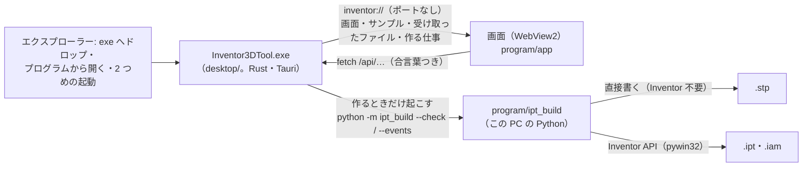
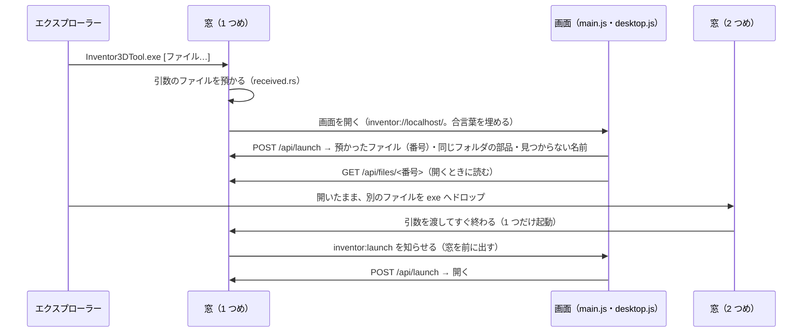

# デスクトップ版（Tauri・Rust の窓 ＋ Python の作る係）

段階 10（[app-architecture.md](app-architecture.md) §6）。ブラウザ ＋ Flask のローカルサーバーで動かしていた形（§11）を、
1 つの exe（`Inventor3DTool.exe`）で動くデスクトップアプリに移した。配り方とアプリの構成は WaveLog（同じ作りのデスクトップ版）に合わせた。

## 1. 決めたこと

| 項目 | 決定 | 理由 |
|---|---|---|
| 窓 | Tauri 2（Rust）。Windows では WebView2 が画面を描く | 画面（HTML・JavaScript・CSS）をそのまま使える。WaveLog と同じ版（tauri 2.12・Cargo.lock も同じものから始めた） |
| Flask | 外す。画面とサンプルを配る・受け取ったファイルを渡す・作る仕事を管理するのは Rust の窓 | ポートを開かない（ほかの PC・ほかのアプリから届かない）・常駐するサーバーが無い（古いサーバーの残り・生存の知らせによる推し量りが無い）・起動が速い |
| Python | **この PC の Python を使う**（同梱しない。利用者の回答）。使うのは「STEP を作る」「Inventor で作る」のときだけ | 見るだけ・取り込むだけなら Python は要らない。作る係（`ipt_build`: STEP の書き手・Inventor の操作）は Python の実装 1 つのまま（Rust へ移すと同じ仕組みが 2 つになる） |
| 入口 | 最上位の `Inventor3DTool.exe`（`Start.vbs` を外した） | exe へのドロップ・「プログラムから開く」がそのまま効く。VBScript は Windows で非推奨になり、将来外される |
| 配り方 | WaveLog と同じ: CI（GitHub Actions）が Windows で exe を作り、本物の WebView2 で自己診断し、通った exe を main の最上位へ置く | 利用者は main の ZIP を落として展開するだけ。exe と `program` の組がずれない |
| 版 | 2.0.0（作り直し → 大。`desktop/Cargo.toml` と `tauri.conf.json`。test_layout が一致を見張る） | 前の版の印（`app/version.py`）は Flask と一緒に外した |

WaveLog から**持ってこなかったもの**: Python の常駐（サイドカー。WaveLog は画面と API を Python の Flask が作るので要る。
こちらは API が小さく Rust だけで答えられる）・共有の置き場からの配布と版の入れ替え（こちらは ZIP を展開して使う）・
版ごとの写しとショートカット作り（同じ理由）。

## 2. 構成



| 場所 | 役割 |
|---|---|
| `desktop/src/main.rs` | 窓（最大化・ドロップは画面が読む）・1 つだけ起動（2 つめに渡されたファイルは 1 つめの窓へ）・自前の仕組み `inventor` の受け口・閉じる前の確かめ・自己診断 |
| `desktop/src/router.rs` | 問い合わせの振り分け: 画面（`program/app/index.html` に起動ごとの合言葉を埋める）・`/static`・`/samples`・`/api/…` |
| `desktop/src/jobs.rs` | 「STEP を作る」「Inventor で作る」の仕事（前の `app/builds.py` を移したもの。§4） |
| `desktop/src/received.rs` | 起動で受け取ったファイル（引数・2 つめの起動）を預かり、画面へ番号で渡す。組立（.iam）と同じフォルダの部品（.ipt）も添える |
| `desktop/src/proc.rs` | 子のプロセスを窓なしで起こし、止めるときは孫まで止める（Windows はジョブオブジェクト） |
| `desktop/src/locate.rs` | 置き場: `program` フォルダ（exe から上へたどる）・作業場所（`%LOCALAPPDATA%\Inventor3DTool`）・Python（WaveLog と同じ探し方） |
| `desktop/src/system.rs` | 保存先（`program\config\appsettings.json` の `build.output_dir`、空ならドキュメント\Inventor 3Dツール）・Inventor が入っているか（レジストリ） |
| `desktop/src/selftest.js`・`fail.html` | 自己診断（§6）・中身が見つからないときの画面 |
| `desktop/build.rs`・`program/tools/app_icon.py` | アイコン（角を丸めた地に等角の立体。画面の色）を作るたびに描く。絵は Python の 1 か所 |
| `program/app/static/js/desktop.js` | 画面から窓へのやりとり（前の `server.js`）。生存の知らせ（heartbeat）は外した |
| `program/ipt_build/__main__.py` | 作る係。窓のために `--check`（作れる変換データかと、作り始めの進み具合を 1 行の JSON で）と `--libraries`（pywin32 があるか）を足した |

外したもの: `Start.vbs`・`program/start_app.py`・`launch_guard.py`・`server.py`・`app/`（Flask: `__init__`・`routes`・`builds`・`lifecycle`・`version`）・
`settings.py`・`local_app.py`・`process_manager.py`・`handoff.py`・`app_build.py`・`loading.html`・`start.bat`・`stop.bat`・`requirements.txt`（Flask）と、
それらの評価（`test_server`・`test_builds`・`test_lifecycle`・`test_local_app`・`test_launch_guard`・`test_e2e`）。役目は上の Rust へ移した。

## 3. 起動・ドロップ・2 つめの起動



- 画面の置き場は、Windows（WebView2）では `http://inventor.localhost/`、ほかでは `inventor://localhost/`（Tauri の決まり）。どちらもポートを使わない
- 画面のファイルは毎回 `program/app` から読む（exe に埋め込まない）。画面を直したら、開き直すだけで効く。exe が変わるのは窓（`desktop/`）とアイコンを直したときだけ
- `program` フォルダは exe の置き場から上へ 6 段までたどって探す（配る形は exe の隣、作る途中は `desktop/target/release` の 3 つ上）。
  見つからなければ、理由と直し方の画面（`fail.html`）を出す
- 作業場所（記録・Python の .pyc・作る係の出力）は `%LOCALAPPDATA%\Inventor3DTool`。`program` フォルダを「使用中」にしない

## 4. 作る仕事（`jobs.rs`）

前の `app/builds.py` の決まりをそのまま移した（[app-architecture.md](app-architecture.md) §11「CAD ファイルを作る」の 1〜8）。違いは次のとおり。

| 項目 | 前（Flask の中） | いま（Rust の窓） |
|---|---|---|
| 作れる変換データかの確かめ | サーバーの中で `parse_spec` | `python -m ipt_build <写し> --check [--step-only]` を 1 度起こす。答え（保存先の名前・作り始めの進み具合）は 1 行の JSON。確かめ方は Python の 1 か所のまま |
| pywin32 があるか | サーバーの中で `find_spec` | `python -m ipt_build --libraries` を 1 度起こして覚える（画面は 0.8 秒ごとに尋ねるので、毎回は起こさない）。入れたら聞き直す |
| Python | サーバー自身の Python | 作るたびに探す（アプリを開いたまま Python を入れても、開き直さずに作れる）。見つからなければ、画面が押す前に理由と入れ方を出す（`python_missing`） |
| 中止で強制的に止める | 子だけ（`terminate`） | 孫まで（ジョブオブジェクト）。py ランチャー（py.exe）は本物の python.exe を子に持つので、子だけ止めると本物が残る（WaveLog で実際に起きた） |
| 画面を閉じたとき | 作り終えるまでサーバーを止めない | 窓の×で「作っている途中です。閉じると中止します」と聞く（中止して閉じる／作り続ける）。中止を選ぶと、作る係が Inventor を戻して止まるまで待ってから閉じる |
| Windows の終了などで、聞かずに終わるとき | — | 中止を頼み、5 秒で止まらなければ孫まで止め、Inventor を操作していたなら戻す係を動かす。ジョブは「持ち手が閉じたら中を全て止める」にしてあるので、窓が落ちても作る係は残らない |

## 5. 守り

- **ポートを開かない**: 問い合わせは窓の中の自前の仕組みで受ける。ほかの PC・ほかのアプリ・ほかの Web サイトから届かない（前の Host の確かめは要らなくなった）
- **合言葉**: 開いた HTML のモデルは隔離した iframe（`sandbox="allow-scripts"`・別の生まれ）で動かすが、同じ置き場へ問い合わせを送ることはできる。
  そこで `/api/…` と窓の操作には、画面の `<meta name="app-token">` にだけ書く起動ごとの合言葉（48 桁）を求める（無い・違うと 403）。
  受け取ったファイルは、画面に渡した番号でしか読めない
- **外のページ**: 画面の外へのリンクは、いつものブラウザで開く（窓の中では開かない）。新しい窓は作らない

## 6. 評価

**Rust の評価**（`desktop` フォルダで `cargo test`。35 件）:

| 評価 | 確かめること |
|---|---|
| `jobs`（19） | 前の `test_builds.py` と同じ: 本物の別のプロセスで作る（Inventor は代替オブジェクト）・STEP だけなら Inventor もライブラリも使わない・上書きしない・作れないものは始めない（保存先を作らない）・1 度に 1 つ・中止（頼めば待たずに止まる／止まらなければ孫まで止め、Inventor を操作中なら戻す係を動かす）・入れてから作る・入れられない（pip の出力）・途中まで作ったら残す・落ちた（終了コードとエラー出力）・Inventor の例外（STEP は残す）・何も作れなければ片付ける・保存先を作れない（設定の場所を示す）。加えて、Python が無いときの理由・ライブラリの答えを覚える・本物の `--libraries` の形・知らせ→状態（STEP だけなら接続へ進まない） |
| `router`（9） | 画面に合言葉を埋める・部品の種類（.js はモジュールとして読める）・外へ出ない（`..`・`%2e%2e`）・全ての `/api` と窓の操作に合言葉・サンプルの並びと中身・受け取ったファイルを番号で渡す（消えたら 404）・尋ねてから入れる（Python が無ければ尋ねずに理由）・作り始めて読み直して保存先を開く・400・409 |
| `received`（2）・`proc`（1）・`locate`（2）・`system`（2） | 1 回だけ渡す・同じフォルダの部品・消えたもの／孫まで止まる（py ランチャーの形を写す）／exe から program を探す・Python の探す順／環境変数の展開・設定の読み方 |

評価の感度: 作る仕事に 4 通りの誤り（片付けない・中止を頼まない・STEP だけでも接続へ進む・強制的に止めても Inventor を戻さない）を入れ、
最初は「STEP だけでも接続へ進む」を見逃した（終わりの状態は同じになる。途中の画面が「Inventor に接続しています」と誤る）ので、
知らせ→状態を直接確かめる評価を足し、4 通りとも落ちることを確かめた。

**Python の評価**（`program` フォルダ）: `test_layout.py` が、配る形（最上位の入口は exe だけ）・名前の一致（exe・アプリの名前・作業場所・版・
画面の案内・CI が置く場所）・画面の合言葉の差し込み口・自前の仕組みの名前と 2 つめの起動の知らせ・作る係の答えの形（`--check`・`--libraries`）を見張る。

**自己診断**（本物の WebView の中から、利用者と同じ道を通す。`src/selftest.js`）: CI は exe をサンプルの組立を渡して起こし、画面の合図を見たら
2 つめの exe に変換データを渡す。調べること: 合言葉・部品の種類・題・起動で受け取った組立が開く（見つからないのは Content Center のボルトだけ）・WebGL・
サンプルの並びと中身（日本語の名前）・合言葉の無い依頼を断る・2 つめの起動のファイルが 1 つめの窓で開く・「STEP を作る」ボタンで STEP ができ、
画面に一致の色で出る・作成中は 409・作れない変換データは 400・HTML のモデルを取り込める（three.js を CDN から読むので、届かない環境では「測っていない」と書く）・
40 本同時・速さ。CI はさらに、2 つめの exe がすぐ終わること・STEP が保存先にあること・作る係（Python）が残っていないことを確かめる。
CI は Python の網（配る形・作る係）も Windows で回す。初めて回したとき、保存先の名前の取り出しが OS によって違う不具合が見つかった
（`source_stem`: Windows の Path は「a:」をドライブと読み、`a:b?.html` が `b_` になる。取り込んだ PC と作る PC は違ってよいので、
OS によらない解釈に固定し、Linux でも Windows の解釈に差し替えて同じ名前になることを確かめる評価を足した）。

### 確かめたこと・確かめていないこと

- この検証環境（Linux・WebKitGTK 2.52・Xvfb）で、CI と同じ手順の自己診断が全て通った（19 項目。HTML の取り込みは、この環境のネットワークの制限で
  three.js の CDN が 403 になるため「測っていない」）。窓の振り分けの速さは 1 問 0.7 ms 前後
- Windows（CI の windows-latest・WebView2 / Edge 153）で、自己診断 19 項目が全て通った（2026 年 10 月）。起動で渡した組立が 0.5 秒で開き、
  2 つめの起動はすぐに終わって（終了コード 0）そのファイルが 1 つめの窓で開き、「STEP を作る」で保存先（ドキュメント\Inventor 3Dツール）に STEP ができ、
  HTML のモデル（LS4_parts_viewer.html）を隔離した iframe で three.js r180 から取り込めた。WebGL も使える。窓の振り分けの速さは 1 問 2〜3 ms。
  終わったあとに作る係（Python）は残らない。Windows の Python の網（配る形・作る係）と Rust の網（ジョブオブジェクト・レジストリ・ドキュメントの場所を含む）も通る
- Windows で初めて回したとき、網が 2 つの誤りを見つけた。1 つは保存先の名前の不具合（上）。もう 1 つは私の試験の書き方の誤り（孫の PID のファイルを、
  書き終える前に読む。Python はファイルを作ってから書くので、その間に読むと空）で、数として読めるまで待つように直した（書くのを遅らせて手元で再現し、直ったことを確かめた）
- 確かめていないこと: 実物の Inventor での「Inventor で作る」（前の版から変わらず。作る係の中身は変えていない）・閉じる前の確認の窓（人が押す窓なので CI では開かない）・
  エクスプローラーからの本物のドロップ（CI は同じ引数で exe を起こす）
- 前の版（ブラウザ）で覚えたシーンの単位（HTML ごと）は、置き場（生まれ）が変わったので引き継がない（1 度選び直せば、また覚える）

## 7. 開発

```
cd desktop
cargo build                 # 窓を作る（target/debug/Inventor3DTool。program フォルダは上へたどって見つける）
cargo test                  # 窓の評価（Python が要る。作る係は本物の別のプロセス）
cargo build --release       # 配る exe（target/release/Inventor3DTool.exe）。main へ置くのは CI
```

Linux で作るときは WebKitGTK などが要る（`libwebkit2gtk-4.1-dev libgtk-3-dev librsvg2-dev libxdo-dev libssl-dev`）。
画面の無い環境では `dbus-run-session -- xvfb-run` で起こす。`INVENTOR_TOOL_SELFTEST=結果.json` で自己診断になる。
開発・評価のための環境変数: `INVENTOR_TOOL_PROGRAM_DIR`（program の場所）・`INVENTOR_TOOL_LOCAL_ROOT`（作業場所）・`INVENTOR_TOOL_PYTHON`（使う Python）・
`INVENTOR_TOOL_CONFIG`（設定ファイル）。
