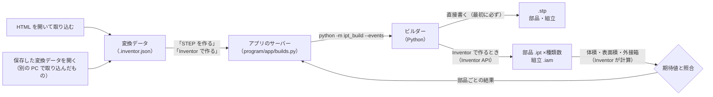

# CAD ビルダー: 変換データから .stp・.ipt・.iam を作る

アプリで three.js の HTML から取り込んだ形状を、STEP（.stp）と、Inventor の部品（.ipt）・組立（.iam）にする手順。
STEP はビルダーが直接書く（Inventor もライブラリも使わない）。.ipt・.iam は Inventor で作る（理由は [cad-output.md](cad-output.md)）。



## 1. 準備（初回のみ）

STEP だけを作るなら準備は要らない（アプリが動けばよい）。.ipt・.iam も作るときは:

1. **Inventor**（部品を作る PC に）
2. **Python**（3.10 以上）。アプリ（画面）と同じ Python を使う（[README](../README.md) の「はじめに」。WaveLog などが動く PC なら入っている）
3. **pywin32**（Inventor の操作に使う Python のライブラリ）。入っていなければ、初めて「Inventor で作る」を押したときに
   「入れて作る」かを尋ねる（インターネットから入れる。1 分ほど）。手動で入れる場合は `program` フォルダで:
   ```
   pip install -r ipt_build/requirements.txt
   ```

## 2. 使い方（アプリの「CAD ファイルを作る」）

1. `Start.vbs` でアプリを開き、HTML を開く（画面へのドラッグ＆ドロップ、`Start.vbs` へのドロップ、「ファイルを開く」）。
   元のページで表示を選び、「この状態を取り込む」を押す（開くと自動で 1 度取り込む）
2. 「取り込み結果」の **シーンの 1 単位** を確かめる。全体の大きさが実寸で出るので、実物と違えば単位を選び直す
   （mm・cm・m・inch・任意の長さ。HTML ごとに覚える）。単位を変えると、認識と変換データが実寸で作り直される
3. パネルの「CAD ファイルを作る」に、作る部品の数と保存先が出る
   - **STEP を作る**: STEP（.stp）だけを作る。数秒で終わる。この PC に Inventor が見つからなければ、こちらを主のボタンにして勧める
   - **Inventor で作る**: STEP を書いてから、Inventor で部品と組立を作る。Inventor が起動していなければ自動で起動する。
     部品を 1 つずつ作り、そのたびに照合の結果（**一致**・**不一致**・**失敗**）が並ぶ
   - 作っている間に別のファイルを開いてもよい（作る仕事は続き、戻ると続きが見える）。画面を閉じても、作り終えるまでサーバーは止まらない
   - **中止** で途中でやめられる（作りかけの部品を終えたところで止まり、Inventor の画面の更新とダイアログをふだんの状態に戻す。
     20 秒たっても止まらなければ強制的に止め、Inventor を別に戻す。Inventor に作りかけの部品が開いていれば、保存せずに閉じる）
4. 終わると「STEP を作りました」「すべての部品が期待値と一致しました」（緑）か「一致しない部品があります」（琥珀）と出る。
   結果の最初の行が STEP（「厳密」か、三角形の面の部品の数）。**保存先を開く** でフォルダを開く
   - Inventor に接続できなかったときは「STEP はできました。Inventor では作れませんでした: 理由」（琥珀）と出て、STEP は残る

保存先は `ドキュメント\Inventor 3Dツール\<名前>_cad`（`<名前>` は取り込んだ HTML のファイル名。同じ名前があれば「 (2)」…を付け、前の結果を上書きしない）。
中身は、STEP（`<名前>.stp`）・部品（.ipt）・組立（.iam。配置が 2 か所以上のとき）・照合の結果（`build-report.json`）・作ったときの変換データの写し
（`<名前>.inventor.json`）。近似の部品を Inventor で開くための部品ごとの STEP は `step` フォルダに置く（.ipt が参照していることがあるので消さない）。
保存先の親フォルダは `program\config\appsettings.json` の `build.output_dir` で変えられる（空ならドキュメント）。
何も作れずに終わった（中止した・STEP も書けなかった）ときは、そのフォルダを残さない。

## 2-2. 変換データ（.inventor.json）の使い方

変換データは、取り込んだ形を作るための**設計図**（部品ごとの断面・回転／押し出し・面取り、近似の部品は三角形、配置と、
照合に使う体積・表面積の期待値）。「STEP を作る」「Inventor で作る」も、内部ではこの変換データをビルダーに渡している。ファイルとして使うのは次のとき:

| 使う場面 | 手順 |
|---|---|
| Inventor の無い PC で取り込み、Inventor のある PC で作る | 取り込んだ PC で「CAD ファイルを作る」の「あとで別の PC で作るとき（変換データを保存）」→ **変換データを保存**。そのファイルを Inventor のある PC に持っていき、アプリで開く（画面か `Start.vbs` にドロップ）→ **Inventor で作る**。STEP だけなら、取り込んだ PC で **STEP を作る** でよい |
| 作ったものの記録・作り直し | 保存先に置いた写し（`<名前>.inventor.json`）を開けば、同じ形をもう一度作れる（新しいフォルダに作る） |
| 中身を確かめる | アプリで開くと、作る形を 3D で表示し、部品ごとの種類・寸法・数を並べる（面取りは形に描かず、説明に書く） |
| コマンドで作る・確かめる | 下の §2-3 |

変換データを開いた画面は、取り込んだ HTML と同じ「CAD ファイルを作る」の節を持つ（部品の一覧・「STEP を作る」「Inventor で作る」）。
変換データではない JSON や、アプリより新しい版の変換データは、理由を示して開かない。

## 2-3. 使い方（コマンド）

`program` フォルダでコマンドプロンプトを開いて実行する。

1. 変換データを **何も作らずに** 確かめる（任意。どの OS でも可）:
   ```
   python -m ipt_build 名前.inventor.json --dry-run
   ```
   部品の一覧と体積・表面積の期待値が出て、最後に「期待値の再計算（Python）とアプリの値: 一致」と出れば正常。
2. STEP だけを作る（Inventor もライブラリも要らない。どの OS でも可）:
   ```
   python -m ipt_build 名前.inventor.json --step-only
   ```
3. STEP と部品・組立を作る（Inventor は起動していなくてもよい。起動していなければ自動で起動する）:
   ```
   python -m ipt_build 名前.inventor.json
   ```
   変換データと同じ場所の `名前_cad` フォルダに、STEP（.stp）・部品（.ipt）・組立（.iam）・結果（`build-report.json`）ができる。
   Inventor に接続できなくても STEP は残る（終了コード 1、理由を表示する）。

| オプション | 内容 |
|---|---|
| `--out フォルダ` | 保存先を変える |
| `--only p01 p03` | 指定した部品だけ作る（まず 1 つで試すときに便利） |
| `--step-only` | STEP だけ作る（Inventor を使わない） |
| `--no-assembly` | 組立を作らない（STEP にも組立を入れない） |
| `--template ファイル.ipt` | 部品のテンプレートを指定する（既定は Inventor の標準テンプレート） |
| `--events` | 進み具合を 1 行 1 つの JSON で出す（アプリのサーバーが読む形。`{"event": "step", ...}` → `{"event": "part", "parts": [...], ...}`） |

## 3. 結果の読み方

アプリでは部品ごとに 1 行（結果の札・部品名・体積の差）。行にカーソルを合わせると、表面積の差・外形の確認・配置の数が出る。
コマンドでは部品ごとに 1 行ずつ表示する。

```
  一致  p01  LS4_parts_viewer_01_回転体_φ240x50  体積 +0.0000%  表面積 +0.0000%  外形 240 × 50 × 240 mm（変換データとの差 0.0000 mm）
```

| 確認 | 内容 | 基準 |
|---|---|---|
| 体積・表面積 | Inventor が計算した値と、変換データの期待値（断面から厳密に計算した値）の差 | 相対 0.01% 以内 |
| 外形 | Inventor が計算したボディの外接箱（`PreciseRangeBox`）と、変換データから計算した外接箱の差 | 0.001 mm 以内 |

- 体積・表面積は、断面の描き方・回転や押し出しの指定・単位の換算のどれかを誤ると一致しない
- 外形の確認は、体積・表面積では分からない位置のずれ（対称のはずの押し出し・回転が片側に寄るなど）を見つける。
  長さの単位（Inventor の内部は cm）の前提は、Inventor が保存した実物の .ipt 全てで確かめている（`program/tests/js/ipt-format.test.mjs`）
- 全部品が「一致」なら終了コード 0、1 つでも「不一致」「失敗」があれば 1

## 4. 部品の作り方

| 種類 | 作り方 |
|---|---|
| 回転体 | XY 平面のスケッチに断面（x = 半径、y = 軸方向）を描き、Y 軸まわりに回転。360° 未満は XY 平面に対して**対称**に回す |
| 近似（三角形のまま） | 部品ごとの STEP（三角形の面。同じ平面の三角形は 1 つの面にまとめる）を `step` フォルダに書き、Inventor で開いて .ipt として保存する（履歴の無い立体） |
| 押し出し | XY 平面のスケッチに断面（外周と穴）を描き、Z 方向に XY 平面に対して**対称**に押し出す |
| 面取り（押し出しのみ） | 押し出した端面（Z = ±長さ/2 の平らな面）の稜線のうち、指定したループの上にあるものを選び、等距離の面取りをかける。同じ大きさの面取りは 1 つのフィーチャにまとめる |
| 組立 | 各部品を、取り込んだシーンと同じ位置・向きで配置する（同じ形の部品は 1 つの .ipt を使い回す） |

- 断面の直線・円弧は、隣どうしで端点を共有させて描く（隙間のない閉じた断面にするため）
- 部品の iProperties に、部品番号（ファイル名と同じ）と説明（種類・面取り・断面の構成）を入れる
- 変換データの版は 3（近似の部品の三角形 `mesh`・注意 `notes` を追加。版 2 で面取りを追加）。ビルダーは版 1〜3 を読める。
  古いビルダーは新しい版を「対応していない版」として拒否する（黙って部品を省くことはない）
- 近似の部品の体積・表面積の期待値は、三角形から計算する（閉じた立体なので体積が決まる）

## 4-2. STEP の書き方

STEP は `ipt_build/step.py`（製品構造と組立）・`brep.py`（面・稜線・頂点）・`p21.py`（ISO 10303-21 の書式）で書く。標準ライブラリだけを使う。

| 部品 | STEP の面 |
|---|---|
| 回転体 | 断面の直線・円弧を回した面（平面・円筒・円錐・球・トーラス）。一周する面は 2 面に割る |
| 押し出し | 側面（平面・円筒）と両端の平面 |
| 面取り付きの押し出し・たる形の回転体（断面の円弧の円が軸と交わる）・近似 | 三角形の面（同じ平面の三角形は 1 つの面にまとめる） |

組立は、配置が 2 か所以上のとき（同じ形は 1 つの部品を使い回す）。形式・検証の詳細は [cad-output.md](cad-output.md) §2。

## 5. ここで確かめたこと・確かめられていないこと

この開発環境には Inventor が無いため、Inventor の代わりに、その動き（単位 cm、時計回りの円弧の端点の入れ替え、
閉じていない断面の拒否、STEP を開く）を模した代替オブジェクトでビルダーを検証した（`program/tests/test_builder.py`）。
STEP は、自作の読み取り（`tests/step_check.py`）・形状カーネル OpenCascade（`tools/check_step.py`）・アプリの読み取りの 3 つで確かめた（`tests/test_step.py`・`tests/js/step-writer.test.mjs`）。

**確かめたこと**
- 5 つの変換データ（丸刃を含む）の全部品で、ビルダーが描いた断面から求めた体積・表面積が期待値と一致する
- 丸刃: 面取りする稜線（穴の縁・両方の端面）を過不足なく選び、1 つの面取りフィーチャにまとめる
- 回転は Y 軸・対称・ラジアン、押し出しは対称・cm で指定している
- 描画の単位換算が抜けると、照合で検出される
- 1 つの部品が失敗しても、残りの部品は作られる
- Inventor に接続できなくても STEP は残る。STEP だけ作るときは Inventor も pywin32 も使わない
- 近似の部品は、部品ごとの STEP を開いて作り、三角形から計算した体積・表面積と一致する
- 全部品の外接箱が変換データと一致する。対称のはずの押し出しが片側に寄ると（体積・表面積は同じでも）、外形の照合で検出される
- 大きさの違う面取りが 2 つ以上ある部品: 大きさごとに、その時点のボディから稜線を選び直す（代替オブジェクトも、本物と同じく
  フィーチャを足すと前に取り出した稜線を使えなくする。以前の作り方は 2 つ目の面取りで失敗していたはず）
- 組立の 1 か所が置けなくても、置けた出現で組立を保存し、置けなかった数と理由を知らせる（以前は組立全体を捨てていた）
- 作り終えたとき・失敗したとき・中止したときに、Inventor の画面の更新とダイアログを**ふだんの状態**（更新する・出す）に戻す。
  前の実行が強制的に止められて「止めたまま」の Inventor に接続しても、ふだんの状態に戻す（以前は作る前の値に戻したので、止めたままが続いた）
- 中止は部品と部品の間で効き、組立は作らない
- 起動したばかり・処理中の Inventor が呼び出しを断る間（COM の RPC_E_CALL_REJECTED など）は待ってやり直す（起動は最大 5 分）
- 変換データの元のファイル名が無い・null でも、名前を「変換データ」にして作る（以前は STEP を書く前に落ちた）

**Inventor 2026 との連携の見直し（2026 年 9 月）で直したこと**: 上の 6 つ（面取り・組立・画面の更新とダイアログ・中止・起動待ち・ファイル名）と、
接続を遅延バインディングにしたこと。この PC に pywin32 の型ライブラリのキャッシュ（makepy）があると、早期バインディングになり、
`Documents.Add` が汎用の Document を返して部品の `ComponentDefinition` を読めなくなる（全部品が「失敗」）。どの PC でも同じ動きにするため、
`win32com.client.dynamic` で接続する。これは代替オブジェクトでは確かめられない（Windows と pywin32 が要る）

**実物の Inventor 2026 で確かめたこと**（2026 年 10 月。`desktop_slitter_threejs.html`、部品 33 種類・69 か所。利用者の PC の `build-report.json`）
- 33 種類の全てが「一致」、組立は 69 か所を置いて誤り無し。作った STEP・部品・組立は Inventor 2026 で普通に開けた（利用者の報告）
- 厳密な部品 28 種類（押し出し 12・回転体 16）: 体積・表面積の差は相対 2e-10 以下（体積は 3e-11 以下）、外形の差は 0.0000 mm。これで次が確かめられた
  - 列挙値（部品・組立・結合・対称、原点の XY 平面 = 3 番目・Y 軸 = 2 番目）と、mm → cm の換算
  - 対称の押し出し・回転で、指定した距離・角度が「両側の合計」になること（片側と解釈されれば体積が 2 倍になる）
  - 外接箱（`SurfaceBody.PreciseRangeBox`）が使えること。体積・表面積の計算（`MassProperties` の既定）は、平面・円筒で相対 2e-10 以内
- 近似の部品 5 種類: アプリが書いた部品ごとの STEP を Inventor 2026 が `Documents.Open` で開き、体積・表面積が相対 2e-7 以内で一致
  （最大の差 0.00087 mm³ は、表面が平均 0.00000013 mm ずれた分に当たり、STEP に書いた精度 0.00001 mm より十分小さい）

**まだ実物で確かめていないこと**
- 組立の配置（`Matrix.SetCoordinateSystem`）の向きが、元の HTML と同じになること（置けることは確かめた。向きは目で見て確かめる）
- 面取り（上の試した形には面取りが無い）: 面取りに使う API（`Face.Edges`・`Edge.PointOnEdge`・`TransientObjects.CreateEdgeCollection`・
  `ChamferFeatures.AddUsingDistance`）の名前と引数、角の形（期待値は CAD の標準の留め継ぎ。丸刃では違っても相対 1e-5 程度の見込みで、許容差 1e-4 の範囲内）、
  丸刃のキー溝の R0.5 付近のように、面取り（1 mm）より短い縁が途中で消える場合に作れるか
- 近似の部品の STEP を開いたときの取り込み（「変換」か「参照」か）。開けて一致することは確かめたが、.ipt が保存先の `step` フォルダの STEP を
  参照し続けるかは分からない（`step` フォルダの名前を変えてから .ipt を開き直すと分かる）
- 2026 年 9 月の見直しで入れた接続（遅延バインディング）・起動待ち（`Application.Ready`）・中止。上の実行がそれより前の版なら、まだ試していない
- トーラス・円錐の体積・表面積の計算の精度（上の形は平面と円筒だけ）

## 6. うまくいかないとき

| 症状 | 対処 |
|---|---|
| 「ライブラリを入れられませんでした」 | 表示された pip の出力を確かめる（インターネットにつながらない・社内のプロキシ）。つながる PC で `program` フォルダの `pip install -r ipt_build/requirements.txt` を実行する |
| 「Python（pythonw.exe）が見つかりません」と出る | §1 の手順で Python を入れる。入れた直後は、一度サインアウトすると PATH が反映される |
| 起動ファイルをダブルクリックしても何も起きない | Windows の設定で VBScript が無効になっている可能性がある（下の「VBScript について」）。その場合は `program\start.bat` を使う |
| 「部品を作る係が途中で終わりました」 | 画面に出た出力（Python のエラー）を知らせてほしい。同じものが `%LOCALAPPDATA%\Inventor3DTool\logs\builder_console.log` にある |
| 「Inventor に接続しています…」のまま止まる | Inventor を手動で起動し、ダイアログが開いていないか確かめる。**中止** してからもう一度押す（起動は最大 5 分待つ） |
| 中止した後、Inventor の画面が更新されない・保存の確認が出ない | 作る係を強制的に止めたとき、Inventor の設定が戻らなかった。`program` フォルダで `python -m ipt_build --restore-inventor` を実行するか、Inventor を起動し直す |
| 部品が「失敗」になる | 表示されたエラー文と、その部品のキー（p01 など）を知らせてほしい。`--only p01` でその部品だけ再実行できる |
| 体積が期待値のちょうど 2 倍・0.5 倍 | 対称の押し出し・回転の距離の解釈の違い。`build-report.json` を知らせてほしい |
| 面取りのある部品だけが「失敗」 | 面取りの API か、短い縁の扱いの問題。エラー文を知らせてほしい |
| 近似の部品だけが「失敗」 | STEP を開く設定（取り込みのダイアログなど）の問題。エラー文を知らせてほしい。STEP（`<名前>.stp`）は Inventor で手で開ける |
| 「STEP はできました。Inventor では作れませんでした」 | Inventor が入っていない・起動できない。STEP を Inventor で開けば .ipt・.iam になる |
| 全体の大きさが 1000 倍・1/1000 | 「シーンの 1 単位」を選び直してから作り直す |
| 外形の確認が「外接箱を取得できませんでした」 | 部品の作成には影響しない（体積・表面積の照合は行う）。Inventor の版を知らせてほしい |

初回の実行後、`build-report.json` と、できた .ipt を 1〜2 個リポジトリに入れてもらえれば、
アプリで開いて（寸法・穴・ねじの表示）結果を確かめ、必要な修正を行う。

### VBScript について

Microsoft は VBScript を段階的に廃止すると公表している（Windows 11 24H2 では「オプション機能」として既定で有効）。
将来の Windows で既定が無効になった場合、「設定 → システム → オプション機能」で VBScript を有効にするか、
`program\start.bat` を使う（VBS は Python を窓なしで起動するためだけにあり、処理はすべて Python の `program\start_app.py` にある）。

