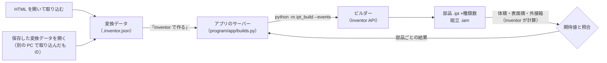

# Inventor ビルダー: 変換データから .ipt を作る

アプリで three.js の HTML から取り込んだ形状を、Inventor の部品（.ipt）と組立（.iam）にする手順。



## 1. 準備（初回のみ）

1. **Inventor**（部品を作る PC に）
2. **Python**（3.10 以上）。アプリ（画面）と同じ Python を使う（[README](../README.md) の「はじめに」。WaveLog などが動く PC なら入っている）
3. **pywin32**（Inventor の操作に使う Python のライブラリ）。入っていなければ、初めて「Inventor で作る」を押したときに
   「入れて作る」かを尋ねる（インターネットから入れる。1 分ほど）。手動で入れる場合は `program` フォルダで:
   ```
   pip install -r ipt_build/requirements.txt
   ```

## 2. 使い方（アプリの「Inventor で作る」）

1. `Start.vbs` でアプリを開き、HTML を開く（画面へのドラッグ＆ドロップ、`Start.vbs` へのドロップ、「ファイルを開く」）。
   元のページで表示を選び、「この状態を取り込む」を押す（開くと自動で 1 度取り込む）
2. パネルの「Inventor へ変換」に、作る部品の数と保存先が出る。**Inventor で作る** を押す
   - Inventor が起動していなければ自動で起動する。部品を 1 つずつ作り、そのたびに照合の結果（**一致**・**不一致**・**失敗**）が並ぶ
   - 作っている間に別のファイルを開いてもよい（作る仕事は続き、戻ると続きが見える）。画面を閉じても、作り終えるまでサーバーは止まらない
   - **中止** で途中でやめられる（Inventor に作りかけの部品が開いていれば、保存せずに閉じる）
3. 終わると「すべての部品が期待値と一致しました」（緑）か「一致しない部品があります」（琥珀）と出る。**保存先を開く** でフォルダを開く

保存先は `ドキュメント\Inventor 3Dツール\<名前>_ipt`（`<名前>` は取り込んだ HTML のファイル名。同じ名前があれば「 (2)」…を付け、前の結果を上書きしない）。
中身は、部品（.ipt）・組立（.iam。配置が 2 か所以上のとき）・照合の結果（`build-report.json`）・作ったときの変換データの写し（`<名前>.inventor.json`）。
保存先の親フォルダは `program\config\appsettings.json` の `build.output_dir` で変えられる（空ならドキュメント）。
何も作れずに終わった（接続できない・中止した）ときは、そのフォルダを残さない。

## 2-2. 変換データ（.inventor.json）の使い方

変換データは、取り込んだ形を Inventor で作るための**設計図**（部品ごとの断面・回転／押し出し・面取り・配置と、照合に使う体積・表面積の期待値）。
「Inventor で作る」も、内部ではこの変換データをビルダーに渡している。ファイルとして使うのは次のとき:

| 使う場面 | 手順 |
|---|---|
| Inventor の無い PC で取り込み、Inventor のある PC で作る | 取り込んだ PC で「Inventor へ変換」の「Inventor の無い PC では（変換データを保存）」→ **変換データを保存**。そのファイルを Inventor のある PC に持っていき、アプリで開く（画面か `Start.vbs` にドロップ）→ **Inventor で作る** |
| 作ったものの記録・作り直し | 保存先に置いた写し（`<名前>.inventor.json`）を開けば、同じ形をもう一度作れる（新しいフォルダに作る） |
| 中身を確かめる | アプリで開くと、作る形を 3D で表示し、部品ごとの種類・寸法・数を並べる（面取りは形に描かず、説明に書く） |
| コマンドで作る・確かめる | 下の §2-3 |

変換データを開いた画面は、取り込んだ HTML と同じ「Inventor へ変換」の節を持つ（部品の一覧・「Inventor で作る」）。
変換データではない JSON や、アプリより新しい版の変換データは、理由を示して開かない。

## 2-3. 使い方（コマンド）

`program` フォルダでコマンドプロンプトを開いて実行する。

1. 変換データを **Inventor を使わずに** 確かめる（任意。どの OS でも可）:
   ```
   python -m ipt_build 名前.inventor.json --dry-run
   ```
   部品の一覧と体積・表面積の期待値が出て、最後に「期待値の再計算（Python）とアプリの値: 一致」と出れば正常。
2. 部品を作る（Inventor は起動していなくてもよい。起動していなければ自動で起動する）:
   ```
   python -m ipt_build 名前.inventor.json
   ```
   変換データと同じ場所の `名前_ipt` フォルダに、部品（.ipt）・組立（.iam）・結果（`build-report.json`）ができる。

| オプション | 内容 |
|---|---|
| `--out フォルダ` | 保存先を変える |
| `--only p01 p03` | 指定した部品だけ作る（まず 1 つで試すときに便利） |
| `--no-assembly` | 組立を作らない |
| `--template ファイル.ipt` | 部品のテンプレートを指定する（既定は Inventor の標準テンプレート） |
| `--events` | 進み具合を 1 行 1 つの JSON で出す（アプリのサーバーが読む形。`{"event": "part", "parts": [...], ...}`） |

## 3. 結果の読み方

アプリでは部品ごとに 1 行（結果の札・部品名・体積の差）。行にカーソルを合わせると、表面積の差・外形の確認・配置の数が出る。
コマンドでは部品ごとに 1 行ずつ表示する。

```
  一致  p01  LS4_parts_viewer_01_回転体_φ240x50  体積 +0.0000%  表面積 +0.0000%  外形 240 × 50 × 240 mm（変換データとの差 0.0000 mm）
```

| 確認 | 内容 | 基準 |
|---|---|---|
| 体積・表面積 | Inventor が計算した値と、変換データの期待値（断面から厳密に計算した値）の差 | 相対 0.01% 以内 |
| 外形 | Inventor が計算したボディの外接箱（`PreciseRangeBox`）と、変換データから計算した外接箱の差 | 0.001 mm 以内 |

- 体積・表面積は、断面の描き方・回転や押し出しの指定・単位の換算のどれかを誤ると一致しない
- 外形の確認は、体積・表面積では分からない位置のずれ（対称のはずの押し出し・回転が片側に寄るなど）を見つける。
  長さの単位（Inventor の内部は cm）の前提は、Inventor が保存した実物の .ipt 全てで確かめている（`program/tests/js/ipt-format.test.mjs`）
- 全部品が「一致」なら終了コード 0、1 つでも「不一致」「失敗」があれば 1

## 4. 部品の作り方

| 種類 | 作り方 |
|---|---|
| 回転体 | XY 平面のスケッチに断面（x = 半径、y = 軸方向）を描き、Y 軸まわりに回転。360° 未満は XY 平面に対して**対称**に回す |
| 押し出し | XY 平面のスケッチに断面（外周と穴）を描き、Z 方向に XY 平面に対して**対称**に押し出す |
| 面取り（押し出しのみ） | 押し出した端面（Z = ±長さ/2 の平らな面）の稜線のうち、指定したループの上にあるものを選び、等距離の面取りをかける。同じ大きさの面取りは 1 つのフィーチャにまとめる |
| 組立 | 各部品を、取り込んだシーンと同じ位置・向きで配置する（同じ形の部品は 1 つの .ipt を使い回す） |

- 断面の直線・円弧は、隣どうしで端点を共有させて描く（隙間のない閉じた断面にするため）
- 部品の iProperties に、部品番号（ファイル名と同じ）と説明（種類・面取り・断面の構成）を入れる
- 変換データの版は 2（面取りを追加）。ビルダーは版 1 と 2 を読める。古いビルダーは版 2 を「対応していない版」として拒否する
  （面取りを黙って省くことはない）
- 近似（三角形のまま）の部品は作らない。一覧の最後に「作らない」として表示する

## 5. ここで確かめたこと・確かめられていないこと

この開発環境には Inventor が無いため、Inventor の代わりに、その動き（単位 cm、時計回りの円弧の端点の入れ替え、
閉じていない断面の拒否など）を模した代替オブジェクトでビルダーを検証した（`program/tests/test_builder.py`）。

**確かめたこと**
- 5 つの変換データ（丸刃を含む）の全部品で、ビルダーが描いた断面から求めた体積・表面積が期待値と一致する
- 丸刃: 面取りする稜線（穴の縁・両方の端面）を過不足なく選び、1 つの面取りフィーチャにまとめる
- 回転は Y 軸・対称・ラジアン、押し出しは対称・cm で指定している
- 描画の単位換算が抜けると、照合で検出される
- 1 つの部品が失敗しても、残りの部品は作られる
- 全部品の外接箱が変換データと一致する。対称のはずの押し出しが片側に寄ると（体積・表面積は同じでも）、外形の照合で検出される

**実物の Inventor でしか確かめられないこと**（初回の実行結果で判明する）
- Inventor API の列挙値（`ipt_build/inventor.py` の先頭にまとめている）
  - 部品 12290・組立 12291、結合 20481、対称 20995、原点の XY 平面 = 3 番目・Y 軸 = 2 番目
- 対称の押し出しで、指定した距離が「両側の合計」になること（片側の距離と解釈されると体積が 2 倍になり、照合で「不一致」になる）
- 組立の配置（`Matrix.SetCoordinateSystem`）が意図どおりの向きになること
- 面取りに使う API（`SurfaceBodies`・`Face.Edges`・`Edge.PointOnEdge`・`TransientObjects.CreateEdgeCollection`・
  `ChamferFeatures.AddUsingDistance`）と外接箱（`SurfaceBody.PreciseRangeBox`）の名前と引数。違っていれば、その部品が「失敗」になりエラー文が表示される
- 面取りの角の形。期待値は CAD の標準（留め継ぎ）で計算している。Inventor が角を別の形にすると、体積・表面積がわずかに変わる
  （丸刃では相対 1e-5 程度の見込みで、照合の許容差 1e-4 の範囲内）
- 丸刃のキー溝の R0.5 付近のように、面取り（1 mm）より短い縁が途中で消える場合に、Inventor が面取りを作れるか

## 6. うまくいかないとき

| 症状 | 対処 |
|---|---|
| 「ライブラリを入れられませんでした」 | 表示された pip の出力を確かめる（インターネットにつながらない・社内のプロキシ）。つながる PC で `program` フォルダの `pip install -r ipt_build/requirements.txt` を実行する |
| 「Python（pythonw.exe）が見つかりません」と出る | §1 の手順で Python を入れる。入れた直後は、一度サインアウトすると PATH が反映される |
| 起動ファイルをダブルクリックしても何も起きない | Windows の設定で VBScript が無効になっている可能性がある（下の「VBScript について」）。その場合は `program\start.bat` を使う |
| 「部品を作る係が途中で終わりました」 | 画面に出た出力（Python のエラー）を知らせてほしい。同じものが `%LOCALAPPDATA%\Inventor3DTool\logs\builder_console.log` にある |
| 「Inventor に接続しています…」のまま止まる | Inventor を手動で起動し、ダイアログが開いていないか確かめる。**中止** してからもう一度押す |
| 部品が「失敗」になる | 表示されたエラー文と、その部品のキー（p01 など）を知らせてほしい。`--only p01` でその部品だけ再実行できる |
| 体積が期待値のちょうど 2 倍・0.5 倍 | 対称の押し出し・回転の距離の解釈の違い。`build-report.json` を知らせてほしい |
| 面取りのある部品だけが「失敗」 | 面取りの API か、短い縁の扱いの問題。エラー文を知らせてほしい |
| 外形の確認が「外接箱を取得できませんでした」 | 部品の作成には影響しない（体積・表面積の照合は行う）。Inventor の版を知らせてほしい |

初回の実行後、`build-report.json` と、できた .ipt を 1〜2 個リポジトリに入れてもらえれば、
アプリで開いて（寸法・穴・ねじの表示）結果を確かめ、必要な修正を行う。

### VBScript について

Microsoft は VBScript を段階的に廃止すると公表している（Windows 11 24H2 では「オプション機能」として既定で有効）。
将来の Windows で既定が無効になった場合、「設定 → システム → オプション機能」で VBScript を有効にするか、
`program\start.bat` を使う（VBS は Python を窓なしで起動するためだけにあり、処理はすべて Python の `program\start_app.py` にある）。

