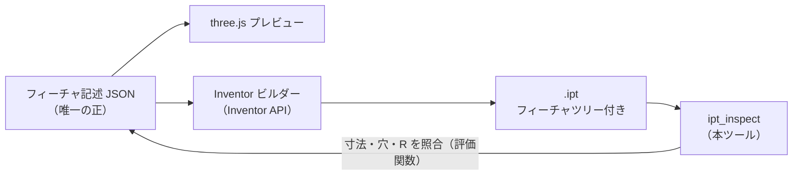

# Inventor 部品ファイル（.ipt）の構造解析

サンプル `E_Plate_改_Φ54.5.ipt`（Inventor 2026 で保存）を実際に分解して確認した内容をまとめる。
再現は `python -m ipt_inspect <file>.ipt --dump out/` で行える。

## 1. 結論

| 層 | 形式 | 読み取り | 根拠 |
|---|---|---|---|
| 外殻 | OLE2 複合ドキュメント（MS-CFB） | ◎ 仕様公開 | `olefile` で全 30 ストリームを列挙できた |
| セグメント圧縮 | Zstandard | ◎ | ヘッダ直後に `28 B5 2F FD` があり、全 16 ストリームを展開できた |
| 最終形状（B-rep） | Autodesk ShapeManager の SAB（ACIS 系バイナリ） | ◎ 寸法まで復元 | 21×7.5×2 mm、穴 Φ4.5×2、R3.5×4 を抽出。画面と一致 |
| スケッチ形状 | 同上（DC セグメント内） | ○ | 押し出し前の 21×7.5 矩形プロファイルを抽出 |
| 設計履歴・パラメータ | 独自オブジェクトグラフ（DC セグメント） | △ 部分的 | パラメータ名 d10〜d34 と寸法値の実在は確認。オブジェクト型の意味は未解読 |
| 表示用メッシュ | 独自形式（Graphics セグメント） | △ | float32 の頂点値は確認。レイアウトは未解読 |
| 管理情報 | RSeDbRevisionInfo / RSeSegInfo / UFRxDoc | × 未解読 | 名前と中の文字列から、版管理・セグメント登録と推測 |

**読むことはできる。特に最終形状は寸法レベルまで復元できる。**
一方、**Inventor が正しく開ける .ipt をゼロから書き出すことは現実的ではない**（§4）。

## 2. ファイル構造

```
E_Plate_改_Φ54.5.ipt  (OLE2 Compound File)
├─ \x05Zrxrt4…          Inventor Summary Information（サムネイル PNG 512×512 を内包）
├─ \x05Pypkiz…          Design Tracking Properties（部品番号・作成者・材質・版数の文字列を確認）
├─ \x05…               その他のプロパティセット（上記と合わせて計 7 本）
├─ UFRxDoc              テンプレートと保存先のパス等を含む（用途は推測: ドキュメント参照情報）
├─ Protein              4 バイトのゼロ（用途は不明）
└─ RSeStorage/
   ├─ RSeDbRevisionInfo 用途は推測: セグメントの版管理
   ├─ RSeSegInfo         セグメント名とその型名の一覧を確認
   ├─ V10/RSeDb          テンプレート由来の DB 情報（※保存日時は 2006 年のテンプレートのもの）
   ├─ M<key> / B<key>    セグメント本体（M=メタ, B=データ）× 8 組
   └─ RSeEmbeddings/     インターフェース名（DerivedPart, Threads 等）の一覧を確認
```

### RSe セグメント（すべて Zstandard 圧縮）

| セグメント | 格納 → 展開 | 中身 | 根拠 |
|---|---|---|---|
| PmBRepSegment | 6,745 → 41,847 B | **最終形状の B-rep**（ASM SAB）＋ロールバック用履歴 | 解読済み |
| PmDCSegment | 10,504 → 50,486 B | 設計履歴（パラメータ d10〜d34 等）＋スケッチ形状の SAB | パラメータ名・寸法値・SAB を確認 |
| PmGraphicsSegment | 15,677 → 76,263 B | 表示用メッシュと寸法テキスト（推測） | float32 の座標値、`7.5` `(21)` 等の文字列を確認 |
| PmBrowserSegment | 1,026 → 3,321 B | モデルブラウザのツリー | `Origin` `YZ Plane` 等の文字列を確認 |
| PmAppSegment | 6,851 → 58,270 B | スタイル・マテリアル・単位・表示設定 | スタイル名・材質名の文字列を確認 |
| PmResultSegment | 427 → 1,136 B | 不明 | 名前のみ |
| DesignViewSegment | 334 → 943 B | ビュー表現（推測） | 名前のみ |
| NBNotebookSegment | 71 → 59 B | エンジニアノート（推測） | 名前のみ |

- `B<key>` = 16 バイトの GUID + 2 バイト + Zstandard フレーム
- `M<key>` = `RSe Meta Stream Version 8` で始まる非圧縮ヘッダ（UTF-16 のセグメント名、作成・更新日時）+ Zstandard フレーム

## 3. 形状データ（SAB）

Inventor の形状カーネル ASM（Autodesk ShapeManager）は ACIS から派生しており、B-rep を
ACIS と同系統のタグ付きバイナリで保存する。ヘッダは `ASM BinaryFile4`、版は 231。

- 1 レコード = 1 エンティティ。`[SUBIDENT…] IDENT フィールド… TERMINATOR(0x11)`
  - 例: `cone`(SUBIDENT) + `surface`(IDENT) → `cone-surface`
- 参照は `REF(0x0C)` の 4 バイト整数（レコード番号、ヘッダが 0 番）
- 座標は `POSITION(0x13)`、方向は `VECTOR(0x14)`、いずれも double×3
- **単位は cm**（ヘッダの `mm_per_unit = 10.0`）。Inventor の内部単位と同じ
- ロールバック用の履歴 `Begin-of-ASM-History-Data` 〜 `End-of-ASM-History-Section` は
  **エンティティ番号に数えない**。区間マーカーと終端 `End-of-ASM-data` には TERMINATOR が無い
  （この規則で全参照の型が整合することをテストで検証済み）
- 面には `INV_NMX_SWEEPGENERATED_TAG`（押し出しで生成）、`INV_NMX_BLEND_TAG`（フィレットで生成）
  などの属性が付き、設計履歴側のフィーチャと対応づけられている

### 円筒・円板のサンプル（A〜D）で分かったこと

A1〜D の 9 ファイル（ねじ穴・切り欠き・角窓を持つ筒と板）を解析して確かめた内容。

| 項目 | 内容 | 根拠 |
|---|---|---|
| 円錐面 | `cone-surface` の doubles は `ratio, …, sin(半頂角), cos(半頂角), u スケール`。軸方向の高さ h（origin から軸の向き）で半径は ρ(h) = \|major\| + h・sin/cos。sin = 0 なら円筒 | 全サンプルの稜線上の点で誤差 7e-16 |
| 交線（`intcurve-curve`） | `{` の中に交線の種類（`int_int_cur` など）と B スプライン: `nubs`（有理なら `nurbs`）, 次数, 閉じ方（0 開・1 閉・2 周期）, ノット数, (ノット値, 重複度)…, 制御点 (x, y, z[, 重み])…。制御点の数 = 重複度の合計 − 次数 + 1（両端のノットは次数重） | 制御点の数が全ての交線で式どおり。周期的な交線では稜線のパラメータ範囲がノットの範囲を越える（周期で巡る） |
| 交線の端点 | B スプラインは近似なので、端が頂点とわずかにずれうる（記録された許容差は約 3.5 µm）。稜線の折れ線の端は頂点の座標にそろえる | 今回のサンプルでの実測は最大 3.0e-6 mm で、表示用の丸め（1e-5 mm）より小さい。許容差いっぱいにずれると隣の稜線と点が合わなくなるため、予防としてそろえる |
| 面の属性 | 面の refs[0] から属性（`ATTRIB_CUSTOM-attrib`）が refs = [attrib, next, prev, owner] でつながる。名前は最初の文字列。見つかった名前: `INV_NMX_SWEEPGENERATED_TAG`・`INV_NMX_BLEND_TAG`・`INV_NMX_HOLE_TAG`・`INV_NMX_THREAD_TAG`・`INV_FEATURE_ORIENTATION_ATTR`・`INV_NMX_MATCHED_ATTRIB`・`INV_NMX_FEATURE_DEPENDENCY_ATTRIB` | 同じ持ち主（refs[3]）の属性が next / prev で相互に指し合う |
| ねじ（`INV_NMX_THREAD_TAG`） | doubles: ピッチ, ねじ山の高さ（cm）。positions: ねじの始点, 終点, …。strings: 名前, 呼び径, 呼び（`M6x1`）, 種類（`ISO Metric profile`）, 空, 空, 等級（`6H`）, ピッチ, 外径, …, 谷の径, …, 下穴径。1 つの面に 2 つ付くこともある（穴の両端のねじ） | ねじ穴の円筒の直径 = 谷の径（M6 → 4.917）。始点・終点の距離 = ねじ長さ（M6: 12 mm）。始点・終点の座標系はフィーチャにより異なり、穴の中心とは一致しないことがある |
| 履歴のシェル | 最終形状のシェルは 1 つ（lump からの next 連鎖）。ほかにも lump を持ち主とするシェルがあるが、どこからも参照されない（ロールバック用の過去の形状） | 最終形状の面数・外形がサムネイルと一致する |
| 質量特性 | Design Tracking Properties の PID 58〜60（体積・表面積などと推測）は全ファイルで同じ値。部品の値ではなくテンプレートの値 | 形の違う 9 ファイルで同値 |

ファイル名の「Φ54.5」は、A〜D では外周の円筒の直径（外径）と一致する。

### サンプルから復元した形状

| 項目 | 値 | 導出 |
|---|---|---|
| 外形 | 21.0 × 7.5 × 厚さ 2.0 mm | 全稜線のサンプル点の外接箱 |
| 穴 | Φ4.5 × 2、中心 X=4.0 / 17.0（ピッチ 13）、貫通 | 凹・全周の円筒面 |
| 角R | R3.5 × 4（各 90°） | 凸・部分円筒面。幅 7.5 に対し 3.5×2 = 7 なので端に 0.5 mm の平面が残る |
| 位相 | 面 12 / 稜線 28 / 頂点 20 / ループ 18 → 種数 2 | オイラー・ポアンカレの式。種数＝貫通穴の数と一致 |
| スケッチ | 21 × 7.5 の平面シート（DC セグメント） | 押し出し 1 のプロファイル |

モデルブラウザの「押し出し1 → 穴1 → フィレット1」と矛盾しない。
なお、ファイル名にある「Φ54.5」が何を指すかは、ファイル内のデータからは分からない。

## 4. .ipt を直接書き出すのが現実的でない理由

1. **.ipt は形状ファイルではなく、Inventor 内部オブジェクトのデータベースを直列化したもの。**
   8 つのセグメントが相互参照している（DC のフィーチャ ↔ B-rep の面属性 ↔ 表示メッシュ ↔ ブラウザ）。
   形状だけを正しく書いても、他のセグメントと整合しなければ、開けないか不整合を起こす可能性が高い（未検証）。
2. **設計履歴（DC）のオブジェクト型は文書化されていない。** メタストリームはクラスを GUID で参照しており、
   その意味は Inventor の内部にしか定義がない。
3. **版ごとに形式が変わる。** 今回のファイル（2026）はセグメントが Zstandard 圧縮されている
   （どの版から圧縮されるようになったかは未確認）。書き出し器は版ごとの追従が必要になる。
4. **正しさを検証する手段が Inventor 自身しかない。** 公式の検証器は存在しない。
5. Autodesk のソフトウェア自体の解析（逆アセンブル等）は利用規約で制限されている。
   自分のファイルのデータを読むこととは別の話だが、書き出し器を配布・商用利用するなら規約の確認を推奨する
   （法的な判断はここではできない）。

## 5. three.js から .ipt を得るための現実的な経路

| 経路 | 得られるもの | フィーチャツリー | 必要なもの | 評価 |
|---|---|---|---|---|
| **A. Inventor API で再構築** | ネイティブ .ipt | ○（押し出し・穴・フィレット…、パラメータ編集可） | Inventor（手元の 2026） | **推奨** |
| B. Design Automation API for Inventor | ネイティブ .ipt | ○ | Autodesk Platform Services（クラウド・有償。料金体系は要確認） | Web だけで完結させたい場合 |
| C. ブラウザで B-rep を作り STEP 出力 → Inventor で取り込み | .ipt（取り込みソリッド） | ×（形状のみ） | OpenCascade.js / replicad | A で表せない自由形状の逃げ道 |
| D. three.js のメッシュ（STL/OBJ）を取り込み | メッシュボディ | × | なし | 円が多角形になる。機械部品には不向き |
| E. .ipt バイナリを直接生成 | — | — | 全セグメントの解読 | §4 の理由で非推奨 |

補足: 無償の Inventor Apprentice Server は .ipt の読み取りとプロパティ編集が主な用途で、フィーチャ（形状）は作成できない。

### 推奨する設計: 「メッシュ」ではなく「フィーチャ記述」を唯一の正にする

three.js が持つのは三角形メッシュで、CAD に必要な情報（真円、穴か切り欠きかという設計意図、
パラメータ、フィーチャの順序）はメッシュ化した時点で失われる。そこで、Web 側の正本を
**パラメトリックなフィーチャ記述（JSON）**にし、three.js はその描画係に徹する。



サンプル部品をこの形式で書くと、例えば次のようになる（スキーマは叩き台）。

```json
{
  "units": "mm",
  "parameters": { "L": 21, "W": 7.5, "T": 2, "D": 4.5, "P": 13, "R": 3.5 },
  "features": [
    { "type": "extrude", "sketch": { "plane": "XZ", "rect": ["L", "W"] }, "distance": "T" },
    { "type": "hole", "diameter": "D", "extent": "through",
      "centers": [["(L-P)/2", "W/2"], ["(L+P)/2", "W/2"]] },
    { "type": "fillet", "edges": "vertical", "radius": "R" }
  ]
}
```

- Inventor 側ビルダーは JSON を読み、`PlanarSketch` → `ExtrudeFeatures` → `HoleFeatures` →
  `FilletFeatures` の順に API を呼び、`parameters` をユーザーパラメータとして登録する。
  実装手段は iLogic（VB.NET）、C# アドイン、または Windows 上の Python + pywin32 のいずれでもよい。
- Inventor API の長さの内部単位は **cm**（SAB の単位と同じ）。mm からの換算を 1 か所に集約する。
- three.js も Inventor も右手系で、このサンプルの表示では Y 軸が上。座標軸はそのまま対応づけられる。
- 出力された .ipt を `ipt_inspect` で読み、JSON から期待される外形・穴・R と照合すれば、
  変換器の回帰テスト（評価関数）がそのまま作れる。

### 段階的な進め方（案）

1. フィーチャ記述 JSON のスキーマ v0 を決める（押し出し・穴・フィレット・面取り）。three.js 描画を実装する
2. Inventor ビルダーを実装し、サンプル部品を JSON から再生成する
3. `ipt_inspect` で生成物を検証し、元のサンプルと寸法が一致することを確認する
4. フィーチャの種類を増やす。表現できない形状は経路 C（STEP）で補う

## 6. 参考

- MS-CFB（複合ファイル形式）: Microsoft Open Specifications
- 先行事例: FreeCAD 用アドオン InventorLoader（.ipt の読み込み。Inventor 2026 の Zstandard 圧縮への対応状況は未確認）
